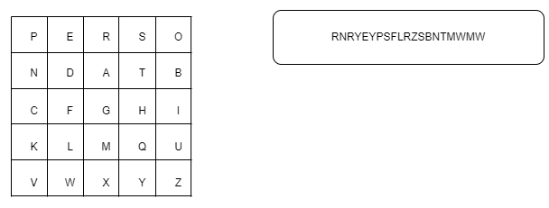
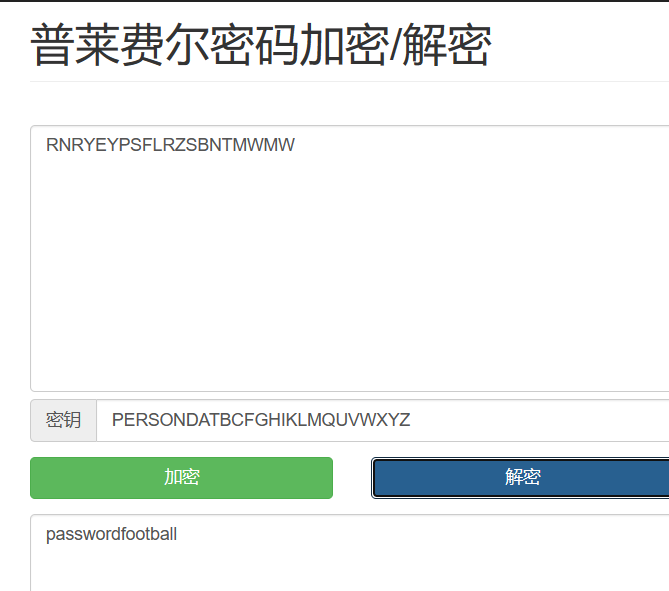
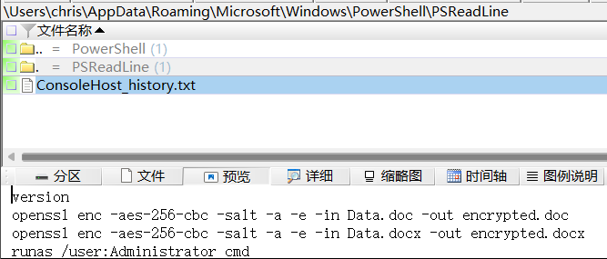
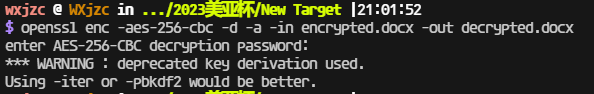
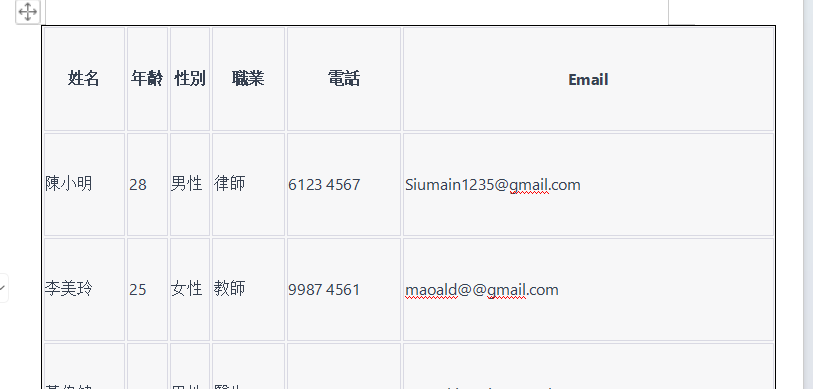

# 常见加密方式

## Playfair Cipher

图片是这个，解析一下是`Playfair Cipher`，[一个工具箱](http://www.atoolbox.net/Tool.php?Id=912)梭了，拿到密码`FOOTBALL`，注意大小写，密码表和密文都是大写的

结果为`FOOTBALL`

## OpenSSL

Linux环境。

> ## 92.参考陈大昆的计算机镜像回答以下题目,在陈大昆的电脑中，加密的压缩文件NewTarget.rar中有2个文件，一个是加密的Word文件，另一个是图片文件。已知图片的隐藏文字为加密的Word文件的Salt(为一个AES256加密)。在加密的Word文件中，李美玲的年龄为?(3分)
>
> 在powershell历史命令中可以看到用openssl进行加密
>
> 
>
> 上面拿到了密码`P@ssw0rd`，解密即可
>
> 
>
> 
>
> 结果为`25`