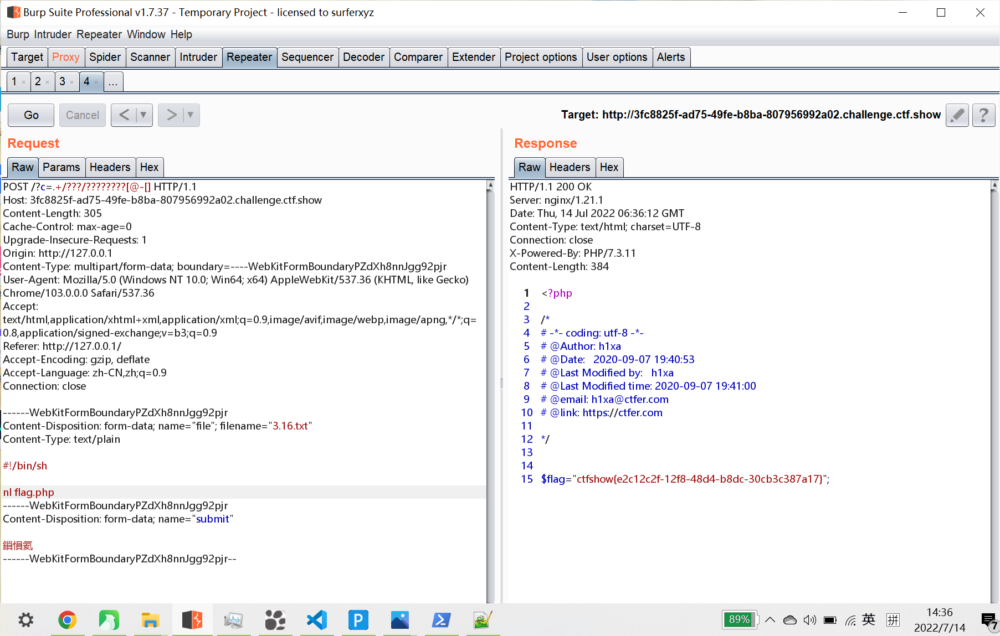

# 知识点
[无字母数字的命令执行(ctfshow web入门 55）](https://blog.csdn.net/qq_46091464/article/details/108513145)<br />[无字母数字webshell之提高篇](https://www.leavesongs.com/PENETRATION/webshell-without-alphanum-advanced.html)<br />[一些不包含数字和字母的webshell](https://www.leavesongs.com/PENETRATION/webshell-without-alphanum.html?page=2#reply-list)
# 思路
源码
```php
if(isset($_GET['c'])){
    $c=$_GET['c'];
    if(!preg_match("/\;|[a-z]|\`|\%|\x09|\x26|\>|\</i", $c)){
        system($c);
    }
}else{
    highlight_file(__FILE__);
}
```

