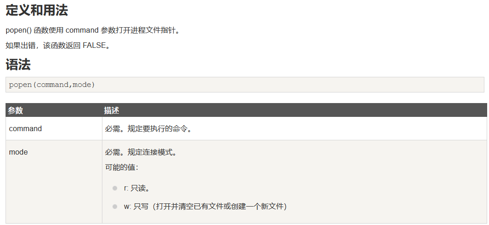

# **exec()**
该函数无回显需使用 echo 进行输出，且**只返回执行后的最后一行结果**
# **shell_exec()**
该函数无回显需使用 echo 或者 var_dump 进行输出，但**返回结果所有内容**。
# **``反引号**
反引号其实调用的是shell_exec()函数，当反引号中的变量可控时就会造成命令执行，且无回显。
# **system()**
该函数会将输入的参数当做命令执行，有回显且返回所有内容。在实战中也是最常见的造成命令执行漏  洞的函数之一。
# **passthru()**
该函数与上述 system() 函数类似，也可将输入的参数当做命令执行，且函数执行后有回显。
# **popen()**
该函数通常用于打开进程文件指针，但如果传入的**参数可控**也可造成命令执行，且该函数无回显,通过  echo 不会直接返回执行的结果，而是返回的是文件指针。 
# **proc_open()**
执行一个命令，并且打开用来输入/输出的文件指针。类似 popen() 函数,但是 proc_open() 所需参  数更多，且处理数据能力更强。
