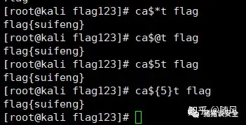
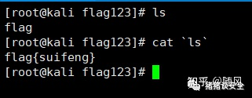

# 文章
[命令执行(RCE)面对各种过滤，骚姿势绕过总结](https://zhuanlan.zhihu.com/p/391439312)<br />[命令执行漏洞利用及绕过方式总结 - My_Dreams - 博客园](https://www.cnblogs.com/zzjdbk/p/13491028.html)<br />[命令执行的一些绕过技巧](https://chybeta.github.io/2017/08/15/%E5%91%BD%E4%BB%A4%E6%89%A7%E8%A1%8C%E7%9A%84%E4%B8%80%E4%BA%9B%E7%BB%95%E8%BF%87%E6%8A%80%E5%B7%A7/)<br />[命令执行(RCE)面对各种过滤，骚姿势绕过总结 - 知乎.pdf](https://www.yuque.com/attachments/yuque/0/2023/pdf/25358086/1688813460922-f5f8ef12-0c60-4cf1-b8fc-210c9e188a68.pdf)
### 使用转义符号
```powershell
ca\t /fl\ag
cat fl''ag
```
### 拼接法
```powershell
=fl;b=ag;cat$IFS$a$b
```
### **使用空变量$*和$@，$x,${x}绕过**

### **反引号绕过**

