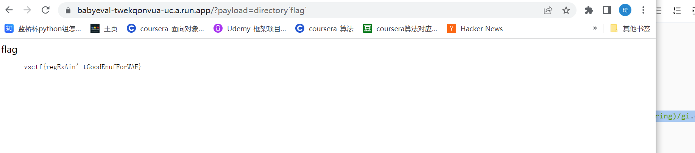

# 知识点
node.js<br />express.js<br />**directory`flag`-> directory("flag")**
# 思路
源码
```javascript
title
View Source CTF
description
Powered by Node.js and Express.js
lastUpdate
2022-02-22T22:22:22.222Z
source
const express = require('express');
const app = express();

function escape(s) {
  return `${s}`.replace(/./g,c => "&#" + c.charCodeAt(0) + ";");
}

function directory(keys) {
  const values = {
    "title": "View Source CTF",
    "description": "Powered by Node.js and Express.js",
    "flag": process.env.FLAG,
    "lyrics": "Good job, you’ve made it to the bottom of the mind control facility. Well done.",
    "createdAt": "1970-01-01T00:00:00.000Z",
    "lastUpdate": "2022-02-22T22:22:22.222Z",
    "source": require('fs').readFileSync(__filename),
  };
  
  return "<dl>" + keys.map(key => `<dt>${key}</dt><dd><pre>${escape(values[key])}</pre></dd>`).join("") + "</dl>";
}

app.get('/', (req, res) => {
  const payload = req.query.payload;
  
  
  if (payload && typeof payload === "string") {
    const matches = /([\.\(\)'"\[\]\{\}<>_$%\\xu^;=]|import|require|process|proto|constructor|app|express|req|res|env|process|fs|child|cat|spawn|fork|exec|file|return|this|toString)/gi.exec(payload);
    if (matches) {
      res.status(400).send(matches.map(i => `<code>${i}</code>`).join("<br>"));
    } else {
      res.send(`${eval(payload)}`);
    }
  } else {
    res.send(directory(["title", "description", "lastUpdate", "source"]));
  }
});

app.listen(process.env.PORT, () => {
  console.log(`Server started on http://127.0.0.1:${process.env.PORT}`);
});
```
分析发现 process.env.FLAG有flag，可以通过调用directory("flag")返回flag<br />访问/时回获取查询得参数payload，并对其进行匹配过滤
```javascript
const matches = /([\.\(\)'"\[\]\{\}<>_$%\\xu^;=]|import|require|process|proto|constructor|app|express|req|res|env|process|fs|child|cat|spawn|fork|exec|file|return|this|toString)/gi.exec(payload);
```
过滤了（）‘“等<br />可以用directory`flag`绕过<br />/?payload=directory`flag`获取flag<br />
