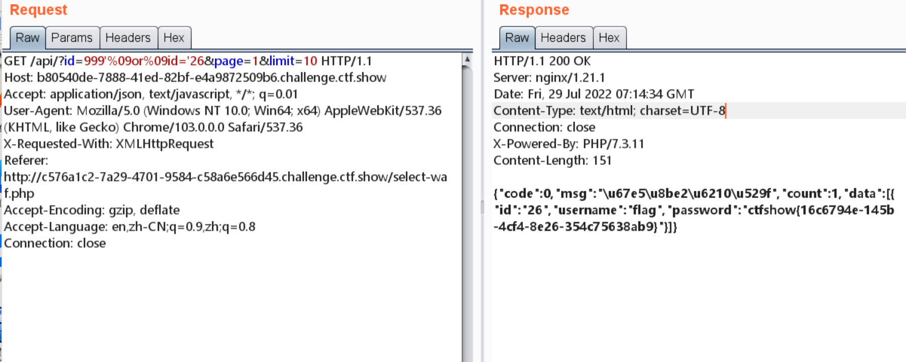

# 知识点
### 过滤了空格以及-+
能够代替空格的字符  x09|\x0a|\x0b|\x00|\x0d|\xa0|\x0c等不可见字符   /**/注释符<br />字段名、表面等可以用反引号` `代替空格<br />select后的字符串可以用引号' '   " "代替空格<br />字段或者表名数据库名描述可以用括号括起来
# 思路
```plsql
function waf($str){
	return preg_match('/ /', $str);
}
```
```plsql
999'%09or%09id='26
```

