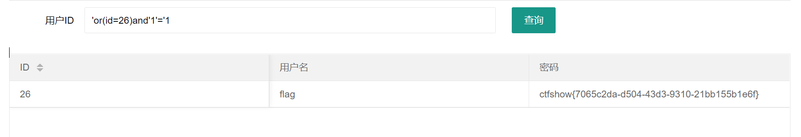

# 知识点
# 思路
```plsql
//对传入的参数进行了过滤
  function waf($str){
    return preg_match('/ |\*|\x09|\x0a|\x0b|\x0c|\x00|\x0d|\xa0|\x23|\#|file|into|select/i', $str);
  }
```
```plsql
'or(id=26)and'1'='1
```

