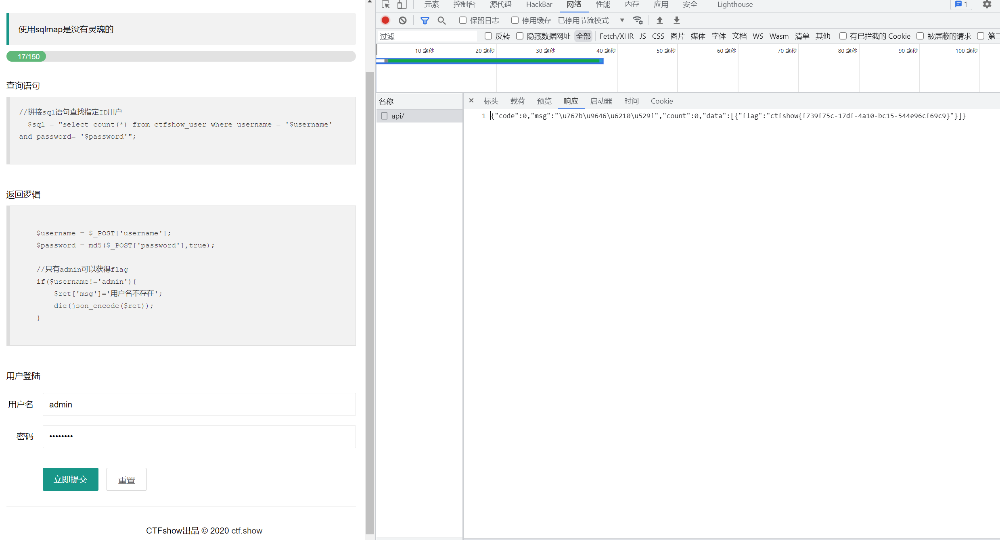

# 知识点
### MD5为true
binary If the optional binary is set to true, then the md5 digest is instead returned in raw binary format with a length of 16.
# 思路
网上公开有md5为true后，开头为'or的字符串，直接拿过来用 例如           ffifdyop 
