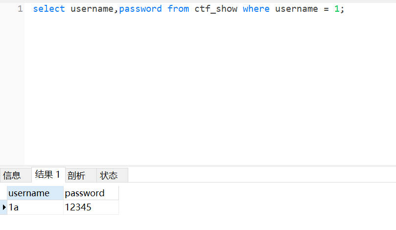
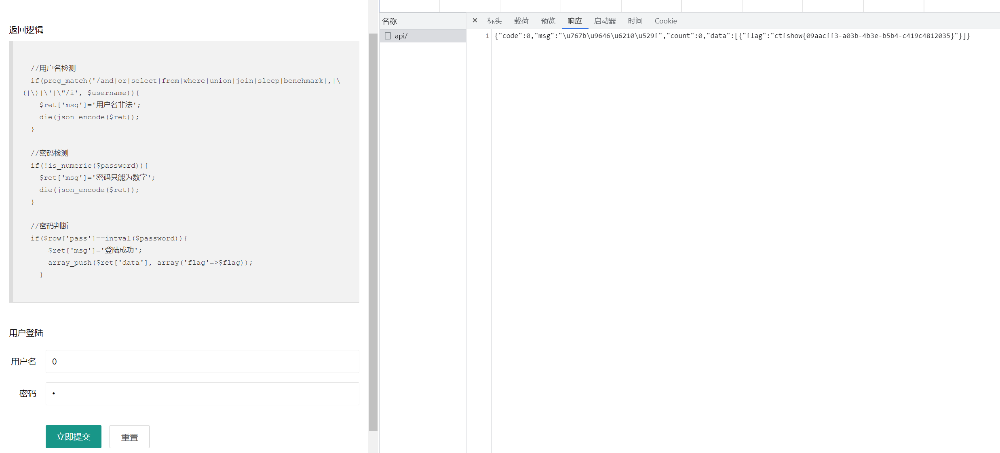

# 知识点
### 数据库的弱类型比较
在where username=0这样的查询中，因为username都会是字符串，在mysql中字符串与数字进行比较的时候，以字母开头的字符串都会转换成数字0，因此这个where可以把所有以字母开头的数据查出来<br />而if($row[‘pass’]==intval($password)) 也是弱比较，查出来的也是字母开头的<br />如下图所示，跟php的弱类型比较基本一样<br />
# 思路
```python
username=0&password=0
```

